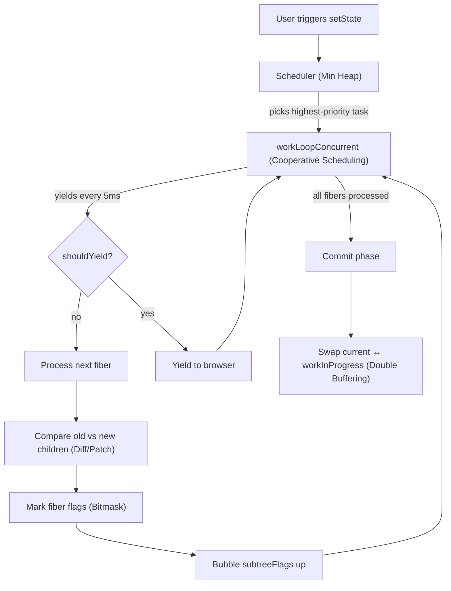
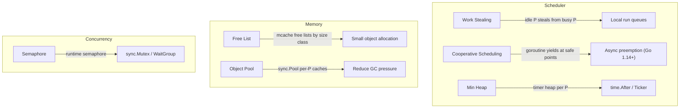
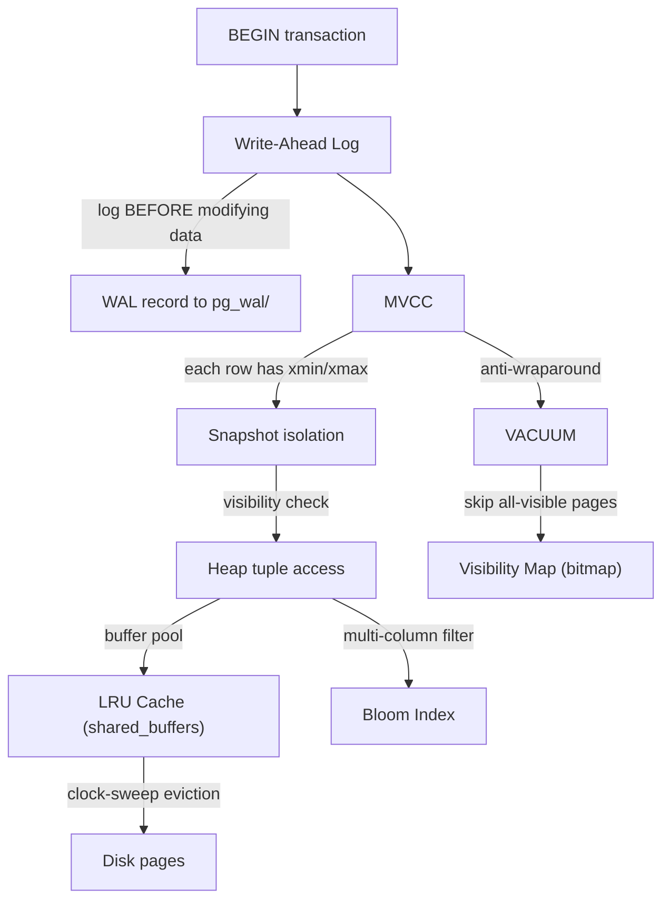
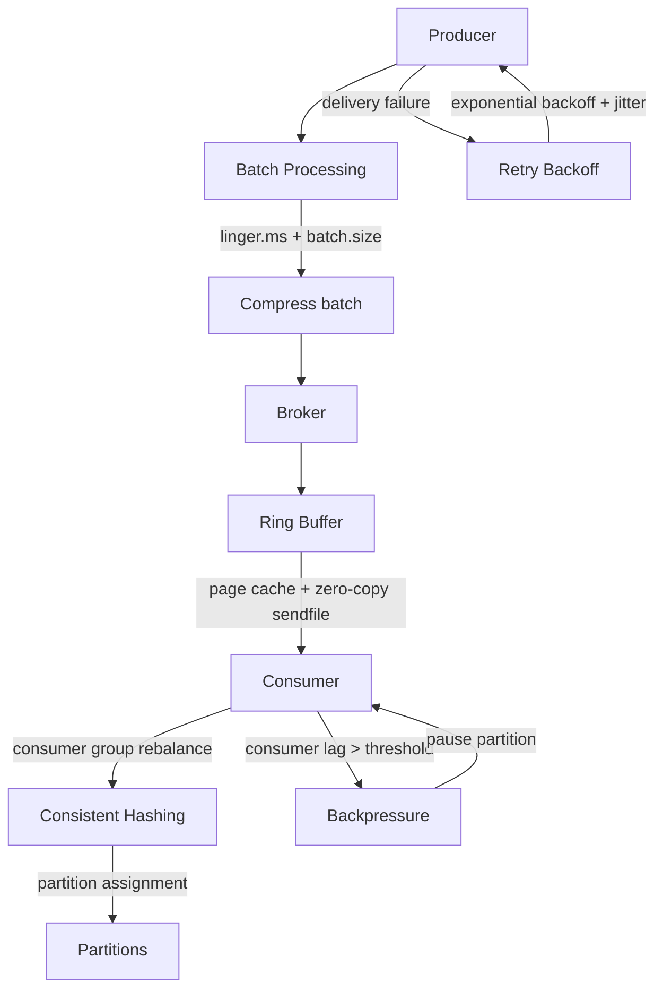

# How Patterns Connect

These patterns don't exist in isolation. The most interesting insight is how production systems **compose** them together.

## React: Five Patterns in One Render Cycle

React's reconciler is a masterclass in pattern composition. Here's how the five patterns from this collection work together in a single render cycle:

| Step | Pattern | What happens |
|------|---------|-------------|
| 1 | **Min Heap** | `setState` enqueues an update. The scheduler's min heap picks the task with the earliest expiration time. |
| 2 | **Cooperative Scheduling** | `workLoopConcurrent` processes fibers one by one, checking `shouldYieldToHost()` every iteration. If 5ms have passed, it yields and reschedules. |
| 3 | **Diff / Patch** | For each fiber, `reconcileChildFibers` diffs the old and new children, deciding which to keep, insert, or delete. |
| 4 | **Bitmask** | Side effects are recorded as bit flags (`Placement \| Update \| Ref`). `subtreeFlags` bubble up via OR so the commit phase can skip clean subtrees. |
| 5 | **Double Buffering** | React maintains two fiber trees — `current` and `workInProgress`. After all work is done, they swap atomically. The old current becomes the new workInProgress (recycled, not GC'd). |

## Redis: Speed Through Data Structure Composition

Redis achieves single-threaded performance that rivals multi-threaded databases by choosing the right data structure pattern for each job.

```mermaid
flowchart TD
    subgraph "Sorted Sets"
        SL["Skip List"] -->|"O(log N) range queries"| ZRANGE["ZRANGEBYSCORE"]
    end
    subgraph "Key Eviction"
        LRU["LRU Cache"] -->|"approximate LRU sampling"| EVICT["maxmemory-policy"]
    end
    subgraph "Key Lookup"
        TRIE["Trie / RAX"] -->|"compressed radix tree"| CLUSTER["Cluster slot routing"]
    end
    subgraph "Probabilistic"
        BF["Bloom Filter"] -->|"BF.EXISTS O(1)"| MODULE["RedisBloom module"]
    end
    subgraph "Throughput"
        BATCH["Batch Processing"] -->|"pipeline N commands"| PIPE["PIPELINE / MULTI"]
    end
```

| Pattern | Where in Redis | Why |
|---------|---------------|-----|
| **Skip List** | Sorted sets (`zset`) — `t_zset.c` | Enables O(log N) insert + range queries. Simpler to implement than balanced trees, with comparable performance. |
| **LRU Cache** | `maxmemory-policy allkeys-lru` — `evict.c` | Approximated LRU via random sampling of 5 keys. Avoids the overhead of a true LRU linked list on every access. |
| **Trie (RAX)** | Cluster key-slot routing, Streams — `rax.c` | Compressed radix tree (RAX) for memory-efficient prefix lookups across cluster routing tables. |
| **Bloom Filter** | RedisBloom module — `BF.ADD`, `BF.EXISTS` | O(1) membership test before expensive lookups. Used to avoid cache penetration. |
| **Batch Processing** | `PIPELINE`, `MULTI/EXEC` | Batch N commands into one network round-trip. Amortizes syscall overhead, achieving 500K+ ops/sec. |

## Go Runtime: Scheduling and Memory at Scale

The Go runtime is a micro-operating system that manages millions of goroutines. Nearly every pattern here appears in its design.

| Pattern | Where in Go Runtime | Why |
|---------|-------------------|-----|
| **Work Stealing** | `proc.go:findRunnable()` — each P has a local run queue; idle Ps steal from busy Ps | Balances goroutine scheduling across OS threads without a global lock. |
| **Free List** | `mcache.go` — per-P free lists organized by 67 size classes | O(1) small object allocation without contention. Each P has its own cache. |
| **Semaphore** | `sema.go:semacquire/semrelease` — used by `sync.Mutex`, `sync.WaitGroup` | Counting semaphore with treap-based wait queue for fairness. |
| **Cooperative Scheduling** | `proc.go:goschedImpl` — goroutines yield at function prologues | Combined with async preemption since Go 1.14 for loops without calls. |
| **Object Pool** | `sync.Pool` — per-P private + shared pools with victim cache | Amortizes allocation cost. Cleared every two GC cycles via victim cache. |
| **Min Heap** | `time.go` — per-P timer heaps (Go 1.14+) | Moved from single global heap to per-P heaps to reduce lock contention. |

## Linux Kernel: The Pattern Motherlode

The Linux kernel has 30+ years of optimization. These patterns appear across subsystems:

```mermaid
flowchart TD
    subgraph "Permissions & Flags"
        BM["Bitmask"] -->|"file mode bits"| STAT["chmod 755 = rwxr-xr-x"]
        BM -->|"capability flags"| CAP["CAP_NET_ADMIN"]
    end
    subgraph "Scheduling"
        HEAP["Min Heap"] -->|"timer wheel"| HRTIMER["hrtimer"]
        SM["State Machine"] -->|"process lifecycle"| TASK["TASK_RUNNING → TASK_INTERRUPTIBLE → ..."]
    end
    subgraph "IPC & I/O"
        RB["Ring Buffer"] -->|"lockless producer-consumer"| PERF["perf_event, io_uring"]
        BP["Backpressure"] -->|"TCP window, cgroups"| FLOW["Flow control"]
    end
    subgraph "Memory"
        FL2["Free List"] -->|"SLAB/SLUB allocator"| KMEM["kmalloc per-CPU caches"]
        SEM2["Semaphore"] -->|"rw_semaphore"| VFS["VFS inode locking"]
    end
    subgraph "Routing"
        TRIE2["Trie"] -->|"LC-trie"| FIB["IP routing table (fib_trie)"]
    end
```

| Pattern | Where in Linux | Why |
|---------|---------------|-----|
| **Bitmask** | `stat.h` file permission bits, `capability.h` flags, `GFP_*` allocation flags | Encode multiple boolean states in a single integer. Used everywhere from syscall flags to memory allocation. |
| **Min Heap** | `lib/min_heap.h` — used by `perf_event`, `hrtimer` | Generic min heap since 5.8. Replaces ad-hoc sorted structures for timer management. |
| **Ring Buffer** | `io_uring` submission/completion queues, `perf` event buffer, `ftrace` | Zero-copy, lockless data passing between kernel and userspace. `io_uring` uses paired ring buffers for async I/O. |
| **State Machine** | Process states (`TASK_RUNNING`, `TASK_INTERRUPTIBLE`, etc.), TCP states, device power states | Every lifecycle in the kernel is modeled as an explicit state machine with defined transitions. |
| **Semaphore** | `rw_semaphore` for VFS, `struct semaphore` for driver synchronization | Reader-writer semaphores allow concurrent reads while serializing writes. |
| **Free List** | SLAB/SLUB allocator — per-CPU free lists by object size | O(1) kernel object allocation. Per-CPU caches eliminate cross-CPU lock contention. |
| **Trie** | `fib_trie.c` — LC-trie (level-compressed trie) for IPv4 routing | Longest-prefix match in O(W) where W is address width. Handles millions of routes. |
| **Backpressure** | TCP receive window, cgroups memory limits, `SO_RCVBUF` | Prevents fast producers from overwhelming slow consumers at every layer of the network stack. |

## PostgreSQL: ACID Through Pattern Composition

PostgreSQL achieves ACID guarantees by composing four patterns into a cohesive transaction engine.

| Pattern | Where in PostgreSQL | Why |
|---------|-------------------|-----|
| **MVCC** | `heapam.c` — each tuple carries `xmin`/`xmax` transaction IDs | Readers never block writers. Each transaction sees a consistent snapshot without locks. |
| **Write-Ahead Log** | `xlog.c` — all changes logged to WAL before page modification | Crash recovery replays WAL to reconstruct committed state. Also enables replication. |
| **LRU Cache** | `bufmgr.c` — `shared_buffers` with clock-sweep eviction | 8KB page cache. Clock-sweep approximates LRU with lower overhead than true LRU. |
| **Bloom Filter** | `contrib/bloom` — bloom index access method | Multi-column equality filter using signature-based indexing. Separate from the visibility map (a simple per-page bitmap used by VACUUM). |

## Kafka: Throughput Through Batching and Flow Control

Kafka achieves millions of messages/sec by composing patterns at every layer of its pipeline.

| Pattern | Where in Kafka | Why |
|---------|---------------|-----|
| **Batch Processing** | Producer `RecordAccumulator` — batches by `linger.ms` and `batch.size` | Amortizes network overhead. A single batch can carry thousands of records in one request. |
| **Ring Buffer** | Broker relies on OS page cache as a circular buffer; `sendfile()` zero-copy to consumers | Log-structured storage is essentially an append-only ring (with retention policy). |
| **Backpressure** | Consumer `max.poll.records`, `pause()`/`resume()` per partition | Prevents slow consumers from falling behind and triggering rebalances. |
| **Retry Backoff** | Producer `retries` + `retry.backoff.ms`, consumer offset commit retries | Exponential backoff with configurable jitter to avoid thundering herd on broker recovery. |
| **Consistent Hashing** | Partition assignment — `DefaultPartitioner` hashes keys to partitions | Ensures key ordering within a partition. Adding partitions redistributes minimally. |

## The Bigger Picture

Understanding individual patterns is useful. Understanding how they **compose** is what separates a senior engineer from a junior one.

When you see a performance problem, you don't think "I need a bitmask." You think "I need to track multiple states cheaply (bitmask), skip work that hasn't changed (subtree flags), process work incrementally (cooperative scheduling), prioritize urgent work (min heap), and avoid allocation on the hot path (double buffering)."

That's what React's team built. That's what Redis, Go, Linux, PostgreSQL, and Kafka all demonstrate. The same patterns recombine in different configurations to solve different problems.

## Summary: Patterns Across Systems

| Pattern | React | Redis | Go Runtime | Linux | PostgreSQL | Kafka |
|---------|:-----:|:-----:|:----------:|:-----:|:----------:|:-----:|
| **Bitmask** | ✅ | | ✅ | ✅ | | |
| **Min Heap** | ✅ | | ✅ | ✅ | | |
| **Cooperative Scheduling** | ✅ | | ✅ | | | |
| **Diff / Patch** | ✅ | | | | | |
| **Double Buffering** | ✅ | | | | | |
| **Batch Processing** | ✅ | ✅ | | ✅ | | ✅ |
| **Dirty Flag** | ✅ | | | | | |
| **Observer** | ✅ | | | | | |
| **Skip List** | | ✅ | | | | |
| **LRU Cache** | | ✅ | ✅ | | ✅ | |
| **Trie** | | ✅ | | ✅ | | |
| **Bloom Filter** | | ✅ | | | ✅ | |
| **Work Stealing** | | | ✅ | | | |
| **Free List** | | | ✅ | ✅ | | |
| **Semaphore** | | | ✅ | ✅ | | |
| **Object Pool** | | | ✅ | | | |
| **Rate Limiter** | | | ✅ | ✅ | | |
| **Arena Allocator** | | | ✅ | | | |
| **State Machine** | | | | ✅ | | |
| **Ring Buffer** | | | | ✅ | | ✅ |
| **Backpressure** | | | | ✅ | | ✅ |
| **Vtable** | | | | ✅ | | |
| **Reference Counting** | | | | ✅ | | |
| **MVCC** | | | | | ✅ | |
| **Write-Ahead Log** | | | | | ✅ | |
| **Retry Backoff** | | | | | | ✅ |
| **Consistent Hashing** | | | ✅ | | | ✅ |
