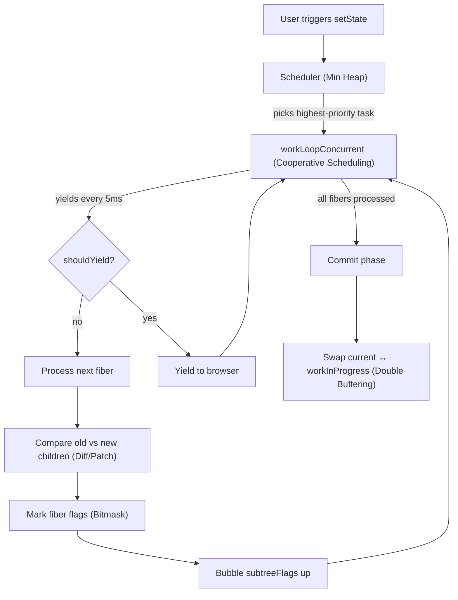

# How Patterns Connect

These patterns don't exist in isolation. The most interesting insight is how production systems **compose** them together.

## React: All Five Patterns in One System

React's reconciler is a masterclass in pattern composition. Here's how the five patterns from this collection work together in a single render cycle:

| Step | Pattern | What happens |
|------|---------|-------------|
| 1 | **Min Heap** | `setState` enqueues an update. The scheduler's min heap picks the task with the earliest expiration time. |
| 2 | **Cooperative Scheduling** | `workLoopConcurrent` processes fibers one by one, checking `shouldYieldToHost()` every iteration. If 5ms have passed, it yields and reschedules. |
| 3 | **Diff / Patch** | For each fiber, `reconcileChildFibers` diffs the old and new children, deciding which to keep, insert, or delete. |
| 4 | **Bitmask** | Side effects are recorded as bit flags (`Placement \| Update \| Ref`). `subtreeFlags` bubble up via OR so the commit phase can skip clean subtrees. |
| 5 | **Double Buffering** | React maintains two fiber trees — `current` and `workInProgress`. After all work is done, they swap atomically. The old current becomes the new workInProgress (recycled, not GC'd). |

## Why This Matters

Understanding individual patterns is useful. Understanding how they **compose** is what separates a senior engineer from a junior one.

When you see a performance problem, you don't think "I need a bitmask." You think "I need to track multiple states cheaply (bitmask), skip work that hasn't changed (subtree flags), process work incrementally (cooperative scheduling), prioritize urgent work (min heap), and avoid allocation on the hot path (double buffering)."

That's what React's team built. That's what you can learn from here.
