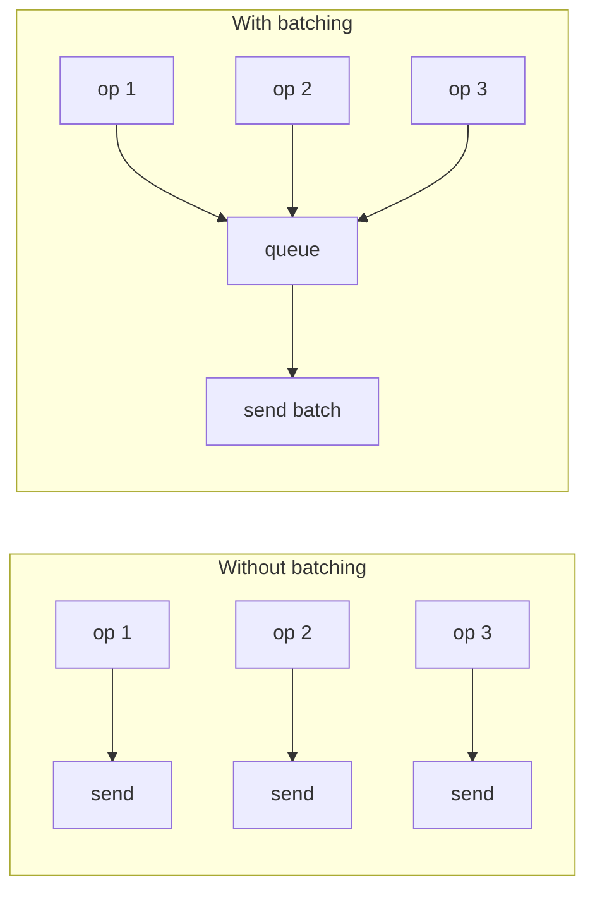

# Pattern: Batch Processing

## One Liner

Accumulate individual operations and execute them together as a group, amortizing per-operation overhead across the batch.

## Core Idea

Instead of processing each item individually (N round-trips, N context switches), batch processing collects items and processes them in one go. The trade-off: slightly higher latency for individual items, dramatically higher throughput overall.



## Production Proof

| Project | Source | Usage |
|---------|--------|-------|
| Apache Kafka | [RecordAccumulator.java#L69-L120](https://github.com/apache/kafka/blob/trunk/clients/src/main/java/org/apache/kafka/clients/producer/internals/RecordAccumulator.java#L69-L120) | The Kafka producer accumulates records into batches per partition. `append()` (line 280) adds records to the current batch; the sender thread drains ready batches. This is how Kafka achieves millions of messages/sec. |
| Linux Kernel | [blk-merge.c#L350-L395](https://github.com/torvalds/linux/blob/master/block/blk-merge.c#L350-L395) | `blk_attempt_req_merge` — the block layer merges adjacent I/O requests into batched operations, amortizing seek time. Checks if two requests have contiguous sectors and compatible flags before merging. |

::: info Note
React's `setState` batching is another well-known example — multiple `setState` calls within the same event handler are batched into a single re-render.
:::

## Implementation

::: code-group

```typescript [TypeScript]
class BatchProcessor<T, R> {
  private queue: Array<{ item: T; resolve: (r: R) => void }> = [];
  private timer: ReturnType<typeof setTimeout> | null = null;

  constructor(
    private processBatch: (items: T[]) => Promise<R[]>,
    private maxSize: number = 10,
    private maxWaitMs: number = 50,
  ) {}

  async add(item: T): Promise<R> {
    return new Promise<R>((resolve) => {
      this.queue.push({ item, resolve });
      if (this.queue.length >= this.maxSize) {
        this.flush();
      } else if (!this.timer) {
        this.timer = setTimeout(() => this.flush(), this.maxWaitMs);
      }
    });
  }

  private async flush(): Promise<void> {
    if (this.timer) { clearTimeout(this.timer); this.timer = null; }
    const batch = this.queue.splice(0);
    if (batch.length === 0) return;
    const results = await this.processBatch(batch.map((b) => b.item));
    batch.forEach((b, i) => b.resolve(results[i]!));
  }
}
```

```python [Python]
import asyncio
from typing import TypeVar, Callable, Awaitable

T = TypeVar("T")
R = TypeVar("R")

class BatchProcessor:
    def __init__(self, process_batch, max_size=10, max_wait=0.05):
        self._process = process_batch
        self._max_size = max_size
        self._max_wait = max_wait
        self._queue = []
        self._timer = None

    async def add(self, item):
        future = asyncio.get_event_loop().create_future()
        self._queue.append((item, future))
        if len(self._queue) >= self._max_size:
            await self._flush()
        elif not self._timer:
            self._timer = asyncio.get_event_loop().call_later(
                self._max_wait, lambda: asyncio.ensure_future(self._flush()))
        return await future

    async def _flush(self):
        if self._timer: self._timer.cancel(); self._timer = None
        batch = self._queue[:]; self._queue.clear()
        results = await self._process([item for item, _ in batch])
        for (_, future), result in zip(batch, results):
            future.set_result(result)
```

```go [Go]
type BatchProcessor[T any, R any] struct {
	queue   []batchEntry[T, R]
	process func([]T) []R
	maxSize int
	mu      sync.Mutex
}

type batchEntry[T any, R any] struct {
	item T
	ch   chan R
}

func (bp *BatchProcessor[T, R]) Add(item T) R {
	bp.mu.Lock()
	ch := make(chan R, 1)
	bp.queue = append(bp.queue, batchEntry[T, R]{item, ch})
	if len(bp.queue) >= bp.maxSize {
		bp.flush()
	}
	bp.mu.Unlock()
	return <-ch
}

func (bp *BatchProcessor[T, R]) flush() {
	items := make([]T, len(bp.queue))
	for i, e := range bp.queue { items[i] = e.item }
	results := bp.process(items)
	for i, e := range bp.queue { e.ch <- results[i] }
	bp.queue = bp.queue[:0]
}
```

:::

## Exercises

| Level | Exercise | File |
|-------|----------|------|
| Basic | Implement a batch processor with size-based flushing | `exercises/typescript/batch-processing/01-basic.test.ts` |
| Intermediate | Timeout flush — flush on size OR time, whichever comes first | `exercises/typescript/batch-processing/02-intermediate.test.ts` |

Run exercises: `pnpm test`

## When to Use

- **Database writes** — batch INSERT instead of N individual INSERTs
- **API calls** — batch GraphQL/REST requests to reduce round-trips
- **Message queues** — Kafka, SQS batch send/receive
- **UI updates** — React batched setState, browser layout batching
- **Network I/O** — TCP Nagle's algorithm, HTTP/2 multiplexing

## When NOT to Use

- **Latency-critical** — batching adds delay; if every millisecond matters, process immediately
- **Small volume** — if you rarely have more than 1 item, batching adds complexity for no gain
- **Partial failure isolation** — if one item in a batch fails, you need retry/dead-letter logic for the whole batch; individual processing is simpler when failure isolation matters
- **Unbounded memory** — without size limits, batches can grow during traffic spikes and OOM the process

## More Production Uses

- React `unstable_batchedUpdates`
- [DataLoader](https://github.com/graphql/dataloader) — GraphQL N+1
- [Redis](https://github.com/redis/redis) — Pipeline
- [Elasticsearch](https://github.com/elastic/elasticsearch) — Bulk API

## Challenge Questions

::: details Q1: Your batch processor uses maxSize=100 and maxWaitMs=50ms. Traffic drops to 1 request/second. What happens, and how do you fix it?
**Answer:** Each request waits the full 50ms timeout before flushing a batch of 1, adding unnecessary latency.

The timeout triggers with just a single item in the queue because the batch never reaches 100 items. The fix is to make the batch size and/or timeout adaptive -- for example, flush immediately when the queue has been idle, or use a shorter timeout when the queue depth is low. Kafka's `linger.ms` works this way: it only delays if there are more records expected.
:::

::: details Q2: A batch of 100 database inserts fails because row 57 violates a unique constraint. What should happen to the other 99 rows?
**Answer:** It depends on whether you need atomicity. If the batch runs in a single transaction, all 100 rows roll back. If not, you need per-item error handling.

The common production approach is to return a result array with per-item success/failure status (like Elasticsearch's Bulk API does). This lets callers retry only the failed items. If you wrap the entire batch in one transaction for atomicity, a single bad row kills the whole batch -- which is simpler but wastes work.
:::

::: details Q3: You have both a size trigger (maxSize=50) and a time trigger (maxWaitMs=100ms). A burst of 200 items arrives in 10ms. How many batches fire, and when?
**Answer:** Four batches of 50 fire immediately, all within that 10ms burst. The time trigger never activates.

The size trigger takes priority whenever the queue reaches maxSize. As items pour in, the queue hits 50, flushes, hits 50 again, flushes, and so on. The timer is only relevant when the queue has items but hasn't reached maxSize -- it's a "don't wait forever" safety net, not the primary trigger under load.
:::

::: details Q4: Why does Kafka batch per-partition rather than using a single global batch across all partitions?
**Answer:** Because each partition is an independent append-only log on a specific broker. A single cross-partition batch would need to be split at send time anyway.

Batching per-partition means each batch maps to exactly one network request to one broker, keeping the I/O path simple. It also preserves per-partition ordering guarantees. A global batch would require grouping by destination at flush time, adding complexity with no throughput benefit.
:::
