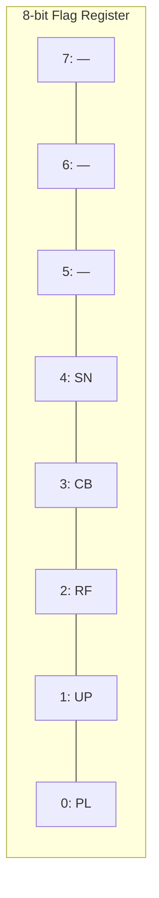

# Pattern: Bitmask

## One Liner

Pack multiple boolean flags into a single integer and manipulate them with bitwise operators for constant-time set operations.

## Core Idea

Instead of using an array of booleans or an object with multiple fields, a bitmask encodes each flag as a single bit in an integer. This gives you O(1) set/check/clear/toggle and trivial combination of multiple flags.



| Bit | Flag | Value | Binary |
|-----|------|-------|--------|
| 0 | Placement | `1 << 0` | `00000001` |
| 1 | Update | `1 << 1` | `00000010` |
| 2 | Ref | `1 << 2` | `00000100` |
| 3 | Callback | `1 << 3` | `00001000` |
| 4 | Snapshot | `1 << 4` | `00010000` |

| Operation | Syntax | Effect |
|-----------|--------|--------|
| Set flag | `flags \|= FLAG` | OR turns bit on |
| Check flag | `flags & FLAG` | AND isolates bit |
| Clear flag | `flags &= ~FLAG` | AND NOT turns bit off |
| Toggle flag | `flags ^= FLAG` | XOR flips bit |
| Combine | `flags \|= A \| B` | OR merges multiple flags |

Key insight: a single `&` operation can check any combination of flags simultaneously — no loops, no branching.

## Production Proof

| Project | Source | Usage |
|---------|--------|-------|
| React | [ReactFiberFlags.js#L14-L36](https://github.com/facebook/react/blob/main/packages/react-reconciler/src/ReactFiberFlags.js#L14-L36) | Side-effect flags on fiber nodes — tracks which effects (Placement, Update, Deletion, Ref, etc.) are pending on each fiber during reconciliation |
| Linux Kernel | [stat.h#L25-L33](https://github.com/torvalds/linux/blob/master/include/uapi/linux/stat.h#L25-L33) | File permission bits — the classic `rwxrwxrwx` (read/write/execute for owner/group/other) encoded as a 9-bit mask |
| Go stdlib | [types.go#L32-L46](https://github.com/golang/go/blob/master/src/os/types.go#L32-L46) | `os.FileMode` — Go's file mode bits mirror Unix permission flags using typed constants with iota bit-shifting |

## Implementation

::: code-group

```typescript [TypeScript]
// Define flags as powers of 2
const Flags = {
  Read:    1 << 0,  // 0b0001
  Write:   1 << 1,  // 0b0010
  Execute: 1 << 2,  // 0b0100
  Delete:  1 << 3,  // 0b1000
} as const;

type FlagSet = number;

const hasFlag = (set: FlagSet, flag: number): boolean =>
  (set & flag) === flag;

const hasAny = (set: FlagSet, mask: number): boolean =>
  (set & mask) !== 0;

const setFlag = (set: FlagSet, flag: number): FlagSet =>
  set | flag;

const clearFlag = (set: FlagSet, flag: number): FlagSet =>
  set & ~flag;

const toggleFlag = (set: FlagSet, flag: number): FlagSet =>
  set ^ flag;

// Usage: combine multiple flags
const editorPerms = Flags.Read | Flags.Write;
hasFlag(editorPerms, Flags.Read);    // true
hasFlag(editorPerms, Flags.Delete);  // false
```

```rust [Rust]
// Idiomatic Rust: typed constants, bitwise ops on u32
pub const READ:    u32 = 1 << 0;
pub const WRITE:   u32 = 1 << 1;
pub const EXECUTE: u32 = 1 << 2;
pub const DELETE:  u32 = 1 << 3;

pub fn has_flag(flags: u32, flag: u32) -> bool {
    (flags & flag) == flag
}

pub fn has_any(flags: u32, mask: u32) -> bool {
    (flags & mask) != 0
}

pub fn set_flag(flags: u32, flag: u32) -> u32 {
    flags | flag
}

pub fn clear_flag(flags: u32, flag: u32) -> u32 {
    flags & !flag
}

pub fn toggle_flag(flags: u32, flag: u32) -> u32 {
    flags ^ flag
}

// Usage
let editor = READ | WRITE;
assert!(has_flag(editor, READ));     // true
assert!(!has_flag(editor, DELETE));  // false
```

```go [Go]
// Idiomatic Go: typed constants with iota
type Permission uint32

const (
    Read    Permission = 1 << iota // 0b0001
    Write                          // 0b0010
    Execute                        // 0b0100
    Delete                         // 0b1000
)

func HasFlag(flags, flag Permission) bool {
    return flags&flag == flag
}

func HasAny(flags, mask Permission) bool {
    return flags&mask != 0
}

func SetFlag(flags, flag Permission) Permission {
    return flags | flag
}

func ClearFlag(flags, flag Permission) Permission {
    return flags &^ flag // Go's AND NOT operator
}

func ToggleFlag(flags, flag Permission) Permission {
    return flags ^ flag
}

// Usage
editor := Read | Write
HasFlag(editor, Read)    // true
HasFlag(editor, Delete)  // false
```

```python [Python]
# Python: native bitwise operators, no size limit on integers
READ    = 1 << 0  # 0b0001
WRITE   = 1 << 1  # 0b0010
EXECUTE = 1 << 2  # 0b0100
DELETE  = 1 << 3  # 0b1000

def has_flag(flags: int, flag: int) -> bool:
    return (flags & flag) == flag

def has_any(flags: int, mask: int) -> bool:
    return (flags & mask) != 0

def set_flag(flags: int, flag: int) -> int:
    return flags | flag

def clear_flag(flags: int, flag: int) -> int:
    return flags & ~flag

def toggle_flag(flags: int, flag: int) -> int:
    return flags ^ flag

# Usage
editor = READ | WRITE
assert has_flag(editor, READ)       # True
assert not has_flag(editor, DELETE)  # True
```

:::

## Exercises

| Level | Exercise | File |
|-------|----------|------|
| Basic | Fundamental bitwise flag operations (set, check, clear, toggle) | `exercises/typescript/bitmask/01-basic.test.ts` |
| Intermediate | Build a role-based permission system | `exercises/typescript/bitmask/02-permission-system.test.ts` |
| Advanced | React-style fiber flags with subtree bubbling | `exercises/typescript/bitmask/03-react-flags.test.ts` |

Run exercises: `pnpm test` (TypeScript) · `cargo test` (Rust) · `go test ./...` (Go)

## When to Use

- **Multiple boolean flags on a hot path** — one integer instead of N booleans saves memory and enables batch operations
- **Combinatorial state** — when you need to check "any of these" or "all of these" in one operation
- **Serialization** — a single integer is trivial to store, transmit, and compare
- **Permission systems** — the Unix `rwx` model is a bitmask for a reason
- **ECS (Entity Component System)** — component membership masks in game engines

## When NOT to Use

- **More than 32 flags** — JavaScript's bitwise operators work on 32-bit integers; beyond that, use `BigInt` or a `Set`
- **Mutually exclusive states** — if only one value can be active at a time, use an `enum` instead
- **Readability matters more than performance** — named boolean fields are clearer to most developers
- **Dynamic flag sets** — if the set of possible flags is not known at compile time, use a `Set<string>`

## Try It

<script setup>
const bitmaskLangs = {
  typescript: `// Define permission flags as powers of 2
var READ    = 1 << 0;  // 0b0001
var WRITE   = 1 << 1;  // 0b0010
var EXECUTE = 1 << 2;  // 0b0100
var DELETE  = 1 << 3;  // 0b1000

// Combine flags with OR
var editor = READ | WRITE;

// Check with AND
assert((editor & READ) !== 0, "editor has READ");
assert((editor & WRITE) !== 0, "editor has WRITE");
assert((editor & EXECUTE) === 0, "editor does NOT have EXECUTE");

// Check all flags at once
var required = READ | WRITE;
assertEquals((editor & required) === required, true, "editor has all required permissions");

// Clear a flag with AND NOT
editor = editor & ~WRITE;
assert((editor & WRITE) === 0, "WRITE cleared");

// Toggle with XOR
editor = editor ^ EXECUTE;
assert((editor & EXECUTE) !== 0, "EXECUTE toggled on");
editor = editor ^ EXECUTE;
assert((editor & EXECUTE) === 0, "EXECUTE toggled off");

console.log("All assertions passed!");`,
  python: `# Define permission flags as powers of 2
READ    = 1 << 0  # 0b0001
WRITE   = 1 << 1  # 0b0010
EXECUTE = 1 << 2  # 0b0100
DELETE  = 1 << 3  # 0b1000

# Combine flags with OR
editor = READ | WRITE

# Check with AND
assert editor & READ,     "editor has READ"
assert editor & WRITE,    "editor has WRITE"
assert not (editor & EXECUTE), "editor does NOT have EXECUTE"

# Check all flags at once
required = READ | WRITE
assert (editor & required) == required, "editor has all required"

# Clear a flag with AND NOT
editor = editor & ~WRITE
assert not (editor & WRITE), "WRITE cleared"

# Toggle with XOR
editor = editor ^ EXECUTE
assert editor & EXECUTE, "EXECUTE toggled on"
editor = editor ^ EXECUTE
assert not (editor & EXECUTE), "EXECUTE toggled off"

print("All assertions passed!")`
};
</script>

<CodePlayground title="Bitmask Playground" :languages="bitmaskLangs" />
