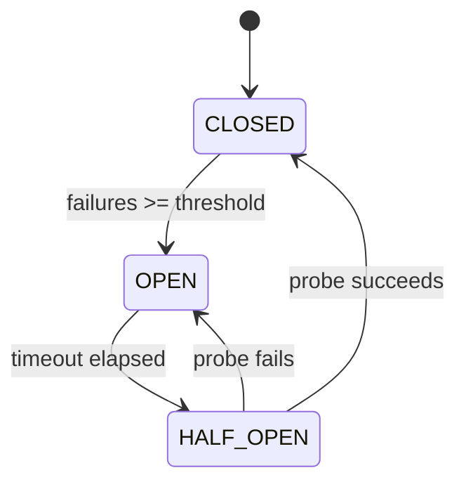

# Pattern: Circuit Breaker

## One Liner

Stop calling a failing service by tracking errors and tripping open — fail fast instead of piling up timeouts.

## Core Idea

A circuit breaker wraps remote calls with a state machine that has three states. In the **closed** state, calls pass through normally. After a threshold of consecutive failures, the breaker **trips open** and all calls fail immediately without attempting the operation. After a cooldown period, the breaker enters the **half-open** state, allowing one probe call to test if the downstream service has recovered.



| State | Behavior |
|-------|----------|
| CLOSED | Calls pass through. Count consecutive failures. |
| OPEN | Calls fail immediately (`CircuitOpenError`). Timer running. |
| HALF_OPEN | Allow one probe call. Success → CLOSED. Failure → OPEN. |

## Production Proof

| Project | Source | Usage |
|---------|--------|-------|
| Netflix Hystrix | [HystrixCircuitBreaker.java#L138-L289](https://github.com/Netflix/Hystrix/blob/master/hystrix-core/src/main/java/com/netflix/hystrix/HystrixCircuitBreaker.java#L138-L289) | `HystrixCircuitBreakerImpl` — the canonical circuit breaker. Three-state enum (L142), `markSuccess`/`markNonSuccess` for HALF_OPEN transitions (L204-L224), `attemptExecution` for OPEN→HALF_OPEN via `compareAndSet` after sleep window (L264-L289). Used across Netflix's entire microservice fleet. |
| Sony gobreaker | [gobreaker.go#L117-L131](https://github.com/sony/gobreaker/blob/master/gobreaker.go#L117-L131) | `CircuitBreaker` struct with state, generation counter, counts, and mutex. `onSuccess`/`onFailure` (L310-L332) drive transitions; generation-based staleness detection (L334-L380) prevents acting on stale state reads. Production use at Sony. |

## Implementation

::: code-group

```typescript [TypeScript]
type State = 'CLOSED' | 'OPEN' | 'HALF_OPEN';

class CircuitBreaker {
  private state: State = 'CLOSED';
  private failureCount = 0;
  private lastFailureTime = 0;

  constructor(
    private threshold: number,
    private resetTimeout: number,
  ) {}

  getState(): State {
    if (this.state === 'OPEN' && Date.now() - this.lastFailureTime >= this.resetTimeout) {
      this.state = 'HALF_OPEN';
    }
    return this.state;
  }

  async call<T>(fn: () => Promise<T>): Promise<T> {
    if (this.getState() === 'OPEN') throw new Error('Circuit is OPEN');
    try {
      const result = await fn();
      this.failureCount = 0;
      this.state = 'CLOSED';
      return result;
    } catch (err) {
      this.failureCount++;
      this.lastFailureTime = Date.now();
      if (this.failureCount >= this.threshold) this.state = 'OPEN';
      throw err;
    }
  }
}
```

```go [Go]
type State int

const (
	StateClosed   State = iota
	StateOpen
	StateHalfOpen
)

type CircuitBreaker struct {
	threshold    int
	resetTimeout int64
	state        State
	failureCount int
	lastFailure  int64
}

func NewCircuitBreaker(threshold int, resetTimeoutMs int64) *CircuitBreaker {
	return &CircuitBreaker{threshold: threshold, resetTimeout: resetTimeoutMs}
}

func now() int64 { return time.Now().UnixMilli() }

func (cb *CircuitBreaker) GetState() State {
	if cb.state == StateOpen && now()-cb.lastFailure >= cb.resetTimeout {
		cb.state = StateHalfOpen
	}
	return cb.state
}

func (cb *CircuitBreaker) Call(fn func() error) error {
	if cb.GetState() == StateOpen {
		return fmt.Errorf("circuit is OPEN")
	}
	if err := fn(); err != nil {
		cb.failureCount++
		cb.lastFailure = now()
		if cb.failureCount >= cb.threshold {
			cb.state = StateOpen
		}
		return err
	}
	cb.failureCount = 0
	cb.state = StateClosed
	return nil
}
```

```python [Python]
import time

class CircuitBreaker:
    def __init__(self, threshold: int = 5, reset_timeout: float = 30.0):
        self.threshold = threshold
        self.reset_timeout = reset_timeout
        self.state = "CLOSED"
        self.failure_count = 0
        self.last_failure_time = 0.0

    def get_state(self) -> str:
        if self.state == "OPEN" and time.time() - self.last_failure_time >= self.reset_timeout:
            self.state = "HALF_OPEN"
        return self.state

    def call(self, fn):
        if self.get_state() == "OPEN":
            raise RuntimeError("Circuit is OPEN")
        try:
            result = fn()
            self.failure_count = 0
            self.state = "CLOSED"
            return result
        except Exception:
            self.failure_count += 1
            self.last_failure_time = time.time()
            if self.failure_count >= self.threshold:
                self.state = "OPEN"
            raise
```

```rust [Rust]
use std::time::Instant;

pub enum State { Closed, Open, HalfOpen }

pub struct CircuitBreaker {
    threshold: u32,
    reset_timeout_ms: u128,
    state: State,
    failure_count: u32,
    last_failure: Option<Instant>,
}

impl CircuitBreaker {
    pub fn new(threshold: u32, reset_timeout_ms: u128) -> Self {
        CircuitBreaker {
            threshold, reset_timeout_ms,
            state: State::Closed, failure_count: 0, last_failure: None,
        }
    }

    pub fn get_state(&mut self) -> &State {
        if let State::Open = self.state {
            if let Some(t) = self.last_failure {
                if t.elapsed().as_millis() >= self.reset_timeout_ms {
                    self.state = State::HalfOpen;
                }
            }
        }
        &self.state
    }

    pub fn call<T, E>(&mut self, f: impl FnOnce() -> Result<T, E>) -> Result<T, String>
    where E: std::fmt::Display {
        if matches!(self.get_state(), State::Open) {
            return Err("Circuit is OPEN".into());
        }
        match f() {
            Ok(v) => { self.failure_count = 0; self.state = State::Closed; Ok(v) }
            Err(e) => {
                self.failure_count += 1;
                self.last_failure = Some(Instant::now());
                if self.failure_count >= self.threshold { self.state = State::Open; }
                Err(e.to_string())
            }
        }
    }
}
```

:::

## Exercises

| Level | Exercise | File |
|-------|----------|------|
| Basic | Implement a circuit breaker with three states | `exercises/typescript/circuit-breaker/01-basic.test.ts` |

Run exercises: `pnpm test`

## When to Use

- **Microservice calls** — prevent cascading failures when a downstream service goes down
- **Database connections** — stop hammering a database that's overloaded
- **External APIs** — handle third-party service outages gracefully
- **Shared resources** — protect any shared resource that can become temporarily unavailable

## When NOT to Use

- **In-process calls** — circuit breakers add overhead; use error handling for local function calls
- **Idempotency not guaranteed** — if retries after half-open can cause duplicates, add deduplication first
- **Single-consumer systems** — if there's only one caller, backoff/retry is simpler than a full state machine
- **Fire-and-forget** — if you don't wait for a response, there's nothing to circuit-break

## More Production Uses

- [resilience4j](https://github.com/resilience4j/resilience4j) — Java circuit breaker for Spring/Micronaut
- [Polly](https://github.com/App-vNext/Polly) — .NET resilience library with circuit breaker policy
- [Envoy Proxy](https://github.com/envoyproxy/envoy) — outlier detection acts as a distributed circuit breaker
- [AWS SDK](https://github.com/aws/aws-sdk-js-v3) — retry with circuit-breaking for service endpoints
