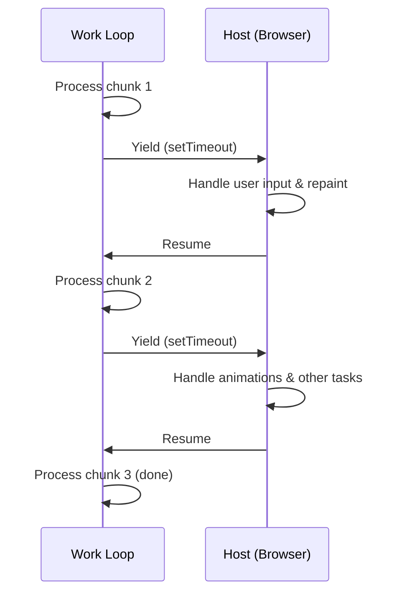

# Pattern: Cooperative Scheduling

## One Liner

Break long-running work into small chunks, yielding control back to the host between each chunk to keep the system responsive.

<DifficultyBadge /> <DemoBadge />

## Real-World Analogy

A meeting facilitator who asks speakers to pause after 5 minutes so others can talk. No one is forcibly cut off — each speaker voluntarily yields. The facilitator keeps the meeting responsive by ensuring no one monopolizes the floor.

## Core Idea

In cooperative scheduling, a task voluntarily checks whether it should pause and let other work run. Unlike preemptive scheduling (where the OS forcibly interrupts), cooperative scheduling relies on the task itself to yield at safe points.



**Without yielding**: one long task blocks everything. **With yielding**: small chunks interleave with UI updates.

The pattern: run a loop, check a deadline after each unit of work, and `yield` if time is up.

**Try it yourself** — start tasks and watch cooperative round-robin scheduling with yielding:

<CooperativeSchedulingViz />

## Production Proof

| Project | Source | Usage |
|---------|--------|-------|
| React | [Scheduler.js#L188-L258](https://github.com/facebook/react/blob/main/packages/scheduler/src/forks/Scheduler.js#L188-L258) | The `workLoop` function processes tasks from a min-heap. At each iteration it calls `shouldYieldToHost()` (line ~447) to check if the 5ms time slice has elapsed — if so, it breaks and schedules a continuation via `MessageChannel`. |
| Go Runtime | [proc.go#L4143-L4200](https://github.com/golang/go/blob/master/src/runtime/proc.go#L4143-L4200) | The `schedule()` function is the goroutine scheduler's main loop. `Gosched()` (line 394) is the voluntary yield point, and `goschedImpl` (line 4315) handles the actual context switch. |

## Implementation

::: code-group

```typescript [TypeScript]
type Task = () => boolean; // returns true if more work remains

interface Scheduler {
  scheduleTask(task: Task): void;
  flush(): void;
}

function createScheduler(yieldInterval: number = 5): Scheduler {
  const queue: Task[] = [];
  let isRunning = false;

  function shouldYield(startTime: number): boolean {
    return performance.now() - startTime >= yieldInterval;
  }

  function workLoop(): void {
    const startTime = performance.now();

    while (queue.length > 0) {
      if (shouldYield(startTime)) {
        // Yield to the host — schedule continuation
        setTimeout(workLoop, 0);
        return;
      }

      const task = queue[0]!;
      const hasMoreWork = task();

      if (!hasMoreWork) {
        queue.shift();
      }
    }

    isRunning = false;
  }

  return {
    scheduleTask(task: Task) {
      queue.push(task);
      if (!isRunning) {
        isRunning = true;
        setTimeout(workLoop, 0);
      }
    },
    flush() {
      while (queue.length > 0) {
        const task = queue[0]!;
        if (!task()) queue.shift();
      }
      isRunning = false;
    },
  };
}
```

```rust [Rust]
use std::time::{Duration, Instant};

pub struct CooperativeScheduler {
    yield_interval: Duration,
}

impl CooperativeScheduler {
    pub fn new(yield_ms: u64) -> Self {
        CooperativeScheduler {
            yield_interval: Duration::from_millis(yield_ms),
        }
    }

    pub fn run<F>(&self, mut work_units: Vec<F>) -> Vec<F>
    where
        F: FnMut() -> bool,
    {
        let start = Instant::now();

        while !work_units.is_empty() {
            if start.elapsed() >= self.yield_interval {
                // Yield: return remaining work to caller
                return work_units;
            }

            let done = (work_units[0])();
            if done {
                work_units.remove(0);
            }
        }

        work_units // empty = all done
    }
}
```

```go [Go]
package scheduling

import "time"

type Task func() bool // returns true when done

type Scheduler struct {
	YieldInterval time.Duration
	queue         []Task
}

func New(yieldInterval time.Duration) *Scheduler {
	return &Scheduler{YieldInterval: yieldInterval}
}

func (s *Scheduler) Schedule(task Task) {
	s.queue = append(s.queue, task)
}

// WorkLoop processes tasks, yielding when the time slice expires.
// Returns true if all work is done, false if yielded.
func (s *Scheduler) WorkLoop() bool {
	start := time.Now()

	for len(s.queue) > 0 {
		if time.Since(start) >= s.YieldInterval {
			return false // yield
		}

		done := s.queue[0]()
		if done {
			s.queue = s.queue[1:]
		}
	}

	return true // all done
}
```

```python [Python]
import time

def work_loop(items, process_item, yield_ms=5):
    """Process items, yielding when time budget exceeded."""
    start = time.monotonic()
    completed = 0

    while completed < len(items):
        elapsed_ms = (time.monotonic() - start) * 1000
        if elapsed_ms >= yield_ms:
            return items[completed:]  # return remaining work

        process_item(items[completed])
        completed += 1

    return []  # all done

# Usage
results = []
remaining = work_loop(
    list(range(100)),
    lambda x: results.append(x * 2),
    yield_ms=5
)
# remaining contains items not yet processed (if any)
```

:::

## Exercises

| Level | Exercise | File |
|-------|----------|------|
| Basic | Implement a time-sliced work loop with yield check | `exercises/typescript/cooperative-scheduling/01-basic.test.ts` |
| Intermediate | Build a priority scheduler that yields between tasks | `exercises/typescript/cooperative-scheduling/02-priority-scheduler.test.ts` |

Run exercises: `pnpm test` (TypeScript) · `cargo test` (Rust) · `go test ./...` (Go) · `pytest` (Python)

Exercise files: Rust `exercises/rust/src/cooperative_scheduling.rs` · Go `exercises/go/cooperative_scheduling_test.go` · Python `exercises/python/test_cooperative_scheduling.py`

## When to Use

- **UI thread work** — keep animations and input responsive while processing large datasets
- **Batch processing** — process items in chunks with pauses for other system work
- **Long computations** — break recursive tree traversals or list operations into resumable chunks
- **Concurrent runtimes** — implement green threads or coroutine scheduling

## When NOT to Use

- **Short tasks** — if the work finishes in < 1ms, the yield overhead isn't worth it
- **Real-time guarantees** — cooperative scheduling can't guarantee deadlines; use preemptive scheduling
- **CPU-bound with no interaction** — if nothing else needs the thread, yielding wastes time
- **When `requestIdleCallback` suffices** — for non-urgent work, the browser's built-in API may be enough

## More Production Uses

- [Lua](https://github.com/lua/lua) — coroutines
- Python [asyncio](https://github.com/python/cpython/tree/main/Lib/asyncio)
- Erlang/BEAM VM — reduction counting
- Unity — coroutines

## Related Patterns

| Pattern | Relationship |
|---------|-------------|
| [Event Loop](/patterns/event-loop/) | Event loops rely on cooperative scheduling — long tasks must yield to keep I/O flowing |
| [Work Stealing](/patterns/work-stealing/) | Cooperative scheduling works within a thread; work stealing distributes across threads |
| [Min Heap](/patterns/min-heap/) | React's scheduler uses a min-heap to select which cooperative task runs next |

## Challenge Questions

::: details Q1: React yields every 5ms. What happens if you increase this to 50ms? What if you decrease it to 0.5ms?
**Answer:** 50ms causes visible UI jank (3 dropped frames at 60fps); 0.5ms wastes most time on yield overhead instead of useful work.

The 5ms target is a sweet spot: short enough that a frame's 16ms budget still has room for browser paint and input handling, but long enough that the scheduler does meaningful work per slice. At 50ms, user input and animations freeze noticeably. At 0.5ms, the overhead of checking the clock, scheduling a `MessageChannel` callback, and re-entering the work loop dominates — you spend more time scheduling than working.
:::

::: details Q2: A cooperatively scheduled task has a bug where it never returns `true` (never signals completion). What happens to the system?
**Answer:** The task monopolizes every time slice forever, starving all other queued tasks.

Unlike preemptive scheduling, the scheduler cannot forcibly remove a misbehaving task. The work loop gives the buggy task CPU time every slice, it runs for 5ms, yields, gets picked up again — endlessly. Other tasks in the queue never execute. This is the fundamental weakness of cooperative scheduling: it trusts tasks to behave. Production schedulers mitigate this with timeouts or starvation detection that can cancel or deprioritize stuck tasks.
:::

::: details Q3: Why does React use `MessageChannel` instead of `setTimeout(fn, 0)` for yielding?
**Answer:** `setTimeout(fn, 0)` has a minimum 4ms delay enforced by browsers after several nested calls, making it too slow for 5ms time slices.

After about 5 nested `setTimeout` calls, browsers clamp the delay to at least 4ms (HTML spec). This means a 5ms time slice followed by a 4ms yield gap wastes nearly half the time. `MessageChannel` posts a macrotask without the 4ms clamping — the browser can interleave paint and input handling between macrotasks, then dispatch the callback typically in under 1ms. This keeps the scheduler responsive without wasting idle time on artificial delays.
:::

::: details Q4: A colleague says "just use Web Workers instead of cooperative scheduling — they run in parallel." Why isn't this a replacement?
**Answer:** Web Workers cannot access the DOM, so they cannot perform UI rendering work like React's reconciliation.

React's cooperative scheduling exists specifically because reconciliation must read and write DOM state, which is only available on the main thread. Workers are great for pure computation (parsing, compression, image processing), but any task that touches the DOM, measures layout, or updates the UI must run on the main thread. Cooperative scheduling is how you share that single thread fairly among rendering, input handling, and application logic.
:::
