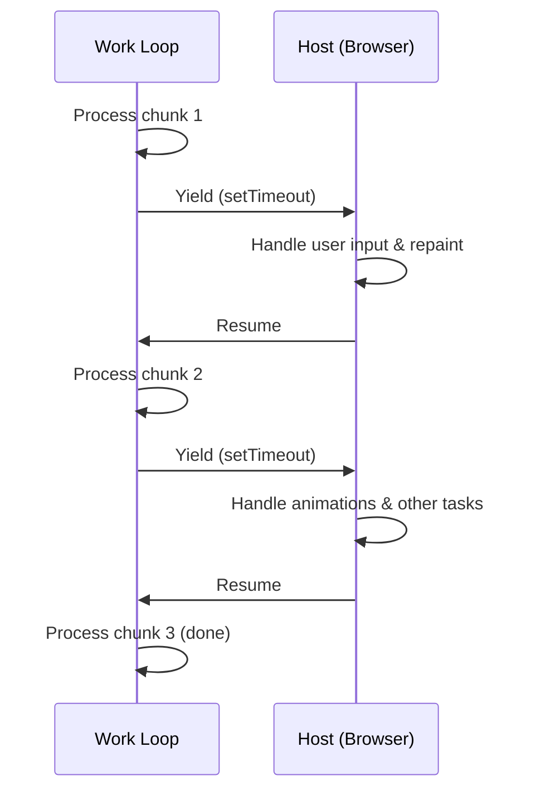

# Pattern: Cooperative Scheduling

## One Liner

Break long-running work into small chunks, yielding control back to the host between each chunk to keep the system responsive.

## Core Idea

In cooperative scheduling, a task voluntarily checks whether it should pause and let other work run. Unlike preemptive scheduling (where the OS forcibly interrupts), cooperative scheduling relies on the task itself to yield at safe points.



**Without yielding**: one long task blocks everything. **With yielding**: small chunks interleave with UI updates.

The pattern: run a loop, check a deadline after each unit of work, and `yield` if time is up.

## Production Proof

| Project | Source | Usage |
|---------|--------|-------|
| React | [Scheduler.js#L188-L258](https://github.com/facebook/react/blob/main/packages/scheduler/src/forks/Scheduler.js#L188-L258) | The `workLoop` function processes tasks from a min-heap. At each iteration it calls `shouldYieldToHost()` (line ~447) to check if the 5ms time slice has elapsed — if so, it breaks and schedules a continuation via `MessageChannel`. |
| Go Runtime | [proc.go#L4143-L4200](https://github.com/golang/go/blob/master/src/runtime/proc.go#L4143-L4200) | The `schedule()` function is the goroutine scheduler's main loop. `Gosched()` (line 394) is the voluntary yield point, and `goschedImpl` (line 4315) handles the actual context switch. |

## Implementation

::: code-group

```typescript [TypeScript]
type Task = () => boolean; // returns true if more work remains

interface Scheduler {
  scheduleTask(task: Task): void;
  flush(): void;
}

function createScheduler(yieldInterval: number = 5): Scheduler {
  const queue: Task[] = [];
  let isRunning = false;

  function shouldYield(startTime: number): boolean {
    return performance.now() - startTime >= yieldInterval;
  }

  function workLoop(): void {
    const startTime = performance.now();

    while (queue.length > 0) {
      if (shouldYield(startTime)) {
        // Yield to the host — schedule continuation
        setTimeout(workLoop, 0);
        return;
      }

      const task = queue[0]!;
      const hasMoreWork = task();

      if (!hasMoreWork) {
        queue.shift();
      }
    }

    isRunning = false;
  }

  return {
    scheduleTask(task: Task) {
      queue.push(task);
      if (!isRunning) {
        isRunning = true;
        setTimeout(workLoop, 0);
      }
    },
    flush() {
      while (queue.length > 0) {
        const task = queue[0]!;
        if (!task()) queue.shift();
      }
      isRunning = false;
    },
  };
}
```

```rust [Rust]
use std::time::{Duration, Instant};

pub struct CooperativeScheduler {
    yield_interval: Duration,
}

impl CooperativeScheduler {
    pub fn new(yield_ms: u64) -> Self {
        CooperativeScheduler {
            yield_interval: Duration::from_millis(yield_ms),
        }
    }

    pub fn run<F>(&self, mut work_units: Vec<F>) -> Vec<F>
    where
        F: FnMut() -> bool,
    {
        let start = Instant::now();

        while !work_units.is_empty() {
            if start.elapsed() >= self.yield_interval {
                // Yield: return remaining work to caller
                return work_units;
            }

            let done = (work_units[0])();
            if done {
                work_units.remove(0);
            }
        }

        work_units // empty = all done
    }
}
```

```go [Go]
package scheduling

import "time"

type Task func() bool // returns true when done

type Scheduler struct {
	YieldInterval time.Duration
	queue         []Task
}

func New(yieldInterval time.Duration) *Scheduler {
	return &Scheduler{YieldInterval: yieldInterval}
}

func (s *Scheduler) Schedule(task Task) {
	s.queue = append(s.queue, task)
}

// WorkLoop processes tasks, yielding when the time slice expires.
// Returns true if all work is done, false if yielded.
func (s *Scheduler) WorkLoop() bool {
	start := time.Now()

	for len(s.queue) > 0 {
		if time.Since(start) >= s.YieldInterval {
			return false // yield
		}

		done := s.queue[0]()
		if done {
			s.queue = s.queue[1:]
		}
	}

	return true // all done
}
```

```python [Python]
import time

def work_loop(items, process_item, yield_ms=5):
    """Process items, yielding when time budget exceeded."""
    start = time.monotonic()
    completed = 0

    while completed < len(items):
        elapsed_ms = (time.monotonic() - start) * 1000
        if elapsed_ms >= yield_ms:
            return items[completed:]  # return remaining work

        process_item(items[completed])
        completed += 1

    return []  # all done

# Usage
results = []
remaining = work_loop(
    list(range(100)),
    lambda x: results.append(x * 2),
    yield_ms=5
)
# remaining contains items not yet processed (if any)
```

:::

## Exercises

| Level | Exercise | File |
|-------|----------|------|
| Basic | Implement a time-sliced work loop with yield check | `exercises/typescript/cooperative-scheduling/01-basic.test.ts` |
| Intermediate | Build a priority scheduler that yields between tasks | `exercises/typescript/cooperative-scheduling/02-priority-scheduler.test.ts` |

Run exercises: `pnpm test`

## When to Use

- **UI thread work** — keep animations and input responsive while processing large datasets
- **Batch processing** — process items in chunks with pauses for other system work
- **Long computations** — break recursive tree traversals or list operations into resumable chunks
- **Concurrent runtimes** — implement green threads or coroutine scheduling

## When NOT to Use

- **Short tasks** — if the work finishes in < 1ms, the yield overhead isn't worth it
- **Real-time guarantees** — cooperative scheduling can't guarantee deadlines; use preemptive scheduling
- **CPU-bound with no interaction** — if nothing else needs the thread, yielding wastes time
- **When `requestIdleCallback` suffices** — for non-urgent work, the browser's built-in API may be enough

## More Production Uses

- [Lua](https://github.com/lua/lua) — coroutines
- Python [asyncio](https://github.com/python/cpython/tree/main/Lib/asyncio)
- Erlang/BEAM VM — reduction counting
- Unity — coroutines
