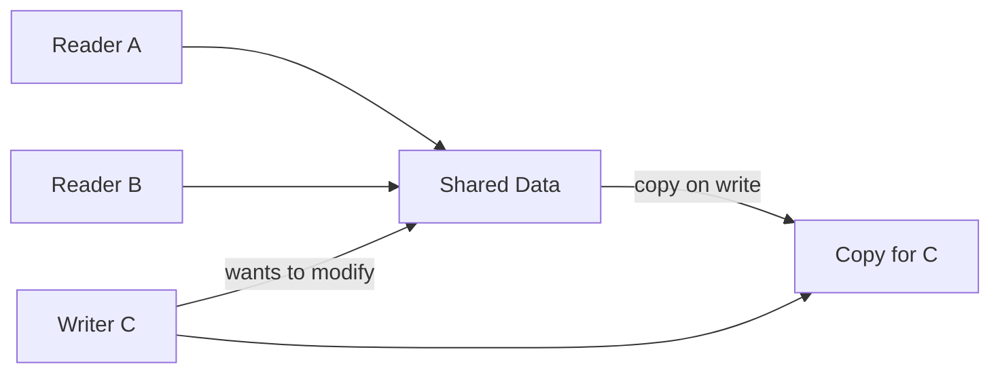

# Pattern: Copy-on-Write (CoW)

## One Liner

Share data by reference until someone modifies it — only then make a private copy, saving memory and allocation cost for read-heavy workloads.

<DemoBadge />

## Core Idea

Copy-on-Write defers the expense of copying until a mutation actually happens. Multiple readers can share the same data. When a writer needs to modify it, the system creates a copy for that writer, leaving all other references untouched.



The key insight: **most data is read far more often than it is written**. CoW exploits this asymmetry — free sharing for reads, pay-per-write for mutations.

**Try it yourself** — click "Write" on any reader to trigger a copy-on-write and watch reference counts change:

<CopyOnWriteViz />

## Production Proof

| Project | Source | Usage |
|---------|--------|-------|
| Git | [object-file.c#L719-L730](https://github.com/git/git/blob/master/object-file.c#L719-L730) | Git objects are immutable content-addressed blobs. When you branch, Git doesn't copy files — it shares the same objects. A new commit only creates new objects for changed files, reusing unchanged ones. This is CoW at the data model level. |
| Rust stdlib | [borrow.rs#L169-L220](https://github.com/rust-lang/rust/blob/main/library/alloc/src/borrow.rs#L169-L220) | `Cow<'a, B>` (Clone on Write) — an enum that holds either a `Borrowed` reference or an `Owned` value. `to_mut()` (line 283) clones the data only if it's currently borrowed, making it owned for mutation. Used throughout the Rust ecosystem for zero-copy parsing. |

## Implementation

::: code-group

```typescript [TypeScript]
class Cow<T extends object> {
  private data: T;
  private shared: boolean;

  constructor(data: T) {
    this.data = data;
    this.shared = false;
  }

  static from<T extends object>(data: T): Cow<T> {
    const cow = new Cow(data);
    cow.shared = true;
    return cow;
  }

  read(): Readonly<T> {
    return this.data;
  }

  write(): T {
    if (this.shared) {
      this.data = structuredClone(this.data);
      this.shared = false;
    }
    return this.data;
  }

  isOwned(): boolean {
    return !this.shared;
  }
}
```

```rust [Rust]
use std::borrow::Cow;

fn process(input: &str) -> Cow<'_, str> {
    if input.contains("bad") {
        // Only allocate when modification needed
        Cow::Owned(input.replace("bad", "good"))
    } else {
        // Zero-copy: just borrow the original
        Cow::Borrowed(input)
    }
}

// Usage
let clean = process("hello world");     // Borrowed, no allocation
let fixed = process("hello bad world"); // Owned, allocated
```

```go [Go]
type CowSlice[T any] struct {
	data   []T
	shared bool
}

func Share[T any](data []T) *CowSlice[T] {
	return &CowSlice[T]{data: data, shared: true}
}

func (c *CowSlice[T]) Read() []T {
	return c.data
}

func (c *CowSlice[T]) Write() []T {
	if c.shared {
		copied := make([]T, len(c.data))
		copy(copied, c.data)
		c.data = copied
		c.shared = false
	}
	return c.data
}
```

```python [Python]
import copy

class Cow:
    """Copy-on-Write wrapper."""
    def __init__(self, data, shared=False):
        self._data = data
        self._shared = shared

    @classmethod
    def share(cls, data):
        return cls(data, shared=True)

    def read(self):
        return self._data

    def write(self):
        if self._shared:
            self._data = copy.deepcopy(self._data)
            self._shared = False
        return self._data

# Usage
original = {"users": ["alice", "bob"]}
view = Cow.share(original)
print(view.read() is original)  # True — same object, no copy

mutable = view.write()          # NOW it copies
mutable["users"].append("charlie")
print(original["users"])        # ["alice", "bob"] — unchanged
```

:::

## Exercises

| Level | Exercise | File |
|-------|----------|------|
| Basic | Implement a Cow wrapper that defers copying until write | `exercises/typescript/copy-on-write/01-basic.test.ts` |
| Intermediate | Versioned config store with CoW fork | `exercises/typescript/copy-on-write/02-intermediate.test.ts` |

Run exercises: `pnpm test` (TypeScript) · `cargo test` (Rust) · `go test ./...` (Go) · `pytest` (Python)

Exercise files: Rust `exercises/rust/src/copy_on_write.rs` · Go `exercises/go/copy_on_write_test.go` · Python `exercises/python/test_copy_on_write.py`

## When to Use

- **Read-heavy data** — config objects, parsed ASTs, cached responses
- **Branching / versioning** — Git's object model, database snapshots
- **Zero-copy parsing** — Rust's `Cow<str>` avoids allocation when input is already valid
- **Undo systems** — share state snapshots, copy only on mutation
- **Immutable-by-default architectures** — React state, Redux reducers

## When NOT to Use

- **Write-heavy workloads** — every write triggers a copy, negating the benefit
- **Small data** — copying a small struct is cheaper than the CoW bookkeeping
- **Concurrent writes** — CoW doesn't solve concurrent mutation; use locks or atomics
- **Deep structures** — shallow CoW can lead to shared mutable sub-objects

## More Production Uses

- Linux `fork()` — page table CoW
- [Swift](https://github.com/swiftlang/swift) — value types
- [Redis](https://github.com/redis/redis) — `BGSAVE`
- [ZFS](https://github.com/openzfs/zfs) / Btrfs — filesystem snapshots

## Related Patterns

| Pattern | Relationship |
|---------|-------------|
| [Double Buffering](/patterns/double-buffering/) | Both defer costs — CoW copies on write, double buffering prepares a second copy |
| [Flyweight](/patterns/flyweight/) | Flyweight shares immutable data; CoW shares mutable data until modification |
| [Merkle Tree](/patterns/merkle-tree/) | Merkle trees enable efficient CoW — only rehash the path from changed node to root |
| [Reference Counting](/patterns/reference-counting/) | Reference counting tracks CoW sharing — copy when ref count > 1 and writing |

## Challenge Questions

::: details Q1: Your CoW wrapper does a shallow copy on write. A reader and writer share a nested object `{ users: [{ name: "alice" }] }`. The writer calls `write()` and mutates `users[0].name`. Does the reader see the mutation?
**Answer:** Yes — a shallow copy only duplicates the top-level object, so the nested `users` array and its elements are still shared references.

This is the "shallow CoW trap." After `write()`, the writer has a new top-level object, but `writer.users === reader.users` still holds. Mutating `users[0].name` affects both. To get true isolation, you need either a deep copy (expensive), structural sharing (copy the spine of the path to the mutation, like immutable.js), or a rule that CoW objects only contain primitives. React and Redux solve this by requiring immutable update patterns: `{ ...state, users: [...state.users] }`.
:::

::: details Q2: Linux `fork()` uses CoW for process memory pages. A child process immediately calls `exec()` to replace its memory. Why is CoW essential here?
**Answer:** Without CoW, `fork()` would copy the entire parent address space only to discard it immediately when `exec()` loads a new program — a massive waste.

The `fork()` + `exec()` pattern is one of the most common operations in Unix. The parent may have gigabytes of memory. CoW means `fork()` is nearly instant: it just duplicates the page table entries and marks all pages read-only. When `exec()` runs, it replaces all mappings anyway, so no pages ever needed copying. Without CoW, spawning a process from a large application (like a web server forking a worker) would be prohibitively slow and memory-intensive.
:::

::: details Q3: A system uses CoW for configuration objects. 100 readers share the config; a writer updates it every second. Under what workload pattern does CoW waste memory compared to a simple mutex-protected shared object?
**Answer:** When every read is followed by a write (100% write ratio), CoW creates a full copy on every access, using more memory than a single shared object protected by a lock.

CoW's advantage is proportional to the read/write ratio. At 99% reads, 100 readers share one copy and only the rare writer pays for a clone — excellent. At 50% reads, half the accesses trigger copies — the benefit is marginal. At 100% writes, every access copies — you've turned a single shared object into N independent copies with no sharing benefit, plus the overhead of tracking shared state. The break-even point depends on object size, but the principle holds: CoW is for read-heavy workloads.
:::

::: details Q4: Rust's `Cow<'a, str>` is an enum with `Borrowed(&'a str)` and `Owned(String)`. Why is this more useful than just always cloning the string?
**Answer:** It lets functions accept and return string data without allocating when the input is already in the right form, achieving zero-copy in the common case.

Consider a URL decoder: most URLs have no percent-encoded characters and can be returned as-is (`Borrowed`). Only URLs with `%20` etc. need a new `String` (`Owned`). With `Cow`, the function signature is `fn decode(input: &str) -> Cow<str>` — callers get the original reference back 90% of the time with zero allocation. Without `Cow`, you'd either always clone (wasteful) or return an enum manually (which is exactly what `Cow` already is, with standard library integration).
:::
