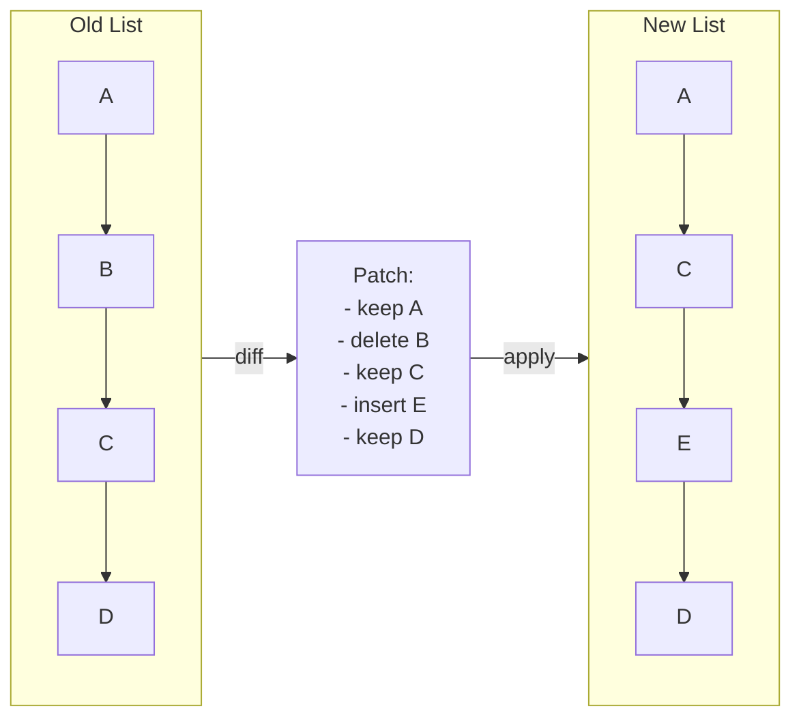

# Pattern: Diff / Patch

## One Liner

Compare two sequences to compute the minimal set of operations (insert, delete, move) needed to transform one into the other.

## Core Idea

Given an old list and a new list, the diff algorithm determines which items were added, removed, or moved. The result is a "patch" — a minimal set of mutations to apply.



React's reconciler uses this to determine which DOM nodes to create, update, or remove. Git uses it to show what changed between commits.

## Production Proof

| Project | Source | Usage |
|---------|--------|-------|
| React | [ReactChildFiber.js](https://github.com/facebook/react/blob/main/packages/react-reconciler/src/ReactChildFiber.js#L1) | `reconcileChildFibers` diffs old and new children arrays. It uses a key-based mapping to detect moves, insertions, and deletions — minimizing DOM mutations. |
| Git | [diff.c](https://github.com/git/git/blob/master/diff.c#L1) | Git's core diff engine computes the minimal edit distance between file versions using Myers' diff algorithm, producing the familiar `+`/`-` patch output. |

## Implementation

::: code-group

```typescript [TypeScript]
type Op<T> =
  | { type: 'keep'; value: T }
  | { type: 'insert'; value: T }
  | { type: 'delete'; value: T };

function diff<T>(oldList: T[], newList: T[], eq: (a: T, b: T) => boolean = (a, b) => a === b): Op<T>[] {
  const ops: Op<T>[] = [];
  let oldIdx = 0;
  let newIdx = 0;

  // Build a map of old items by value for O(1) lookup
  const oldMap = new Map<string, number>();
  oldList.forEach((item, i) => oldMap.set(String(item), i));

  while (oldIdx < oldList.length && newIdx < newList.length) {
    if (eq(oldList[oldIdx]!, newList[newIdx]!)) {
      ops.push({ type: 'keep', value: oldList[oldIdx]! });
      oldIdx++;
      newIdx++;
    } else if (!newList.some((n, ni) => ni >= newIdx && eq(n, oldList[oldIdx]!))) {
      ops.push({ type: 'delete', value: oldList[oldIdx]! });
      oldIdx++;
    } else {
      ops.push({ type: 'insert', value: newList[newIdx]! });
      newIdx++;
    }
  }

  while (oldIdx < oldList.length) {
    ops.push({ type: 'delete', value: oldList[oldIdx]! });
    oldIdx++;
  }

  while (newIdx < newList.length) {
    ops.push({ type: 'insert', value: newList[newIdx]! });
    newIdx++;
  }

  return ops;
}

function patch<T>(oldList: T[], ops: Op<T>[]): T[] {
  const result: T[] = [];
  for (const op of ops) {
    if (op.type === 'keep' || op.type === 'insert') result.push(op.value);
  }
  return result;
}
```

```rust [Rust]
#[derive(Debug, PartialEq)]
pub enum Op<T> {
    Keep(T),
    Insert(T),
    Delete(T),
}

pub fn diff<T: PartialEq + Clone>(old: &[T], new: &[T]) -> Vec<Op<T>> {
    let mut ops = Vec::new();
    let (mut oi, mut ni) = (0, 0);

    while oi < old.len() && ni < new.len() {
        if old[oi] == new[ni] {
            ops.push(Op::Keep(old[oi].clone()));
            oi += 1;
            ni += 1;
        } else if !new[ni..].contains(&old[oi]) {
            ops.push(Op::Delete(old[oi].clone()));
            oi += 1;
        } else {
            ops.push(Op::Insert(new[ni].clone()));
            ni += 1;
        }
    }

    while oi < old.len() { ops.push(Op::Delete(old[oi].clone())); oi += 1; }
    while ni < new.len() { ops.push(Op::Insert(new[ni].clone())); ni += 1; }

    ops
}

pub fn patch<T: Clone>(ops: &[Op<T>]) -> Vec<T> {
    ops.iter().filter_map(|op| match op {
        Op::Keep(v) | Op::Insert(v) => Some(v.clone()),
        Op::Delete(_) => None,
    }).collect()
}
```

```python [Python]
from typing import TypeVar, List, Tuple, Literal

T = TypeVar("T")
Op = Tuple[Literal["keep", "insert", "delete"], T]

def diff(old: List[T], new: List[T]) -> List[Op]:
    ops: List[Op] = []
    oi, ni = 0, 0

    while oi < len(old) and ni < len(new):
        if old[oi] == new[ni]:
            ops.append(("keep", old[oi]))
            oi += 1; ni += 1
        elif old[oi] not in new[ni:]:
            ops.append(("delete", old[oi]))
            oi += 1
        else:
            ops.append(("insert", new[ni]))
            ni += 1

    while oi < len(old): ops.append(("delete", old[oi])); oi += 1
    while ni < len(new): ops.append(("insert", new[ni])); ni += 1
    return ops

def patch(ops: List[Op]) -> List[T]:
    return [val for op_type, val in ops if op_type != "delete"]

# Usage
ops = diff(["a", "b", "c", "d"], ["a", "c", "e", "d"])
assert patch(ops) == ["a", "c", "e", "d"]
```

:::

## Exercises

| Level | Exercise | File |
|-------|----------|------|
| Basic | Implement a simple list diff that produces keep/insert/delete ops | `exercises/typescript/diff-patch/01-basic.test.ts` |
| Intermediate | Apply a patch to reconstruct the new list from the old | `exercises/typescript/diff-patch/02-patch-apply.test.ts` |

Run exercises: `pnpm test`

## When to Use

- **UI reconciliation** — minimize DOM mutations by diffing virtual trees
- **Version control** — compute file changes between commits
- **Collaborative editing** — merge concurrent edits via operational transform or CRDT diffs
- **State synchronization** — send only deltas instead of full state over the network
- **Undo/redo** — store diffs as compact undo entries instead of full snapshots

## When NOT to Use

- **Completely different lists** — if > 80% of items changed, just replace the whole list
- **Unordered sets** — diff assumes order matters; for sets, use set intersection/difference
- **Real-time streaming** — if items arrive one at a time, an incremental approach is better than batch diffing
- **Large lists without keys** — without stable identifiers, diff degrades to O(n²)

## Try It

<script setup>
const diffLangs = {
  typescript: `// Diff/Patch: compute minimal changes between two lists
function diff(oldList, newList) {
  var ops = [];
  var oi = 0, ni = 0;
  while (oi < oldList.length && ni < newList.length) {
    if (oldList[oi] === newList[ni]) {
      ops.push({ type: "keep", value: oldList[oi] });
      oi++; ni++;
    } else if (newList.slice(ni).indexOf(oldList[oi]) === -1) {
      ops.push({ type: "delete", value: oldList[oi] });
      oi++;
    } else {
      ops.push({ type: "insert", value: newList[ni] });
      ni++;
    }
  }
  while (oi < oldList.length) { ops.push({ type: "delete", value: oldList[oi] }); oi++; }
  while (ni < newList.length) { ops.push({ type: "insert", value: newList[ni] }); ni++; }
  return ops;
}

function patch(ops) {
  return ops.filter(function(op) { return op.type !== "delete"; }).map(function(op) { return op.value; });
}

// Test: insert + delete
var ops = diff(["a", "b", "c", "d"], ["a", "c", "e", "d"]);
console.log("Ops: " + JSON.stringify(ops.map(function(o) { return o.type + " " + o.value; })));

var result = patch(ops);
assertEquals(JSON.stringify(result), JSON.stringify(["a","c","e","d"]), "patch reconstructs new list");

// Test: identical lists
var ops2 = diff([1,2,3], [1,2,3]);
assertEquals(ops2.every(function(o) { return o.type === "keep"; }), true, "identical = all keeps");

// Test: empty to populated
var ops3 = diff([], ["x", "y"]);
assertEquals(ops3.length, 2, "2 inserts");
assertEquals(patch(ops3).length, 2, "patch produces 2 items");

console.log("All assertions passed!");`,
  python: `# Diff/Patch: compute minimal changes between two lists
def diff(old_list, new_list):
    ops = []
    oi, ni = 0, 0
    while oi < len(old_list) and ni < len(new_list):
        if old_list[oi] == new_list[ni]:
            ops.append(("keep", old_list[oi]))
            oi += 1; ni += 1
        elif old_list[oi] not in new_list[ni:]:
            ops.append(("delete", old_list[oi]))
            oi += 1
        else:
            ops.append(("insert", new_list[ni]))
            ni += 1
    while oi < len(old_list):
        ops.append(("delete", old_list[oi])); oi += 1
    while ni < len(new_list):
        ops.append(("insert", new_list[ni])); ni += 1
    return ops

def patch(ops):
    return [v for t, v in ops if t != "delete"]

ops = diff(["a","b","c","d"], ["a","c","e","d"])
result = patch(ops)
assert result == ["a","c","e","d"], f"got {result}"

print("All assertions passed!")`
};
</script>

<CodePlayground title="Diff/Patch Playground" :languages="diffLangs" />
