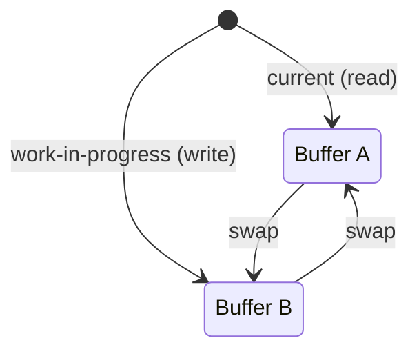

# Pattern: Double Buffering

## One Liner

Maintain two copies of state and atomically swap between them so readers always see a consistent snapshot.

## Core Idea

Double buffering keeps two versions of a data structure: one "current" (being read) and one "work-in-progress" (being written). When the write is complete, the two are swapped atomically. This avoids tearing — readers never see a half-updated state.



After swap: old "current" becomes new "work-in-progress" (reused, not GC'd). The same two objects are recycled forever — **zero allocation** on the hot path.

## Production Proof

| Project | Source | Usage |
|---------|--------|-------|
| React | [ReactFiber.js#L327-L355](https://github.com/facebook/react/blob/main/packages/react-reconciler/src/ReactFiber.js#L327-L355) | `createWorkInProgress` — creates or reuses an alternate fiber. The comment says: *"We use a double buffering pooling technique because we know that we'll only ever need at most two versions of a tree."* `current.alternate = workInProgress` and `workInProgress.alternate = current` establish the mutual link. |
| SDL | [SDL_render.c#L5535-L5570](https://github.com/libsdl-org/SDL/blob/main/src/render/SDL_render.c#L5535-L5570) | `SDL_RenderPresent` — flushes queued render commands, calls the backend's `RenderPresent` to swap front/back buffers for tear-free frame presentation, and handles vsync simulation. |

## Implementation

::: code-group

```typescript [TypeScript]
class DoubleBuffer<T> {
  private buffers: [T, T];
  private currentIndex: 0 | 1 = 0;

  constructor(createBuffer: () => T) {
    this.buffers = [createBuffer(), createBuffer()];
  }

  current(): T {
    return this.buffers[this.currentIndex];
  }

  next(): T {
    return this.buffers[this.currentIndex === 0 ? 1 : 0];
  }

  swap(): void {
    this.currentIndex = this.currentIndex === 0 ? 1 : 0;
  }
}

// React-style fiber double buffering
interface Fiber {
  tag: string;
  pendingProps: Record<string, unknown>;
  memoizedState: unknown;
  alternate: Fiber | null;
}

function createWorkInProgress(current: Fiber, pendingProps: Record<string, unknown>): Fiber {
  let wip = current.alternate;

  if (wip === null) {
    // First render: create the alternate
    wip = {
      tag: current.tag,
      pendingProps,
      memoizedState: current.memoizedState,
      alternate: current,
    };
    current.alternate = wip;
  } else {
    // Subsequent renders: reuse the alternate (zero allocation)
    wip.pendingProps = pendingProps;
    wip.memoizedState = current.memoizedState;
  }

  return wip;
}
```

```rust [Rust]
pub struct DoubleBuffer<T> {
    buffers: [T; 2],
    current: usize,
}

impl<T: Default + Clone> DoubleBuffer<T> {
    pub fn new(init: T) -> Self {
        DoubleBuffer {
            buffers: [init.clone(), init],
            current: 0,
        }
    }

    pub fn current(&self) -> &T {
        &self.buffers[self.current]
    }

    pub fn next(&mut self) -> &mut T {
        &mut self.buffers[1 - self.current]
    }

    pub fn swap(&mut self) {
        self.current = 1 - self.current;
    }
}
```

```go [Go]
type DoubleBuffer[T any] struct {
	buffers [2]T
	current int
}

func NewDoubleBuffer[T any](init T, clone func(T) T) *DoubleBuffer[T] {
	return &DoubleBuffer[T]{
		buffers: [2]T{clone(init), init},
		current: 0,
	}
}

func (db *DoubleBuffer[T]) Current() *T {
	return &db.buffers[db.current]
}

func (db *DoubleBuffer[T]) Next() *T {
	return &db.buffers[1-db.current]
}

func (db *DoubleBuffer[T]) Swap() {
	db.current = 1 - db.current
}
```

```python [Python]
class DoubleBuffer:
    def __init__(self, create_buffer):
        self._buffers = [create_buffer(), create_buffer()]
        self._current = 0

    def current(self):
        return self._buffers[self._current]

    def next(self):
        return self._buffers[1 - self._current]

    def swap(self):
        self._current = 1 - self._current

# Usage
buf = DoubleBuffer(lambda: {"pixels": [0, 0]})
buf.next()["pixels"] = [255, 128]  # write to back buffer
assert buf.current()["pixels"] == [0, 0]  # front unchanged
buf.swap()
assert buf.current()["pixels"] == [255, 128]  # now visible
```

:::

## Exercises

| Level | Exercise | File |
|-------|----------|------|
| Basic | Implement a generic double buffer with swap | `exercises/typescript/double-buffering/01-basic.test.ts` |
| Intermediate | Build React-style fiber alternates | `exercises/typescript/double-buffering/02-fiber-alternate.test.ts` |

Run exercises: `pnpm test`

## When to Use

- **Render pipelines** — GPU front/back buffer, game frame rendering
- **Concurrent reads and writes** — readers see consistent state while writers prepare the next version
- **Tree reconciliation** — React's fiber architecture uses this to diff old and new trees
- **Zero-allocation hot paths** — reuse two buffers forever instead of allocating new ones
- **Database MVCC** — readers see a snapshot while writers prepare a new version

## When NOT to Use

- **Simple state updates** — if your state is a single value and updates are atomic, double buffering adds unnecessary complexity
- **Memory-constrained environments** — you're paying 2x memory cost
- **Frequent partial reads** — if readers need real-time access to in-progress writes, double buffering hides updates until the swap

## More Production Uses

- [OpenGL](https://www.khronos.org/opengl/) / Vulkan — swap chains
- [PostgreSQL](https://github.com/postgres/postgres) — MVCC snapshot isolation
- Unreal Engine — frame rendering
