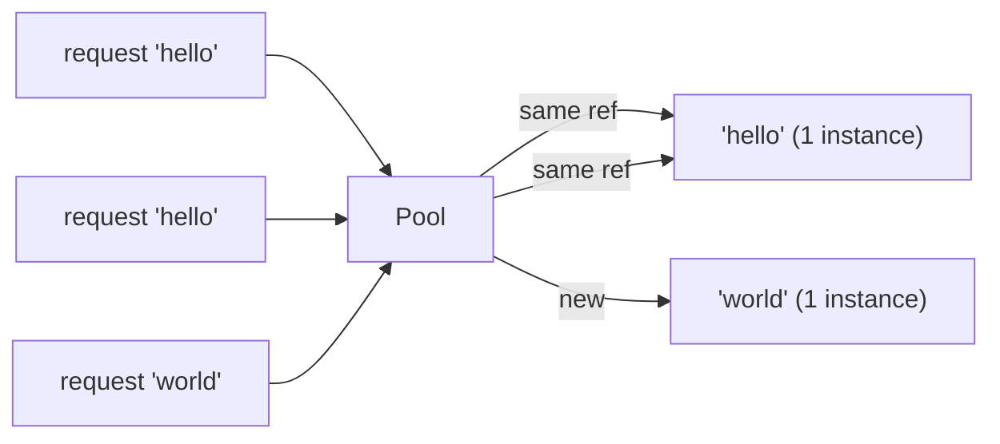

# Pattern: Flyweight / Interning

## One Liner

Share identical immutable objects instead of creating duplicates, trading a lookup cost for massive memory savings when many instances have the same value.

## Core Idea

When thousands of objects have the same value (strings, small integers, colors), allocating each separately wastes memory. Flyweight/interning maintains a pool of canonical instances and returns the same reference for equal values.



Two requests for `"hello"` get the **same object** — not a copy. This is why `"hello" === "hello"` in many languages (string interning).

## Production Proof

| Project | Source | Usage |
|---------|--------|-------|
| Python (CPython) | [longobject.c#L61-L75](https://github.com/python/cpython/blob/main/Objects/longobject.c#L61-L75) | `get_small_int` returns pre-cached integer objects for -5 to 256. `a = 42; b = 42; a is b` is `True` because both reference the same cached object. This avoids millions of integer allocations in typical programs. |
| Go stdlib | [pool.go#L52-L97](https://github.com/golang/go/blob/master/src/sync/pool.go#L52-L97) | `sync.Pool` is the flyweight pattern applied to temporary objects — `Get()` returns a cached instance instead of allocating, `Put()` returns it for reuse. Used in `fmt.Fprintf`, `encoding/json`, and HTTP handlers to share buffers. |

::: info Note
Java's `String.intern()`, JavaScript engine string tables (V8), and Rust's `&'static str` all implement variations of this pattern. The JVM interns all string literals automatically.
:::

## Implementation

::: code-group

```typescript [TypeScript]
class Interner<T> {
  private pool = new Map<string, T>();

  intern(key: string, create: () => T): T {
    if (this.pool.has(key)) {
      return this.pool.get(key)!;
    }
    const value = create();
    this.pool.set(key, value);
    return value;
  }

  has(key: string): boolean {
    return this.pool.has(key);
  }

  get size(): number {
    return this.pool.size;
  }
}
```

```rust [Rust]
use std::collections::HashMap;

pub struct Interner {
    pool: HashMap<String, usize>,
    strings: Vec<String>,
}

impl Interner {
    pub fn new() -> Self {
        Interner { pool: HashMap::new(), strings: Vec::new() }
    }

    pub fn intern(&mut self, s: &str) -> usize {
        if let Some(&id) = self.pool.get(s) {
            return id;
        }
        let id = self.strings.len();
        self.strings.push(s.to_string());
        self.pool.insert(s.to_string(), id);
        id
    }

    pub fn resolve(&self, id: usize) -> &str {
        &self.strings[id]
    }
}
```

```python [Python]
import sys

class Interner:
    def __init__(self):
        self._pool: dict[str, object] = {}

    def intern(self, key: str, factory=None):
        if key in self._pool:
            return self._pool[key]
        value = factory() if factory else key
        self._pool[key] = value
        return value

    @property
    def size(self) -> int:
        return len(self._pool)

# Python already interns small integers:
a = 256
b = 256
print(a is b)  # True — same object, flyweight!
print(sys.getrefcount(256))  # many references to the same int
```

```go [Go]
type Interner struct {
	pool map[string]int
	data []string
}

func NewInterner() *Interner {
	return &Interner{pool: make(map[string]int)}
}

func (in *Interner) Intern(s string) int {
	if id, ok := in.pool[s]; ok {
		return id
	}
	id := len(in.data)
	in.data = append(in.data, s)
	in.pool[s] = id
	return id
}

func (in *Interner) Resolve(id int) string {
	return in.data[id]
}
```

:::

## Exercises

| Level | Exercise | File |
|-------|----------|------|
| Basic | Implement a string interner with intern/resolve | `exercises/typescript/flyweight/01-basic.test.ts` |

Run exercises: `pnpm test`

## When to Use

- **Repeated identical values** — strings, colors, icons, type tags
- **Memory-constrained environments** — embedded systems, mobile, browser tabs
- **Compilers and interpreters** — symbol tables, string interning
- **Game engines** — shared meshes, textures, materials
- **Database query results** — deduplicate repeated column values

## When NOT to Use

- **Unique values** — if every instance is different, the pool adds overhead
- **Mutable objects** — flyweight assumes shared objects are immutable
- **Short-lived data** — if objects are created and discarded quickly, interning adds lookup cost
- **Thread safety** — concurrent intern requires synchronization

## Also Used In

Java `String.intern()`, V8 string table, Python small int cache (-5..256), Rust `string_cache` crate, .NET string interning, CSS value deduplication in browsers.
