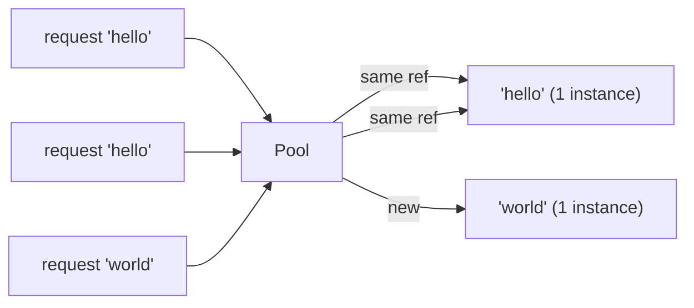

# Pattern: Flyweight / Interning

## One Liner

Share identical immutable objects instead of creating duplicates, trading a lookup cost for massive memory savings when many instances have the same value.

<DemoBadge />

## Core Idea

When thousands of objects have the same value (strings, small integers, colors), allocating each separately wastes memory. Flyweight/interning maintains a pool of canonical instances and returns the same reference for equal values.



Two requests for `"hello"` get the **same object** — not a copy. This is why `"hello" === "hello"` in many languages (string interning).

**Try it yourself** — add characters and see how flyweight objects are shared:

<FlyweightViz />

## Production Proof

| Project | Source | Usage |
|---------|--------|-------|
| Python (CPython) | [longobject.c#L61-L75](https://github.com/python/cpython/blob/main/Objects/longobject.c#L61-L75) | `get_small_int` returns pre-cached integer objects for -5 to 256. `a = 42; b = 42; a is b` is `True` because both reference the same cached object. This avoids millions of integer allocations in typical programs. |
| Go stdlib | [pool.go#L52-L97](https://github.com/golang/go/blob/master/src/sync/pool.go#L52-L97) | `sync.Pool` is the flyweight pattern applied to temporary objects — `Get()` returns a cached instance instead of allocating, `Put()` returns it for reuse. Used in `fmt.Fprintf`, `encoding/json`, and HTTP handlers to share buffers. |

::: info Note
Java's `String.intern()`, JavaScript engine string tables (V8), and Rust's `&'static str` all implement variations of this pattern. The JVM interns all string literals automatically.
:::

## Implementation

::: code-group

```typescript [TypeScript]
class Interner<T> {
  private pool = new Map<string, T>();

  intern(key: string, create: () => T): T {
    if (this.pool.has(key)) {
      return this.pool.get(key)!;
    }
    const value = create();
    this.pool.set(key, value);
    return value;
  }

  has(key: string): boolean {
    return this.pool.has(key);
  }

  get size(): number {
    return this.pool.size;
  }
}
```

```rust [Rust]
use std::collections::HashMap;

pub struct Interner {
    pool: HashMap<String, usize>,
    strings: Vec<String>,
}

impl Interner {
    pub fn new() -> Self {
        Interner { pool: HashMap::new(), strings: Vec::new() }
    }

    pub fn intern(&mut self, s: &str) -> usize {
        if let Some(&id) = self.pool.get(s) {
            return id;
        }
        let id = self.strings.len();
        self.strings.push(s.to_string());
        self.pool.insert(s.to_string(), id);
        id
    }

    pub fn resolve(&self, id: usize) -> &str {
        &self.strings[id]
    }
}
```

```python [Python]
import sys

class Interner:
    def __init__(self):
        self._pool: dict[str, object] = {}

    def intern(self, key: str, factory=None):
        if key in self._pool:
            return self._pool[key]
        value = factory() if factory else key
        self._pool[key] = value
        return value

    @property
    def size(self) -> int:
        return len(self._pool)

# Python already interns small integers:
a = 256
b = 256
print(a is b)  # True — same object, flyweight!
print(sys.getrefcount(256))  # many references to the same int
```

```go [Go]
type Interner struct {
	pool map[string]int
	data []string
}

func NewInterner() *Interner {
	return &Interner{pool: make(map[string]int)}
}

func (in *Interner) Intern(s string) int {
	if id, ok := in.pool[s]; ok {
		return id
	}
	id := len(in.data)
	in.data = append(in.data, s)
	in.pool[s] = id
	return id
}

func (in *Interner) Resolve(id int) string {
	return in.data[id]
}
```

:::

## Exercises

| Level | Exercise | File |
|-------|----------|------|
| Basic | Implement a string interner with intern/resolve | `exercises/typescript/flyweight/01-basic.test.ts` |
| Intermediate | Icon registry that deduplicates objects by name | `exercises/typescript/flyweight/02-intermediate.test.ts` |

Run exercises: `pnpm test` (TypeScript) · `cargo test` (Rust) · `go test ./...` (Go)

## When to Use

- **Repeated identical values** — strings, colors, icons, type tags
- **Memory-constrained environments** — embedded systems, mobile, browser tabs
- **Compilers and interpreters** — symbol tables, string interning
- **Game engines** — shared meshes, textures, materials
- **Database query results** — deduplicate repeated column values

## When NOT to Use

- **Unique values** — if every instance is different, the pool adds overhead
- **Mutable objects** — flyweight assumes shared objects are immutable
- **Short-lived data** — if objects are created and discarded quickly, interning adds lookup cost
- **Thread safety** — concurrent intern requires synchronization

## More Production Uses

- Java `String.intern()`
- Python small int cache (-5..256)
- Rust [string_cache](https://crates.io/crates/string_cache) crate
- .NET string interning
- CSS value deduplication in browsers

## Related Patterns

| Pattern | Relationship |
|---------|-------------|
| [Interning](/patterns/interning/) | Interning is the mechanism that implements flyweight — deduplicate identical values |
| [Copy-on-Write (CoW)](/patterns/copy-on-write/) | Both share data — flyweight shares immutable objects, CoW shares until mutation |
| [LRU Cache](/patterns/lru-cache/) | LRU caches can store flyweight instances, evicting least-used shared objects |

## Challenge Questions

::: details Q1: Someone interns a mutable object (say, a config map) and later modifies it. What breaks?
**Answer:** Every consumer sharing that reference sees the mutation, causing unpredictable behavior across unrelated parts of the system.

Flyweight's entire premise is that shared instances are identical and interchangeable. If one caller mutates the shared object, all other callers silently get the changed value. This is why interned/flyweight objects must be immutable. If you need mutation, clone-on-write or don't intern.
:::

::: details Q2: Python caches integers -5 to 256 as flyweights. Why not cache all integers?
**Answer:** Because the memory cost of pre-allocating every possible integer far exceeds the savings from sharing. The cache only pays off for values that appear frequently.

The range -5 to 256 was chosen empirically -- these cover loop counters, array indices, boolean-like values, and common constants. Caching `1_000_000` would waste memory since most large integers appear only once. The flyweight pattern only saves memory when duplicates are common.
:::

::: details Q3: You build a string interner for a compiler. After processing 10,000 source files, the interner holds 2 million strings and uses 500MB. What went wrong?
**Answer:** The interner never evicts entries, so it accumulates every string ever seen -- including one-off identifiers and string literals that are never referenced again.

A production interner needs a strategy for scope: either clear it per-compilation-unit, use weak references so unreferenced strings get collected, or limit interning to identifiers (which repeat frequently) and skip arbitrary string literals. Unbounded growth is the classic flyweight pitfall.
:::

::: details Q4: Two threads simultaneously call `intern("hello")` and both see it as missing from the pool. What can go wrong?
**Answer:** Both threads create a new instance and insert it, resulting in two different objects for the same key -- breaking the "same reference for same value" guarantee.

Without synchronization, you get a race: thread A checks the pool, finds nothing, creates the object; thread B does the same before A inserts. Now consumers on different threads hold different references for `"hello"`, defeating identity comparison (`===` / `is`). The fix is a lock around the check-and-insert, or a concurrent map with `putIfAbsent` semantics.
:::
