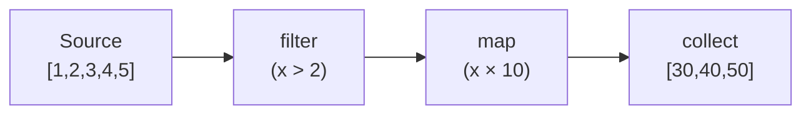

# Pattern: Iterator / Lazy Evaluation

## One Liner

Process sequences one element at a time without materializing the entire collection, enabling composable transformations with zero intermediate allocations.

## Core Idea

An iterator is an object that produces values one at a time via a `next()` method. Transformations (map, filter, fold) are chained lazily — nothing executes until a terminal operation (collect, for-each) drives the chain.



No intermediate arrays are created. Each element flows through the entire chain before the next one starts.

## Production Proof

| Project | Source | Usage |
|---------|--------|-------|
| Rust stdlib | [iterator.rs#L68-L112](https://github.com/rust-lang/rust/blob/main/library/core/src/iter/traits/iterator.rs#L68-L112) | The `Iterator` trait — `next()` (line 78) is the single required method. `map` (line 831), `filter` (line 952), `fold`, `collect` are all built on top. This is the foundation of Rust's zero-cost abstraction for sequences. |
| Python | [genobject.c#L259-L374](https://github.com/python/cpython/blob/main/Objects/genobject.c#L259-L374) | `gen_send_ex2` (L259-L324) — core generator send: pushes arg onto frame stack, calls `_PyEval_EvalFrame`, distinguishes yield vs return. `gen_send_ex` (L329-L374) validates generator state (CREATED/EXECUTING/FINISHED) before delegating. |

## Implementation

::: code-group

```typescript [TypeScript]
class Iter<T> {
  constructor(private source: () => Generator<T>) {}

  static from<T>(items: T[]): Iter<T> {
    return new Iter(function* () { yield* items; });
  }

  map<U>(fn: (x: T) => U): Iter<U> {
    const source = this.source;
    return new Iter(function* () {
      for (const item of source()) yield fn(item);
    });
  }

  filter(pred: (x: T) => boolean): Iter<T> {
    const source = this.source;
    return new Iter(function* () {
      for (const item of source()) if (pred(item)) yield item;
    });
  }

  take(n: number): Iter<T> {
    const source = this.source;
    return new Iter(function* () {
      let i = 0;
      for (const item of source()) {
        if (i++ >= n) break;
        yield item;
      }
    });
  }

  collect(): T[] {
    return [...this.source()];
  }

  fold<U>(init: U, fn: (acc: U, x: T) => U): U {
    let acc = init;
    for (const item of this.source()) acc = fn(acc, item);
    return acc;
  }
}
```

```rust [Rust]
// Rust's Iterator trait is built-in. Usage:
fn example() {
    let result: Vec<i32> = (1..=10)
        .filter(|x| x % 2 == 0)
        .map(|x| x * x)
        .collect();
    // [4, 16, 36, 64, 100] — no intermediate Vec allocated
}
```

```python [Python]
# Python generators are native lazy iterators
def fibonacci():
    a, b = 0, 1
    while True:
        yield a
        a, b = b, a + b

# Take first 10 even Fibonacci numbers — lazy, infinite-safe
evens = (x for x in fibonacci() if x % 2 == 0)
first_10 = [next(evens) for _ in range(10)]
```

```go [Go]
// Go uses range + channels for iteration patterns
func Filter[T any](in []T, pred func(T) bool) []T {
	out := make([]T, 0)
	for _, v := range in {
		if pred(v) {
			out = append(out, v)
		}
	}
	return out
}
```

:::

## Exercises

| Level | Exercise | File |
|-------|----------|------|
| Basic | Implement a lazy iterator with map, filter, collect | `exercises/typescript/iterator/01-basic.test.ts` |

Run exercises: `pnpm test`

## When to Use

- **Large/infinite sequences** — process millions of rows without loading all into memory
- **Composable pipelines** — chain transformations without intermediate allocations
- **Early termination** — `take(5)` on a billion-element source only processes 5
- **Stream processing** — files, network data, event streams

## When NOT to Use

- **Random access** — iterators are sequential; use arrays/vectors for index-based access
- **Multiple passes** — most iterators are single-use; use a collection if you need to traverse twice
- **Simple loops** — a plain `for` loop is clearer than a one-step iterator chain

## More Production Uses

- Java Streams
- C# LINQ
- Haskell lazy lists
- [Kotlin](https://github.com/JetBrains/kotlin) Sequences
- Swift `LazySequence`
