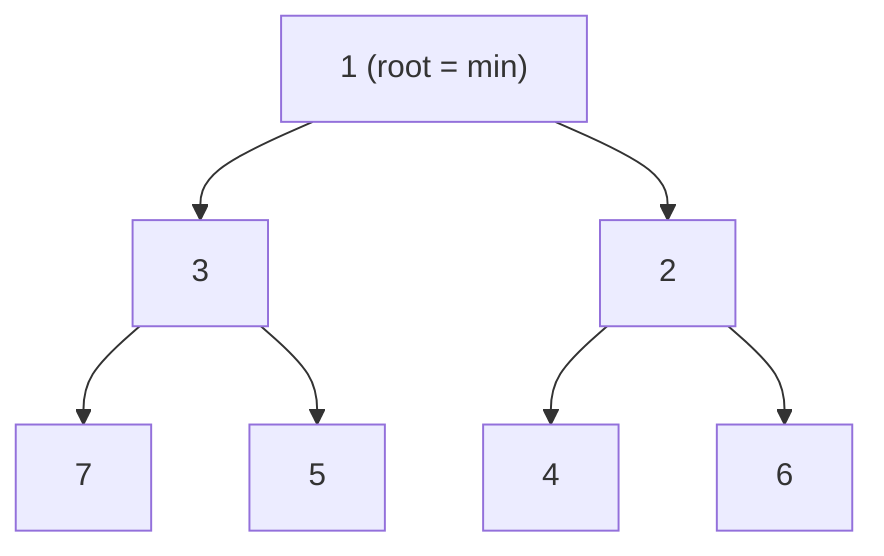

# Pattern: Min Heap / Priority Queue

<DifficultyBadge />

## One Liner

A binary tree stored in an array where the smallest element is always at the root, enabling O(1) peek and O(log n) insert/remove.

<DemoBadge />

## Real-World Analogy

An emergency room triage desk. Patients aren't seen in arrival order — the most critical case is always next. New patients are slotted into the queue by severity, and the system always knows who's most urgent without scanning everyone.

## Core Idea

A min heap is a complete binary tree where every parent is smaller than its children. By storing it in a flat array (parent at `i`, children at `2i+1` and `2i+2`), you avoid pointer overhead and get cache-friendly access.



Two operations maintain the invariant:

- **sift up** — after inserting at the end, bubble the element up until the parent is smaller
- **sift down** — after removing the root (swap with last element), push the new root down until both children are larger

Array layout: `[1, 3, 2, 7, 5, 4, 6]` — the tree above stored flat.

**Try it yourself** — insert values and extract the minimum to see sift-up and sift-down in action:

<MinHeapViz />

## Production Proof

| Project | Source | Usage |
|---------|--------|-------|
| React | [SchedulerMinHeap.js#L17-L90](https://github.com/facebook/react/blob/main/packages/scheduler/src/SchedulerMinHeap.js#L17-L90) | React's scheduler stores scheduled tasks in a min heap sorted by `sortIndex` (expiration time). `peek()` returns the highest-priority task in O(1). The entire implementation is ~75 lines. |
| Linux Kernel | [fair.c#L1407-L1460](https://github.com/torvalds/linux/blob/master/kernel/sched/fair.c#L1407-L1460) | CFS's `update_curr` updates each task's virtual runtime. `pick_next_task_fair` (line 9234) selects the task with the smallest vruntime from a red-black tree — the same "always access the minimum" principle as a min heap. |

## Implementation

::: code-group

```typescript [TypeScript]
interface HeapNode {
  sortIndex: number;
  id: number;
}

class MinHeap<T extends HeapNode> {
  private heap: T[] = [];

  peek(): T | null {
    return this.heap[0] ?? null;
  }

  push(node: T): void {
    this.heap.push(node);
    this.siftUp(this.heap.length - 1);
  }

  pop(): T | null {
    if (this.heap.length === 0) return null;
    const first = this.heap[0]!;
    const last = this.heap.pop()!;
    if (this.heap.length > 0) {
      this.heap[0] = last;
      this.siftDown(0);
    }
    return first;
  }

  get size(): number {
    return this.heap.length;
  }

  private siftUp(i: number): void {
    while (i > 0) {
      const parent = (i - 1) >>> 1;
      if (this.compare(this.heap[i]!, this.heap[parent]!) < 0) {
        this.swap(i, parent);
        i = parent;
      } else break;
    }
  }

  private siftDown(i: number): void {
    const len = this.heap.length;
    const half = len >>> 1;
    while (i < half) {
      let smallest = i;
      const left = 2 * i + 1;
      const right = 2 * i + 2;
      if (left < len && this.compare(this.heap[left]!, this.heap[smallest]!) < 0) smallest = left;
      if (right < len && this.compare(this.heap[right]!, this.heap[smallest]!) < 0) smallest = right;
      if (smallest !== i) {
        this.swap(i, smallest);
        i = smallest;
      } else break;
    }
  }

  private compare(a: T, b: T): number {
    const diff = a.sortIndex - b.sortIndex;
    return diff !== 0 ? diff : a.id - b.id;
  }

  private swap(i: number, j: number): void {
    [this.heap[i], this.heap[j]] = [this.heap[j]!, this.heap[i]!];
  }
}
```

```rust [Rust]
pub struct MinHeap<T: Ord> {
    data: Vec<T>,
}

impl<T: Ord> MinHeap<T> {
    pub fn new() -> Self { MinHeap { data: Vec::new() } }

    pub fn peek(&self) -> Option<&T> { self.data.first() }

    pub fn push(&mut self, val: T) {
        self.data.push(val);
        self.sift_up(self.data.len() - 1);
    }

    pub fn pop(&mut self) -> Option<T> {
        if self.data.is_empty() { return None; }
        let last = self.data.len() - 1;
        self.data.swap(0, last);
        let val = self.data.pop();
        if !self.data.is_empty() { self.sift_down(0); }
        val
    }

    fn sift_up(&mut self, mut i: usize) {
        while i > 0 {
            let parent = (i - 1) / 2;
            if self.data[i] < self.data[parent] {
                self.data.swap(i, parent);
                i = parent;
            } else { break; }
        }
    }

    fn sift_down(&mut self, mut i: usize) {
        let len = self.data.len();
        loop {
            let (left, right) = (2 * i + 1, 2 * i + 2);
            let mut smallest = i;
            if left < len && self.data[left] < self.data[smallest] { smallest = left; }
            if right < len && self.data[right] < self.data[smallest] { smallest = right; }
            if smallest != i { self.data.swap(i, smallest); i = smallest; }
            else { break; }
        }
    }
}
```

```go [Go]
type HeapNode struct {
	SortIndex int
	ID        int
}

type MinHeap struct {
	data []HeapNode
}

func (h *MinHeap) Peek() (HeapNode, bool) {
	if len(h.data) == 0 { return HeapNode{}, false }
	return h.data[0], true
}

func (h *MinHeap) Push(node HeapNode) {
	h.data = append(h.data, node)
	h.siftUp(len(h.data) - 1)
}

func (h *MinHeap) Pop() (HeapNode, bool) {
	if len(h.data) == 0 { return HeapNode{}, false }
	val := h.data[0]
	last := len(h.data) - 1
	h.data[0] = h.data[last]
	h.data = h.data[:last]
	if len(h.data) > 0 { h.siftDown(0) }
	return val, true
}

func (h *MinHeap) siftUp(i int) {
	for i > 0 {
		parent := (i - 1) / 2
		if h.less(i, parent) { h.data[i], h.data[parent] = h.data[parent], h.data[i]; i = parent } else { break }
	}
}

func (h *MinHeap) siftDown(i int) {
	n := len(h.data)
	for {
		left, right, smallest := 2*i+1, 2*i+2, i
		if left < n && h.less(left, smallest) { smallest = left }
		if right < n && h.less(right, smallest) { smallest = right }
		if smallest != i { h.data[i], h.data[smallest] = h.data[smallest], h.data[i]; i = smallest } else { break }
	}
}

func (h *MinHeap) less(i, j int) bool {
	if h.data[i].SortIndex != h.data[j].SortIndex { return h.data[i].SortIndex < h.data[j].SortIndex }
	return h.data[i].ID < h.data[j].ID
}
```

```python [Python]
import heapq

# Python's heapq module implements a min heap on a list
heap = []

heapq.heappush(heap, (10, "low-priority"))
heapq.heappush(heap, (1, "urgent"))
heapq.heappush(heap, (5, "medium"))

# peek: heap[0] is always the minimum
assert heap[0] == (1, "urgent")

# pop in priority order
assert heapq.heappop(heap) == (1, "urgent")
assert heapq.heappop(heap) == (5, "medium")
assert heapq.heappop(heap) == (10, "low-priority")

# Custom: from-scratch implementation
class MinHeap:
    def __init__(self):
        self._data = []

    def push(self, val):
        self._data.append(val)
        self._sift_up(len(self._data) - 1)

    def pop(self):
        if not self._data:
            return None
        self._data[0], self._data[-1] = self._data[-1], self._data[0]
        val = self._data.pop()
        if self._data:
            self._sift_down(0)
        return val

    def peek(self):
        return self._data[0] if self._data else None

    def _sift_up(self, i):
        while i > 0:
            parent = (i - 1) // 2
            if self._data[i] < self._data[parent]:
                self._data[i], self._data[parent] = self._data[parent], self._data[i]
                i = parent
            else:
                break

    def _sift_down(self, i):
        n = len(self._data)
        while True:
            smallest, left, right = i, 2*i+1, 2*i+2
            if left < n and self._data[left] < self._data[smallest]:
                smallest = left
            if right < n and self._data[right] < self._data[smallest]:
                smallest = right
            if smallest != i:
                self._data[i], self._data[smallest] = self._data[smallest], self._data[i]
                i = smallest
            else:
                break
```

:::

## Exercises

| Level | Exercise | File |
|-------|----------|------|
| Basic | Implement push, pop, peek with sift operations | `exercises/typescript/min-heap/01-basic.test.ts` |
| Intermediate | Build a React-style task scheduler using min heap | `exercises/typescript/min-heap/02-task-scheduler.test.ts` |

Run exercises: `pnpm test` (TypeScript) · `cargo test` (Rust) · `go test ./...` (Go) · `pytest` (Python)

Exercise files: Rust `exercises/rust/src/min_heap.rs` · Go `exercises/go/min_heap_test.go` · Python `exercises/python/test_min_heap.py`

## When to Use

- **Task scheduling** — always process the highest-priority (lowest deadline) task first
- **Event-driven systems** — timer heaps for scheduling callbacks at specific times
- **Graph algorithms** — Dijkstra's shortest path, Prim's MST
- **Streaming top-K** — maintain the K smallest/largest elements from a stream
- **OS schedulers** — CFS uses a tree with min-heap properties for fair CPU distribution

## When NOT to Use

- **Need O(1) arbitrary lookup** — heaps only guarantee O(1) for the minimum; use a hash map for lookups
- **Sorted iteration** — if you need all elements in order, sort once; repeated pop is O(n log n)
- **Small fixed sets** — for < 10 elements, a linear scan is simpler and often faster
- **Need stable ordering** — equal-priority items may change order across operations

## More Production Uses

- [Node.js libuv](https://github.com/libuv/libuv) — timer queue
- Java `PriorityQueue`
- Python [heapq](https://github.com/python/cpython/blob/main/Lib/heapq.py)
- Dijkstra / Prim graph algorithms

## Related Patterns

| Pattern | Relationship |
|---------|-------------|
| [Merge Iterator (K-Way Merge)](/patterns/merge-iterator/) | K-way merge uses a min-heap to select the smallest element across streams |
| [Cooperative Scheduling](/patterns/cooperative-scheduling/) | React's scheduler uses a min-heap to pick the highest-priority task |
| [Event Loop](/patterns/event-loop/) | Timer queues in event loops often use min-heaps for earliest-deadline scheduling |
| [B+ Tree](/patterns/b-plus-tree/) | Alternative ordered structure — B+ trees optimize for disk, heaps for priority access |

## Challenge Questions

::: details Q1: How do you convert a min heap into a max heap without changing the data structure?
**Answer:** Negate the sort keys on insert and negate them back on extract.

Push `-priority` instead of `priority`. The min heap puts the most negative value (highest original priority) at the root. On pop, negate the key again to recover the original value. This works because a min heap over negated values is equivalent to a max heap over the original values. Python's `heapq` community uses this trick since the stdlib only provides a min heap.
:::

::: details Q2: Why does React use a min heap for scheduling instead of a sorted array?
**Answer:** A sorted array has O(n) insertion (shifting elements), while a min heap has O(log n) insertion and O(1) peek.

React's scheduler frequently inserts new tasks with varying expiration times and always needs the earliest-expiring task. A sorted array gives O(1) access to the minimum but costs O(n) to insert (binary search + shift). A min heap gives O(1) peek and O(log n) insert/remove — a better tradeoff for a dynamic queue where tasks are constantly added and removed. For a static, one-time sort, the sorted array wins.
:::

::: details Q3: A balanced BST (like a red-black tree) also gives O(log n) insert and O(log n) find-min. Why does Linux CFS use a red-black tree but React uses a min heap?
**Answer:** CFS needs to remove arbitrary tasks (not just the minimum) when processes exit, which a BST handles in O(log n) but a heap handles in O(n).

A min heap only efficiently removes the root. Deleting an arbitrary element requires O(n) search + O(log n) sift. A red-black tree supports O(log n) deletion of any node. CFS frequently removes processes that exit or change priority, so the BST is justified. React's scheduler almost exclusively pops the highest-priority task from the front, making the simpler min heap (with its smaller constant factors and cache-friendly array layout) the better choice.
:::

::: details Q4: You have 1 billion log entries and need the 10 most recent. Should you use a min heap or a max heap, and what size?
**Answer:** Use a min heap of size 10. For each entry, if it's larger than the heap's minimum, pop the minimum and push the new entry.

This is the "top-K" pattern. A min heap of size K keeps the K largest elements seen so far, with the smallest of those K at the root as a gatekeeper. Each new element is compared to the root in O(1) — if it's smaller, skip it; if larger, replace the root in O(log K). Total cost: O(n log K) with O(K) memory, not O(n log n) for a full sort.
:::
