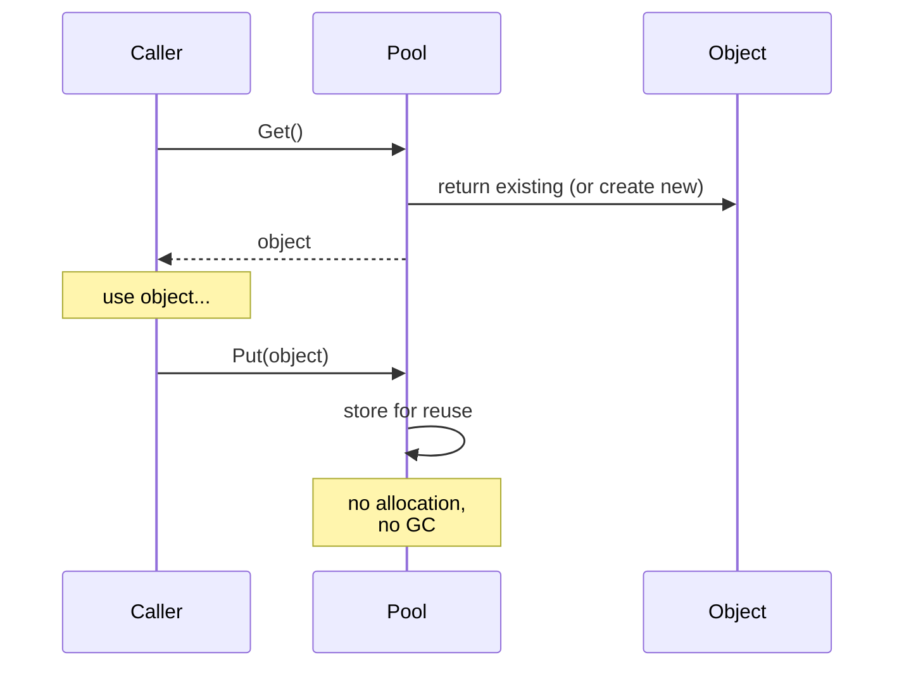

# Pattern: Object Pool

## One Liner

Pre-allocate a set of reusable objects to avoid the cost of repeated allocation and garbage collection on hot paths.

<DemoBadge />

## Core Idea

Creating and destroying objects is expensive — memory allocation, constructor logic, GC pressure. An object pool maintains a collection of pre-initialized objects. When you need one, you "get" it from the pool; when done, you "put" it back instead of discarding it.



The pool acts as a cache of allocated objects. The key trade-off: memory usage (idle objects sitting in the pool) vs. CPU/GC savings (no allocation on the hot path).

**Try it yourself** — acquire connections from the pool and watch what happens when it's exhausted:

<ObjectPoolViz />

## Production Proof

| Project | Source | Usage |
|---------|--------|-------|
| Go stdlib | [pool.go#L52-L97](https://github.com/golang/go/blob/master/src/sync/pool.go#L52-L97) | `sync.Pool` — Go's standard library pool for temporary objects. `Get()` (line 132) retrieves from a per-P local pool first (lock-free), then falls back to stealing from other Ps. `Put()` (line 100) returns objects for reuse. Used extensively in `fmt`, `encoding/json`, and HTTP handlers. |
| Godot Engine | [pooled_list.h#L35-L100](https://github.com/godotengine/godot/blob/master/core/templates/pooled_list.h#L35-L100) | `PooledList` — a freelist-based pool for game engine objects. Elements are allocated in contiguous pages and recycled via a freelist, avoiding per-frame allocation for entities, particles, and physics bodies. |

## Implementation

::: code-group

```typescript [TypeScript]
class ObjectPool<T> {
  private pool: T[] = [];
  private factory: () => T;
  private reset: (obj: T) => void;

  constructor(factory: () => T, reset: (obj: T) => void, initialSize = 0) {
    this.factory = factory;
    this.reset = reset;
    for (let i = 0; i < initialSize; i++) {
      this.pool.push(factory());
    }
  }

  get(): T {
    if (this.pool.length > 0) {
      return this.pool.pop()!;
    }
    return this.factory();
  }

  release(obj: T): void {
    this.reset(obj);
    this.pool.push(obj);
  }

  get size(): number {
    return this.pool.length;
  }
}
```

```rust [Rust]
pub struct ObjectPool<T> {
    pool: Vec<T>,
    factory: Box<dyn Fn() -> T>,
}

impl<T> ObjectPool<T> {
    pub fn new(factory: impl Fn() -> T + 'static, initial: usize) -> Self {
        let factory = Box::new(factory);
        let pool = (0..initial).map(|_| (factory)()).collect();
        ObjectPool { pool, factory }
    }

    pub fn get(&mut self) -> T {
        self.pool.pop().unwrap_or_else(|| (self.factory)())
    }

    pub fn release(&mut self, obj: T) {
        self.pool.push(obj);
    }
}
```

```go [Go]
package pool

import "sync"

// In production, use sync.Pool directly:
var bufPool = sync.Pool{
	New: func() any {
		return make([]byte, 0, 4096)
	},
}

func ProcessRequest(data []byte) []byte {
	buf := bufPool.Get().([]byte)
	buf = buf[:0] // reset length, keep capacity
	buf = append(buf, data...)
	// ... process ...
	result := make([]byte, len(buf))
	copy(result, buf)
	bufPool.Put(buf) // return to pool
	return result
}
```

```python [Python]
from typing import TypeVar, Callable, List

T = TypeVar("T")

class ObjectPool:
    def __init__(self, factory: Callable[[], T], reset: Callable[[T], None], initial: int = 0):
        self._factory = factory
        self._reset = reset
        self._pool: List[T] = [factory() for _ in range(initial)]

    def get(self) -> T:
        if self._pool:
            return self._pool.pop()
        return self._factory()

    def release(self, obj: T) -> None:
        self._reset(obj)
        self._pool.append(obj)
```

:::

## Exercises

| Level | Exercise | File |
|-------|----------|------|
| Basic | Implement a generic object pool with get/release | `exercises/typescript/object-pool/01-basic.test.ts` |
| Intermediate | Build a connection pool with max-size and timeout | `exercises/typescript/object-pool/02-connection-pool.test.ts` |

Run exercises: `pnpm test` (TypeScript) · `cargo test` (Rust) · `go test ./...` (Go) · `pytest` (Python)

Exercise files: Rust `exercises/rust/src/object_pool.rs` · Go `exercises/go/object_pool_test.go` · Python `exercises/python/test_object_pool.py`

## When to Use

- **High-frequency allocation** — game loops, request handlers, particle systems
- **Expensive constructors** — database connections, thread contexts, large buffers
- **GC-sensitive environments** — real-time systems, game engines, low-latency services
- **Fixed resource limits** — connection pools, thread pools, file descriptor pools

## When NOT to Use

- **Cheap objects** — if allocation is fast and GC is not a concern, a pool adds complexity
- **Varied lifetimes** — if objects are held for long, unpredictable durations, the pool won't help
- **Small scale** — for a handful of objects, the pool overhead exceeds the savings
- **Immutable objects** — pool only makes sense for mutable objects that need resetting

## More Production Uses

- Java `ThreadPoolExecutor`
- .NET `ArrayPool<T>`
- [HikariCP](https://github.com/brettwooldridge/HikariCP) — JDBC connection pool
- Unity `ObjectPool<T>`

## Related Patterns

| Pattern | Relationship |
|---------|-------------|
| [Free List](/patterns/free-list/) | Free lists manage the pool's internal allocation of slots |
| [Arena Allocator](/patterns/arena-allocator/) | Arena allocators batch-allocate for pool objects; both avoid per-object malloc |
| [Semaphore](/patterns/semaphore/) | Pool size acts as a semaphore limiting concurrent object usage |

## Challenge Questions

::: details Q1: Your pool is initialized with 10 objects, but at peak load you need 100. Should the pool grow dynamically or reject requests beyond 10?
**Answer:** It depends on the resource type. Grow dynamically for cheap objects (buffers); enforce a hard cap for expensive/limited resources (database connections).

A buffer pool should grow on demand and optionally shrink during idle periods — the cost of allocating an extra buffer is low. A database connection pool should enforce `maxSize` because each connection consumes server memory, file descriptors, and auth state. Requests beyond the cap should queue and wait (with a timeout) rather than creating unbounded connections that crash the database. HikariCP defaults to a max of 10 connections for this reason.
:::

::: details Q2: A developer calls `pool.get()` but never calls `pool.release()`. How does this "object leak" manifest, and how can you detect it?
**Answer:** The pool gradually empties and starts allocating new objects every time, defeating its purpose and potentially exhausting resources.

Detection strategies: (1) track outstanding objects with a Set and log warnings when count exceeds a threshold, (2) use weak references and a finalizer to detect objects that were GC'd without being returned, (3) wrap pooled objects in a proxy that auto-releases after a timeout. Go's `sync.Pool` sidesteps this entirely — it offers no guarantees about object retention and lets the GC reclaim idle pool entries, making leaks less catastrophic but the pool less predictable.
:::

::: details Q3: Two goroutines call `pool.Get()` simultaneously. What makes Go's `sync.Pool` safe here without an explicit mutex around every get/put?
**Answer:** `sync.Pool` uses per-P (per-processor) local pools with lock-free access, falling back to a shared pool with a mutex only when the local pool is empty.

Each OS thread (P in Go's scheduler) has its own private pool slot. `Get()` first checks the local slot (no lock needed — only one goroutine runs on a P at a time). If empty, it steals from other Ps' pools under a lock. `Put()` goes to the local slot first. This per-P sharding pattern minimizes contention. For a hand-rolled pool in a multithreaded environment, you would need a mutex or a lock-free data structure like a concurrent stack.
:::

::: details Q4: You build an object pool for HTTP request objects in a Node.js server. After profiling, you discover it's slower than just using `new Request()`. What went wrong?
**Answer:** In V8's generational GC, short-lived small objects are allocated and collected almost for free — the pool's reset logic and bookkeeping cost more than the allocation it avoids.

V8's young generation GC uses bump-pointer allocation (essentially free) and collects short-lived objects by copying survivors, not scanning garbage. If your `Request` objects are small, created per-request, and discarded immediately, GC handles them efficiently. The pool adds overhead: maintaining the free list, resetting object state, preventing V8 from optimizing object shapes. Object pools shine for expensive constructors (DB connections, compiled regexes) or GC-pause-sensitive contexts (game loops), not for cheap objects in a modern GC runtime.
:::
