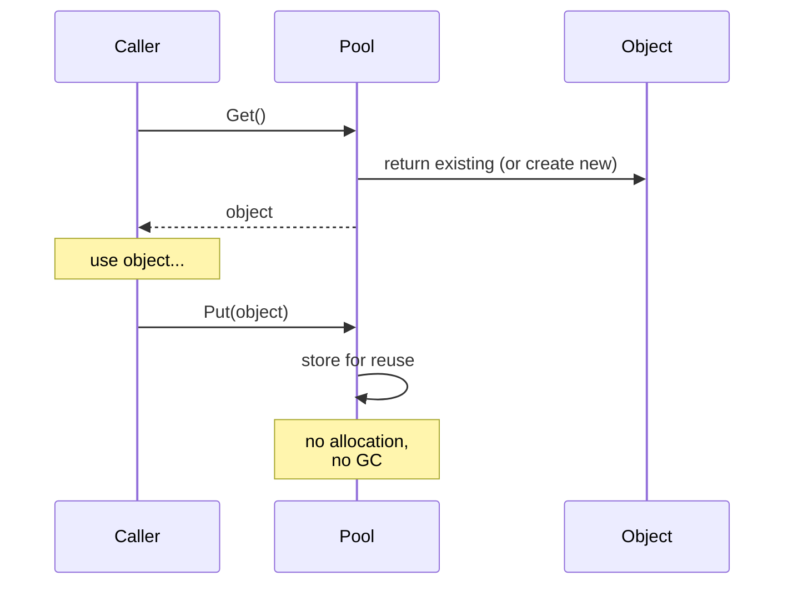

# Pattern: Object Pool

## One Liner

Pre-allocate a set of reusable objects to avoid the cost of repeated allocation and garbage collection on hot paths.

## Core Idea

Creating and destroying objects is expensive — memory allocation, constructor logic, GC pressure. An object pool maintains a collection of pre-initialized objects. When you need one, you "get" it from the pool; when done, you "put" it back instead of discarding it.



The pool acts as a cache of allocated objects. The key trade-off: memory usage (idle objects sitting in the pool) vs. CPU/GC savings (no allocation on the hot path).

## Production Proof

| Project | Source | Usage |
|---------|--------|-------|
| Go stdlib | [pool.go#L52-L97](https://github.com/golang/go/blob/master/src/sync/pool.go#L52-L97) | `sync.Pool` — Go's standard library pool for temporary objects. `Get()` (line 132) retrieves from a per-P local pool first (lock-free), then falls back to stealing from other Ps. `Put()` (line 100) returns objects for reuse. Used extensively in `fmt`, `encoding/json`, and HTTP handlers. |
| Godot Engine | [pooled_list.h#L35-L100](https://github.com/godotengine/godot/blob/master/core/templates/pooled_list.h#L35-L100) | `PooledList` — a freelist-based pool for game engine objects. Elements are allocated in contiguous pages and recycled via a freelist, avoiding per-frame allocation for entities, particles, and physics bodies. |

## Implementation

::: code-group

```typescript [TypeScript]
class ObjectPool<T> {
  private pool: T[] = [];
  private factory: () => T;
  private reset: (obj: T) => void;

  constructor(factory: () => T, reset: (obj: T) => void, initialSize = 0) {
    this.factory = factory;
    this.reset = reset;
    for (let i = 0; i < initialSize; i++) {
      this.pool.push(factory());
    }
  }

  get(): T {
    if (this.pool.length > 0) {
      return this.pool.pop()!;
    }
    return this.factory();
  }

  release(obj: T): void {
    this.reset(obj);
    this.pool.push(obj);
  }

  get size(): number {
    return this.pool.length;
  }
}
```

```rust [Rust]
pub struct ObjectPool<T> {
    pool: Vec<T>,
    factory: Box<dyn Fn() -> T>,
}

impl<T> ObjectPool<T> {
    pub fn new(factory: impl Fn() -> T + 'static, initial: usize) -> Self {
        let factory = Box::new(factory);
        let pool = (0..initial).map(|_| (factory)()).collect();
        ObjectPool { pool, factory }
    }

    pub fn get(&mut self) -> T {
        self.pool.pop().unwrap_or_else(|| (self.factory)())
    }

    pub fn release(&mut self, obj: T) {
        self.pool.push(obj);
    }
}
```

```go [Go]
package pool

import "sync"

// In production, use sync.Pool directly:
var bufPool = sync.Pool{
	New: func() any {
		return make([]byte, 0, 4096)
	},
}

func ProcessRequest(data []byte) []byte {
	buf := bufPool.Get().([]byte)
	buf = buf[:0] // reset length, keep capacity
	buf = append(buf, data...)
	// ... process ...
	result := make([]byte, len(buf))
	copy(result, buf)
	bufPool.Put(buf) // return to pool
	return result
}
```

```python [Python]
from typing import TypeVar, Callable, List

T = TypeVar("T")

class ObjectPool:
    def __init__(self, factory: Callable[[], T], reset: Callable[[T], None], initial: int = 0):
        self._factory = factory
        self._reset = reset
        self._pool: List[T] = [factory() for _ in range(initial)]

    def get(self) -> T:
        if self._pool:
            return self._pool.pop()
        return self._factory()

    def release(self, obj: T) -> None:
        self._reset(obj)
        self._pool.append(obj)
```

:::

## Exercises

| Level | Exercise | File |
|-------|----------|------|
| Basic | Implement a generic object pool with get/release | `exercises/typescript/object-pool/01-basic.test.ts` |
| Intermediate | Build a connection pool with max-size and timeout | `exercises/typescript/object-pool/02-connection-pool.test.ts` |

Run exercises: `pnpm test` · `cargo test` · `go test ./...`

## When to Use

- **High-frequency allocation** — game loops, request handlers, particle systems
- **Expensive constructors** — database connections, thread contexts, large buffers
- **GC-sensitive environments** — real-time systems, game engines, low-latency services
- **Fixed resource limits** — connection pools, thread pools, file descriptor pools

## When NOT to Use

- **Cheap objects** — if allocation is fast and GC is not a concern, a pool adds complexity
- **Varied lifetimes** — if objects are held for long, unpredictable durations, the pool won't help
- **Small scale** — for a handful of objects, the pool overhead exceeds the savings
- **Immutable objects** — pool only makes sense for mutable objects that need resetting

## More Production Uses

- Java `ThreadPoolExecutor`
- .NET `ArrayPool<T>`
- [HikariCP](https://github.com/brettwooldridge/HikariCP) — JDBC connection pool
- Unity `ObjectPool<T>`
