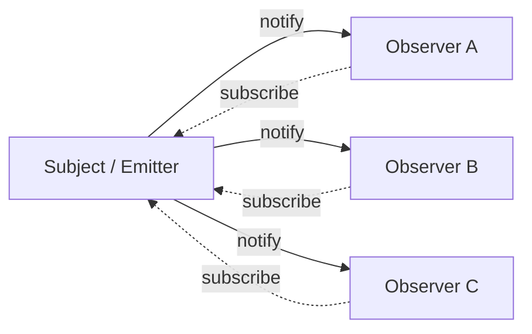

# Pattern: Observer / Pub-Sub

## One Liner

Decouple producers from consumers by letting objects subscribe to events and get notified when something happens, without the source knowing who's listening.

## Core Idea

The Observer pattern creates a one-to-many dependency: when the subject changes state, all registered observers are notified. The subject doesn't know what the observers do — it just calls them.



This decoupling is why the pattern is everywhere: from DOM `addEventListener` to Redux `store.subscribe` to Node.js `EventEmitter` to React's `useEffect` cleanup pattern.

## Production Proof

| Project | Source | Usage |
|---------|--------|-------|
| Node.js | [events.js#L456-L520](https://github.com/nodejs/node/blob/main/lib/events.js#L456-L520) | `EventEmitter.prototype.emit` — the core method that iterates over registered listeners and calls each one. Line 209 defines the `EventEmitter` constructor. This is the foundation of Node's event-driven architecture. |
| Redux | [createStore.ts#L211-L280](https://github.com/reduxjs/redux/blob/master/src/createStore.ts#L211-L280) | `subscribe()` adds a listener, `dispatch()` (line 280) calls all listeners after running the reducer. Redux snapshots the listener array before dispatch to handle subscribe/unsubscribe during notification safely. |

## Implementation

::: code-group

```typescript [TypeScript]
type Listener<T> = (data: T) => void;

class EventEmitter<Events extends Record<string, unknown>> {
  private listeners = new Map<keyof Events, Set<Listener<any>>>();

  on<K extends keyof Events>(event: K, listener: Listener<Events[K]>): () => void {
    if (!this.listeners.has(event)) {
      this.listeners.set(event, new Set());
    }
    this.listeners.get(event)!.add(listener);

    return () => this.off(event, listener);
  }

  off<K extends keyof Events>(event: K, listener: Listener<Events[K]>): void {
    this.listeners.get(event)?.delete(listener);
  }

  emit<K extends keyof Events>(event: K, data: Events[K]): void {
    this.listeners.get(event)?.forEach((listener) => listener(data));
  }

  listenerCount(event: keyof Events): number {
    return this.listeners.get(event)?.size ?? 0;
  }
}
```

```rust [Rust]
use std::collections::HashMap;

pub struct EventEmitter {
    listeners: HashMap<String, Vec<Box<dyn Fn(&str)>>>,
}

impl EventEmitter {
    pub fn new() -> Self {
        EventEmitter { listeners: HashMap::new() }
    }

    pub fn on(&mut self, event: &str, listener: impl Fn(&str) + 'static) {
        self.listeners
            .entry(event.to_string())
            .or_default()
            .push(Box::new(listener));
    }

    pub fn emit(&self, event: &str, data: &str) {
        if let Some(listeners) = self.listeners.get(event) {
            for listener in listeners {
                listener(data);
            }
        }
    }
}
```

```go [Go]
type Listener func(data any)

type EventEmitter struct {
	listeners map[string][]Listener
}

func NewEmitter() *EventEmitter {
	return &EventEmitter{listeners: make(map[string][]Listener)}
}

func (e *EventEmitter) On(event string, listener Listener) {
	e.listeners[event] = append(e.listeners[event], listener)
}

func (e *EventEmitter) Emit(event string, data any) {
	for _, listener := range e.listeners[event] {
		listener(data)
	}
}
```

```python [Python]
from collections import defaultdict
from typing import Callable, Any

class EventEmitter:
    def __init__(self):
        self._listeners: dict[str, list[Callable]] = defaultdict(list)

    def on(self, event: str, listener: Callable) -> Callable:
        self._listeners[event].append(listener)
        return lambda: self._listeners[event].remove(listener)

    def emit(self, event: str, data: Any = None) -> None:
        for listener in self._listeners[event]:
            listener(data)

    def listener_count(self, event: str) -> int:
        return len(self._listeners[event])

# Usage
emitter = EventEmitter()

messages = []
unsub = emitter.on("message", lambda data: messages.append(data))

emitter.emit("message", "hello")
emitter.emit("message", "world")
print(messages)  # ["hello", "world"]

unsub()  # unsubscribe
emitter.emit("message", "ignored")
print(messages)  # ["hello", "world"] — unchanged
```

:::

## Exercises

| Level | Exercise | File |
|-------|----------|------|
| Basic | Implement an EventEmitter with on/off/emit | `exercises/typescript/observer/01-basic.test.ts` |

Run exercises: `pnpm test`

## When to Use

- **Event-driven systems** — UI events, network events, message queues
- **Decoupling modules** — plugins, middleware, extension points
- **State management** — Redux store, MobX observables, Vue reactivity
- **Logging / metrics** — emit events without knowing who collects them
- **Real-time updates** — WebSocket message distribution, live feeds

## When NOT to Use

- **Synchronous pipelines** — if the order and completion of processing matters, use direct function calls
- **Too many events** — event storms can be hard to debug; consider batching
- **Circular dependencies** — A observes B, B observes A → infinite loop
- **Strong ordering guarantees** — observer notification order may not be deterministic across implementations
