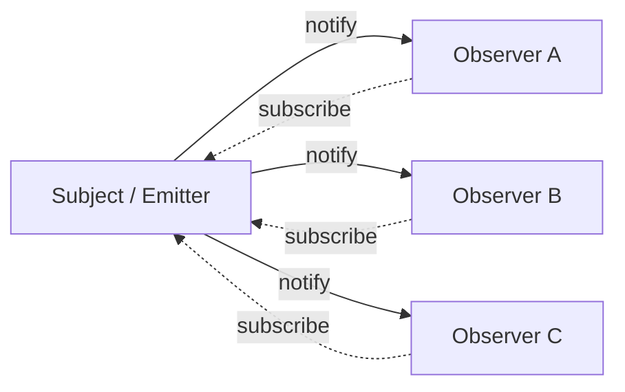

# Pattern: Observer / Pub-Sub

<DifficultyBadge />

## One Liner

Decouple producers from consumers by letting objects subscribe to events and get notified when something happens, without the source knowing who's listening.

<DemoBadge />

## Real-World Analogy

A newspaper subscription. You sign up once, and every morning the paper arrives at your door. You don't have to check the newsstand — the publisher pushes updates to all subscribers. Cancel anytime.

## Core Idea

The Observer pattern creates a one-to-many dependency: when the subject changes state, all registered observers are notified. The subject doesn't know what the observers do — it just calls them.



This decoupling is why the pattern is everywhere: from DOM `addEventListener` to Redux `store.subscribe` to Node.js `EventEmitter` to React's `useEffect` cleanup pattern.

| Property | Value |
|----------|-------|
| subscribe | O(1) — add to listener set |
| unsubscribe | O(1) — remove from listener set |
| emit / notify | O(n) — call each of n listeners |
| Space | O(listeners) per event type |

**Try it yourself** — emit events and watch them fan out to all subscribers:

<ObserverViz />

## Production Proof

| Project | Source | Usage |
|---------|--------|-------|
| Node.js | [events.js#L456-L520](https://github.com/nodejs/node/blob/main/lib/events.js#L456-L520) | `EventEmitter.prototype.emit` — the core method that iterates over registered listeners and calls each one. Line 209 defines the `EventEmitter` constructor. This is the foundation of Node's event-driven architecture. |
| Redux | [createStore.ts#L211-L280](https://github.com/reduxjs/redux/blob/master/src/createStore.ts#L211-L280) | `subscribe()` adds a listener, `dispatch()` (line 280) calls all listeners after running the reducer. Redux snapshots the listener array before dispatch to handle subscribe/unsubscribe during notification safely. |

## Implementation

::: code-group

```typescript [TypeScript]
type Listener<T> = (data: T) => void;

class EventEmitter<Events extends Record<string, unknown>> {
  private listeners = new Map<keyof Events, Set<Listener<any>>>();

  on<K extends keyof Events>(event: K, listener: Listener<Events[K]>): () => void {
    if (!this.listeners.has(event)) {
      this.listeners.set(event, new Set());
    }
    this.listeners.get(event)!.add(listener);

    return () => this.off(event, listener);
  }

  off<K extends keyof Events>(event: K, listener: Listener<Events[K]>): void {
    this.listeners.get(event)?.delete(listener);
  }

  emit<K extends keyof Events>(event: K, data: Events[K]): void {
    this.listeners.get(event)?.forEach((listener) => listener(data));
  }

  listenerCount(event: keyof Events): number {
    return this.listeners.get(event)?.size ?? 0;
  }
}
```

```rust [Rust]
use std::collections::HashMap;

pub struct EventEmitter {
    listeners: HashMap<String, Vec<Box<dyn Fn(&str)>>>,
}

impl EventEmitter {
    pub fn new() -> Self {
        EventEmitter { listeners: HashMap::new() }
    }

    pub fn on(&mut self, event: &str, listener: impl Fn(&str) + 'static) {
        self.listeners
            .entry(event.to_string())
            .or_default()
            .push(Box::new(listener));
    }

    pub fn emit(&self, event: &str, data: &str) {
        if let Some(listeners) = self.listeners.get(event) {
            for listener in listeners {
                listener(data);
            }
        }
    }
}
```

```go [Go]
type Listener func(data any)

type EventEmitter struct {
	listeners map[string][]Listener
}

func NewEmitter() *EventEmitter {
	return &EventEmitter{listeners: make(map[string][]Listener)}
}

func (e *EventEmitter) On(event string, listener Listener) {
	e.listeners[event] = append(e.listeners[event], listener)
}

func (e *EventEmitter) Emit(event string, data any) {
	for _, listener := range e.listeners[event] {
		listener(data)
	}
}
```

```python [Python]
from collections import defaultdict
from typing import Callable, Any

class EventEmitter:
    def __init__(self):
        self._listeners: dict[str, list[Callable]] = defaultdict(list)

    def on(self, event: str, listener: Callable) -> Callable:
        self._listeners[event].append(listener)
        return lambda: self._listeners[event].remove(listener)

    def emit(self, event: str, data: Any = None) -> None:
        for listener in self._listeners[event]:
            listener(data)

    def listener_count(self, event: str) -> int:
        return len(self._listeners[event])

# Usage
emitter = EventEmitter()

messages = []
unsub = emitter.on("message", lambda data: messages.append(data))

emitter.emit("message", "hello")
emitter.emit("message", "world")
print(messages)  # ["hello", "world"]

unsub()  # unsubscribe
emitter.emit("message", "ignored")
print(messages)  # ["hello", "world"] — unchanged
```

:::

## Exercises

| Level | Exercise | File |
|-------|----------|------|
| Basic | Implement an EventEmitter with on/off/emit | `exercises/typescript/observer/01-basic.test.ts` |
| Intermediate | Typed event bus with on/once/off/emit | `exercises/typescript/observer/02-intermediate.test.ts` |

Run exercises: `pnpm test` (TypeScript) · `cargo test` (Rust) · `go test ./...` (Go) · `pytest` (Python)

Exercise files: Rust `exercises/rust/src/observer/mod.rs` · Go `exercises/go/observer/observer_test.go` · Python `exercises/python/observer/test_observer.py`

## When to Use

- **Event-driven systems** — UI events, network events, message queues
- **Decoupling modules** — plugins, middleware, extension points
- **State management** — Redux store, MobX observables, Vue reactivity
- **Logging / metrics** — emit events without knowing who collects them
- **Real-time updates** — WebSocket message distribution, live feeds

## When NOT to Use

- **Synchronous pipelines** — if the order and completion of processing matters, use direct function calls
- **Too many events** — event storms can be hard to debug; consider batching
- **Circular dependencies** — A observes B, B observes A → infinite loop
- **Strong ordering guarantees** — observer notification order may not be deterministic across implementations

## More Production Uses

- [RxJS](https://github.com/ReactiveX/rxjs) — reactive streams
- [Vue 3](https://github.com/vuejs/core) — reactivity system
- [MobX](https://github.com/mobxjs/mobx)
- [Chromium EventTarget](https://github.com/chromium/chromium/blob/main/third_party/blink/renderer/core/dom/events/event_target.cc) — DOM `addEventListener` implementation in Blink
- [.NET events](https://github.com/dotnet/runtime/blob/main/src/libraries/System.Private.CoreLib/src/System/EventHandler.cs) — C# `event` keyword delegates

## Related Patterns

| Pattern | Relationship |
|---------|-------------|
| [Event Loop](/patterns/event-loop/) | Event loops dispatch events to observers registered for specific event types |
| [Dirty Flag](/patterns/dirty-flag/) | Observer triggers notification; dirty flag defers the expensive reaction |
| [Middleware](/patterns/middleware-chain/) | Middleware observes and transforms data flowing through a pipeline |
| [Actor Model](/patterns/actor-model/) | Both decouple producers from consumers — observer via callbacks, actors via message passing |

## Challenge Questions

::: details Q1: A React component subscribes to a store in `useEffect` but forgets to return a cleanup function. What happens when the component unmounts?
**Answer:** The listener remains registered, causing a memory leak and phantom updates to an unmounted component.

The store holds a reference to the listener callback, which closes over the component's state. The component is unmounted but never garbage collected because the store still references it. Worse, when the store emits, the stale listener runs and may call `setState` on an unmounted component. This is the classic observer memory leak — every `subscribe` must have a corresponding `unsubscribe`, and `useEffect`'s cleanup function is the mechanism React provides for this.
:::

::: details Q2: You have 3 observers: A logs to a file, B updates the UI, C sends a network request. Does the order they are notified matter?
**Answer:** In most implementations, observers are called in registration order, but you should not rely on this — the pattern makes no ordering guarantees.

If B's UI update depends on A's log completing first, you have an implicit coupling that the observer pattern is supposed to eliminate. Each observer should be independent. If ordering matters, you need a different pattern: a middleware chain, a pipeline, or explicit dependency declaration. Node.js's `EventEmitter` calls listeners in registration order, but Redux explicitly snapshots the listener array to avoid order-dependent bugs during subscribe/unsubscribe within a dispatch.
:::

::: details Q3: An `emit('data', payload)` call triggers 50 synchronous observers, one of which throws an exception. What happens to observers 2-50?
**Answer:** In a naive implementation, observers 2-50 never execute — the exception propagates up and aborts the `emit` loop.

This is why production implementations wrap each listener call in a try-catch. Node.js `EventEmitter` does NOT do this by default — one throwing listener kills the rest. You must handle errors yourself. RxJS uses an error boundary per subscriber. The design choice is: fail-fast (one bad observer stops everything) vs. fault-tolerant (isolate failures, continue notifying). For critical systems, always isolate observer failures.
:::

::: details Q4: Should observer notifications be synchronous or asynchronous? What breaks if you switch from sync to async?
**Answer:** Synchronous notifications guarantee that all observers have processed the event before `emit()` returns; switching to async breaks any code that assumes state is updated immediately after emitting.

With sync: `emit('change'); readState()` sees the updated state because observers ran inline. With async: `emit('change'); readState()` sees the OLD state because observers are queued. This breaks patterns like Redux where `dispatch()` is expected to have fully completed by the time it returns. Async notification is better for performance (non-blocking) but requires the system to handle the "eventually consistent" gap between emit and observer execution.
:::
