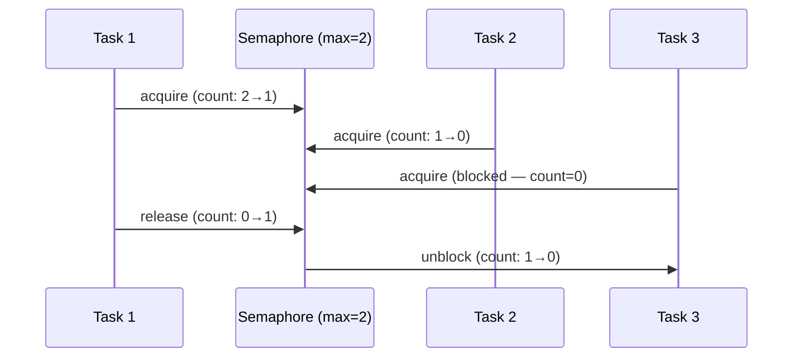

# Pattern: Semaphore / Bounded Concurrency

## One Liner

Limit the number of concurrent operations by maintaining a counter — acquire before work, release after, block when the limit is reached.

## Core Idea

A semaphore is a counter with two atomic operations: `acquire` (decrement, block if zero) and `release` (increment). It controls how many concurrent tasks can access a shared resource.



**Try it yourself** — acquire permits and watch workers queue when the semaphore is full:

<SemaphoreViz />

## Production Proof

| Project | Source | Usage |
|---------|--------|-------|
| Linux Kernel | [semaphore.h#L15-L55](https://github.com/torvalds/linux/blob/master/include/linux/semaphore.h#L15-L55) | `struct semaphore` — kernel counting semaphore with `down()` (acquire) and `up()` (release). Used for device driver access control, limiting concurrent I/O operations. |
| Go stdlib | [semaphore.go#L28-L107](https://github.com/golang/sync/blob/master/semaphore/semaphore.go#L28-L107) | `Weighted` struct (L28-L33) with `size`, `cur`, `mu`, `waiters`. `Acquire` (L38-L107) blocks until semaphore weight is available or context is cancelled. Used internally by `errgroup` to limit goroutine concurrency. |

## Implementation

::: code-group

```typescript [TypeScript]
class Semaphore {
  private queue: (() => void)[] = [];
  private count: number;

  constructor(private max: number) {
    this.count = max;
  }

  async acquire(): Promise<void> {
    if (this.count > 0) {
      this.count--;
      return;
    }
    return new Promise<void>((resolve) => this.queue.push(resolve));
  }

  release(): void {
    const next = this.queue.shift();
    if (next) {
      next();
    } else {
      this.count++;
    }
  }

  get available(): number {
    return this.count;
  }
}

async function withSemaphore<T>(sem: Semaphore, fn: () => Promise<T>): Promise<T> {
  await sem.acquire();
  try { return await fn(); }
  finally { sem.release(); }
}
```

```go [Go]
// Idiomatic Go: buffered channel as semaphore
func process(s string) { /* work */ }

func processWithLimit(items []string, maxConcurrent int) {
	sem := make(chan struct{}, maxConcurrent)
	var wg sync.WaitGroup

	for _, item := range items {
		wg.Add(1)
		sem <- struct{}{} // acquire
		go func(s string) {
			defer wg.Done()
			defer func() { <-sem }() // release
			process(s)
		}(item)
	}
	wg.Wait()
}
```

```python [Python]
import asyncio

async def fetch_with_limit(urls: list[str], max_concurrent: int = 5):
    sem = asyncio.Semaphore(max_concurrent)
    async def fetch_one(url: str):
        async with sem:  # acquire + release via context manager
            return await do_fetch(url)
    return await asyncio.gather(*(fetch_one(u) for u in urls))
```

```rust [Rust]
use std::sync::{Arc, Mutex, Condvar};

pub struct Semaphore {
    count: Mutex<usize>,
    cvar: Condvar,
}

impl Semaphore {
    pub fn new(max: usize) -> Self {
        Semaphore { count: Mutex::new(max), cvar: Condvar::new() }
    }

    pub fn acquire(&self) {
        let mut count = self.count.lock().unwrap();
        while *count == 0 { count = self.cvar.wait(count).unwrap(); }
        *count -= 1;
    }

    pub fn release(&self) {
        *self.count.lock().unwrap() += 1;
        self.cvar.notify_one();
    }
}
```

:::

## Exercises

| Level | Exercise | File |
|-------|----------|------|
| Basic | Implement a counting semaphore with acquire/release | `exercises/typescript/semaphore/01-basic.test.ts` |
| Intermediate | Connection pool guarded by a semaphore | `exercises/typescript/semaphore/02-intermediate.test.ts` |

Run exercises: `pnpm test`

## When to Use

- **Rate limiting** — limit concurrent API calls, database connections
- **Resource pools** — control access to a fixed number of resources
- **Backpressure** — prevent overwhelming downstream services
- **Throttling** — limit concurrent file I/O, network requests

## When NOT to Use

- **Mutual exclusion** — if you need exclusive access (max=1), use a mutex/lock instead
- **Simple counters** — if you don't need blocking, use an atomic counter
- **Queue-based flow** — if order matters, use a bounded queue instead

## More Production Uses

- Java `Semaphore`
- Python `threading.Semaphore`
- [Nginx](https://github.com/nginx/nginx) — worker connections
- [PostgreSQL](https://github.com/postgres/postgres) — `max_connections`

## Challenge Questions

::: details Q1: A semaphore with max=1 behaves like a mutex. Why would you ever use a mutex instead of a semaphore(1)?
**Answer:** A mutex has ownership semantics — only the thread that acquired it can release it — which prevents accidental release by another thread and enables priority inheritance.

A semaphore is an anonymous counter: any thread can call `release()` regardless of who called `acquire()`. This means a bug where thread B accidentally releases thread A's semaphore goes undetected. A mutex tracks its owner, so an unlock by a non-owner is an error (or panic). Additionally, mutex ownership enables priority inheritance: if a high-priority thread is waiting for a mutex held by a low-priority thread, the OS can temporarily boost the holder's priority. Semaphores can't do this because there's no "holder."
:::

::: details Q2: Three high-priority tasks and one low-priority task share a semaphore(1). The low-priority task acquires the semaphore, then a medium-priority task preempts it. The high-priority tasks are now blocked. What is this called and how is it solved?
**Answer:** This is priority inversion — a high-priority task is indirectly blocked by a medium-priority task that preempts the low-priority lock holder.

The classic example is the Mars Pathfinder bug. The medium-priority task runs indefinitely because it doesn't need the semaphore, preventing the low-priority task from finishing and releasing the semaphore. Solutions: (1) priority inheritance — temporarily boost the lock holder to the highest waiter's priority, (2) priority ceiling — assign the semaphore a ceiling priority equal to the highest-priority task that uses it, (3) avoid holding semaphores across preemption points.
:::

::: details Q3: You use a semaphore(10) to limit concurrent database connections. Under load, you discover connections are being created and destroyed rapidly. What is wrong with this design?
**Answer:** A semaphore only limits concurrency, not reuse. You need a connection pool (object pool pattern) combined with a semaphore, not a semaphore alone.

A semaphore permits up to 10 tasks to proceed but doesn't manage the connections themselves. Each task creates a new connection, uses it, and destroys it — the semaphore just gates how many do this simultaneously. A connection pool holds 10 pre-created connections and lends them out. The pool internally uses a semaphore (or equivalent blocking mechanism) to make callers wait when all connections are checked out. The semaphore is the concurrency primitive; the pool is the resource manager.
:::

::: details Q4: Go uses a buffered channel as a semaphore (`sem := make(chan struct{}, N)`). What advantage does this have over a traditional semaphore implementation?
**Answer:** It composes naturally with Go's `select` statement, enabling timeout, cancellation, and multi-resource acquisition without additional APIs.

With a channel-based semaphore, you can write `select { case sem <- struct{}{}: /* acquired */ case <-ctx.Done(): /* cancelled */ }` — combining acquisition with context cancellation in one construct. A traditional semaphore needs a separate `TryAcquire` or `AcquireWithTimeout` method. The channel approach also benefits from Go's runtime scheduler: goroutines blocked on channel operations are parked efficiently without consuming OS threads. The tradeoff is that channels have slightly higher overhead than a mutex-based counter for simple cases.
:::
