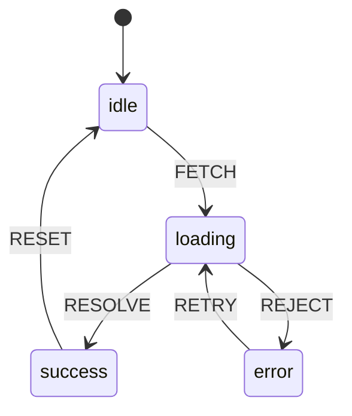

# Pattern: State Machine

## One Liner

Model an entity's lifecycle as a set of states with explicit transitions, making impossible states unrepresentable and every state change auditable.

## Core Idea

A state machine defines a finite set of states an entity can be in, and the transitions between them. At any point, the entity is in exactly one state. Transitions are triggered by events and can have guard conditions.



The power: **impossible transitions don't exist**. You can't go from `success` to `error` because no such transition is defined. The compiler (or runtime) enforces this.

## Production Proof

| Project | Source | Usage |
|---------|--------|-------|
| XState | [StateMachine.ts#L58-L120](https://github.com/statelyai/xstate/blob/main/packages/core/src/StateMachine.ts#L58-L120) | `StateMachine` class — the industry-standard state machine library for JavaScript/TypeScript. Used by Netflix, Microsoft, and AWS for complex UI flows, workflow orchestration, and protocol handling. |
| Linux Kernel | [tcp_input.c#L4865-L4920](https://github.com/torvalds/linux/blob/master/net/ipv4/tcp_input.c#L4865-L4920) | TCP connection state machine — the `switch (sk->sk_state)` block implements the TCP state transitions (LISTEN → SYN_SENT → ESTABLISHED → FIN_WAIT, etc.) that every internet connection uses. |

## Implementation

::: code-group

```typescript [TypeScript]
type StateConfig<S extends string, E extends string> = {
  [state in S]: {
    on: Partial<Record<E, S>>;
  };
};

class StateMachine<S extends string, E extends string> {
  private current: S;

  constructor(
    private config: StateConfig<S, E>,
    initial: S,
  ) {
    this.current = initial;
  }

  get state(): S {
    return this.current;
  }

  send(event: E): S {
    const transitions = this.config[this.current].on;
    const next = transitions[event];
    if (next !== undefined) {
      this.current = next;
    }
    return this.current;
  }

  can(event: E): boolean {
    return this.config[this.current].on[event] !== undefined;
  }
}
```

```rust [Rust]
use std::collections::HashMap;

pub struct StateMachine {
    current: String,
    transitions: HashMap<(String, String), String>,
}

impl StateMachine {
    pub fn new(initial: &str) -> Self {
        StateMachine {
            current: initial.to_string(),
            transitions: HashMap::new(),
        }
    }

    pub fn add_transition(&mut self, from: &str, event: &str, to: &str) {
        self.transitions.insert(
            (from.to_string(), event.to_string()),
            to.to_string(),
        );
    }

    pub fn send(&mut self, event: &str) -> &str {
        let key = (self.current.clone(), event.to_string());
        if let Some(next) = self.transitions.get(&key) {
            self.current = next.clone();
        }
        &self.current
    }

    pub fn state(&self) -> &str {
        &self.current
    }
}
```

```go [Go]
type StateMachine struct {
	current     string
	transitions map[string]map[string]string // state -> event -> next
}

func New(initial string) *StateMachine {
	return &StateMachine{
		current:     initial,
		transitions: make(map[string]map[string]string),
	}
}

func (sm *StateMachine) AddTransition(from, event, to string) {
	if sm.transitions[from] == nil {
		sm.transitions[from] = make(map[string]string)
	}
	sm.transitions[from][event] = to
}

func (sm *StateMachine) Send(event string) string {
	if next, ok := sm.transitions[sm.current][event]; ok {
		sm.current = next
	}
	return sm.current
}

func (sm *StateMachine) State() string { return sm.current }
```

```python [Python]
class StateMachine:
    def __init__(self, config: dict, initial: str):
        self._config = config
        self._current = initial

    @property
    def state(self) -> str:
        return self._current

    def send(self, event: str) -> str:
        transitions = self._config.get(self._current, {}).get("on", {})
        if event in transitions:
            self._current = transitions[event]
        return self._current

    def can(self, event: str) -> bool:
        return event in self._config.get(self._current, {}).get("on", {})

# Usage
traffic_light = StateMachine({
    "green":  {"on": {"TIMER": "yellow"}},
    "yellow": {"on": {"TIMER": "red"}},
    "red":    {"on": {"TIMER": "green"}},
}, initial="green")

traffic_light.send("TIMER")  # "yellow"
traffic_light.send("TIMER")  # "red"
traffic_light.send("TIMER")  # "green"
```

:::

## Exercises

| Level | Exercise | File |
|-------|----------|------|
| Basic | Implement a state machine with send/can | `exercises/typescript/state-machine/01-basic.test.ts` |

Run exercises: `pnpm test`

## When to Use

- **Protocol implementation** — TCP, HTTP, WebSocket state transitions
- **UI flow management** — multi-step forms, authentication flows, modals
- **Game logic** — character states (idle, walking, attacking, dead)
- **Workflow engines** — approval chains, deployment pipelines
- **Parsing** — tokenizers, regex engines, protocol decoders

## When NOT to Use

- **Simple boolean toggles** — a `true`/`false` doesn't need a state machine
- **Unbounded states** — if the state space is continuous (positions, scores), use plain variables
- **No invalid transitions** — if any state can transition to any other, you don't need constraints

## More Production Uses

- Regex engines (NFA/DFA)
- HTTP/2 stream states ([RFC 7540](https://datatracker.ietf.org/doc/html/rfc7540))
- [Kubernetes](https://github.com/kubernetes/kubernetes) — pod lifecycle
- Game AI (behavior trees + FSM)
