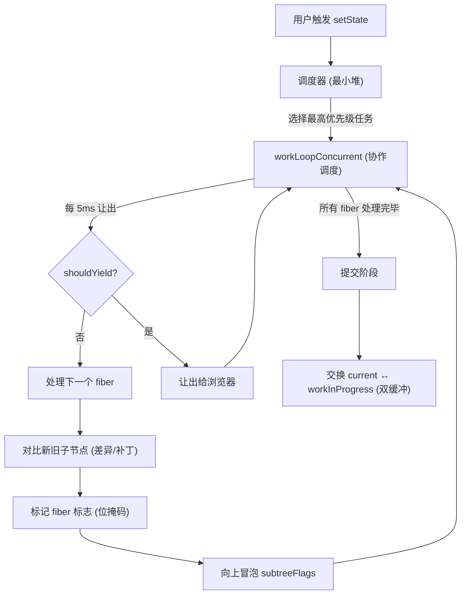
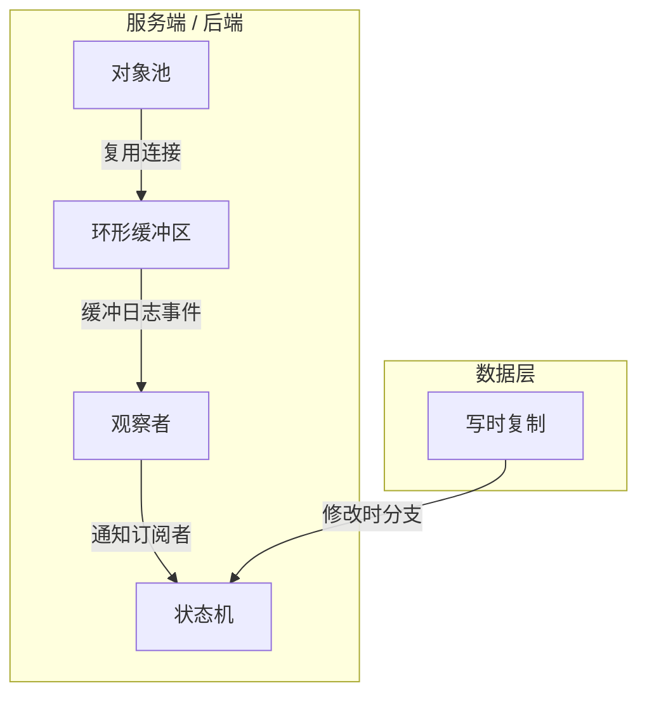

# 模式如何协作

这些模式不是孤立存在的。最有价值的洞察是生产系统如何将它们**组合**在一起。

## React：一个系统中的五个模式

React 的协调器是模式组合的典范。以下是本集合中五个模式如何在一次渲染周期中协同工作：

| 步骤 | 模式 | 发生了什么 |
|------|------|-----------|
| 1 | **最小堆** | `setState` 将更新入队。调度器的最小堆选择过期时间最早的任务。 |
| 2 | **协作调度** | `workLoopConcurrent` 逐个处理 fiber，每轮检查 `shouldYieldToHost()`。如果超过 5ms 就让出并重新调度。 |
| 3 | **差异/补丁** | 对每个 fiber，`reconcileChildFibers` 对比新旧子节点，决定保留、插入还是删除。 |
| 4 | **位掩码** | 副作用以位标志记录（`Placement \| Update \| Ref`）。`subtreeFlags` 通过 OR 向上冒泡，让提交阶段能跳过干净的子树。 |
| 5 | **双缓冲** | React 维护两棵 fiber 树——`current` 和 `workInProgress`。所有工作完成后原子交换。旧 current 变成新 workInProgress（回收，不被 GC）。 |

## 为什么这很重要

理解单个模式有用。理解它们如何**组合**才是区分高级工程师和初级工程师的关键。

当你遇到性能问题时，你不会想"我需要一个位掩码"。你会想"我需要低成本追踪多个状态（位掩码）、跳过未变更的部分（子树标志）、增量处理工作（协作调度）、优先处理紧急任务（最小堆）、在热路径上避免分配（双缓冲）。"

这就是 React 团队构建的。这就是你可以从这里学到的。

## 超越 React：跨系统的模式组合

另外五个模式出现在完全不同的领域，但常常与上述模式组合使用：

| 模式 | 组合对象 | 示例 |
|------|---------|------|
| **对象池** | 环形缓冲区 | 预分配的 buffer 池输入环形缓冲区，实现零分配 I/O（LMAX Disruptor） |
| **环形缓冲区** | 观察者 | 日志事件写入环形缓冲区，观察者异步消费（Linux ftrace） |
| **状态机** | 观察者 | 状态转换发射事件；观察者响应变化（XState + React） |
| **写时复制** | 双缓冲 | 都延迟复制开销——CoW 在数据层，双缓冲在结构层（Git + React Fiber） |
| **观察者** | 状态机 | 订阅者监听状态转换（Redux = 状态机 + 观察者） |
| **迭代器** | 批处理 | 惰性迭代源，批量 flush（Kafka 消费者） |
| **信号量** | 对象池 | N 个资源的池由 N 个许可的信号量守护（数据库连接池） |
| **指数退避重试** | 观察者 | 每次重试发射事件；观察者记录/告警/熔断（gRPC 拦截器） |
| **享元** | 对象池 | 都复用对象——享元共享不可变值，对象池回收可变实例 |
| **批处理** | 指数退避重试 | 批次失败 → 整批退避重试（Kafka 生产者） |

## 全局视角

这 15 个模式不是 15 个孤立的技巧。它们是生产系统混合搭配的**工具箱**：

- **React** 在一次渲染周期中使用 5 个（位掩码 + 双缓冲 + 调度 + 堆 + diff）
- **LMAX Disruptor** 组合对象池 + 环形缓冲区实现每秒 600 万笔订单
- **Git** 用写时复制 + 差异/补丁构建整个数据模型
- **Linux 内核** 跨子系统使用位掩码 + 最小堆 + 环形缓冲区 + 状态机 + 信号量
- **Kafka** 组合批处理 + 指数退避重试 + 环形缓冲区提升吞吐
- **Kubernetes** 使用指数退避重试 + 状态机 + 信号量管理 pod 生命周期

理解它们如何组合——这才是"知道一个模式"和"知道何时使用它"之间的差距。
