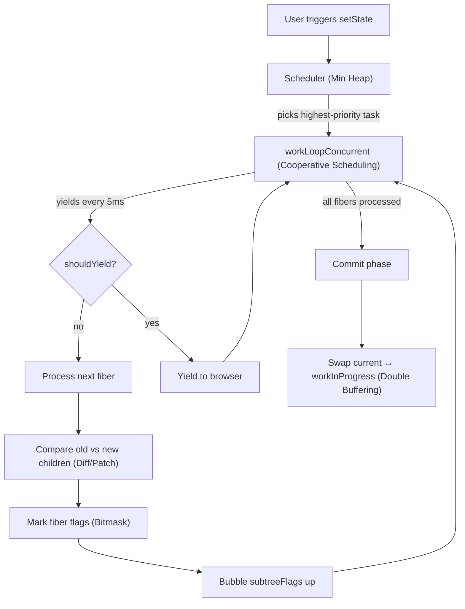
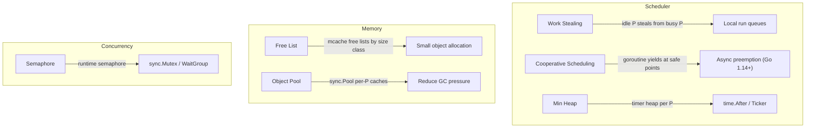
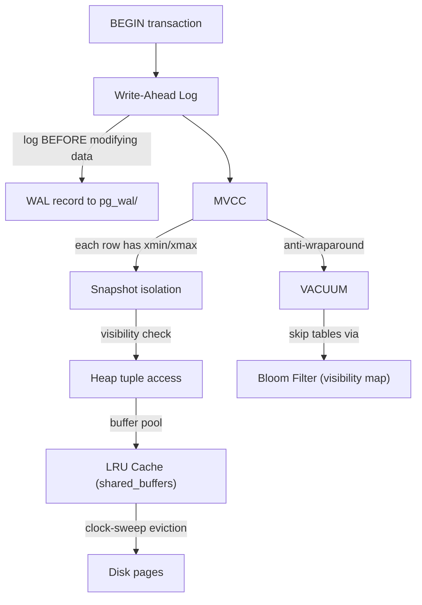
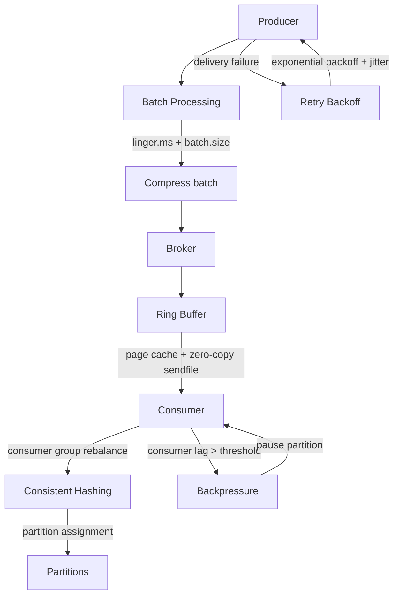

# 模式如何协作

这些模式不是孤立存在的。最有价值的洞察是生产系统如何将它们**组合**在一起。

## React：一次渲染周期中的五个模式

React 的协调器是模式组合的典范。以下是本集合中五个模式如何在一次渲染周期中协同工作：

| 步骤 | 模式 | 发生了什么 |
|------|------|-----------|
| 1 | **Min Heap** | `setState` 将更新入队。调度器的最小堆选择过期时间最早的任务。 |
| 2 | **Cooperative Scheduling** | `workLoopConcurrent` 逐个处理 fiber，每轮检查 `shouldYieldToHost()`。如果超过 5ms 就让出并重新调度。 |
| 3 | **Diff / Patch** | 对每个 fiber，`reconcileChildFibers` 对比新旧子节点，决定保留、插入还是删除。 |
| 4 | **Bitmask** | 副作用以位标志记录（`Placement \| Update \| Ref`）。`subtreeFlags` 通过 OR 向上冒泡，让提交阶段能跳过干净的子树。 |
| 5 | **Double Buffering** | React 维护两棵 fiber 树——`current` 和 `workInProgress`。所有工作完成后原子交换。旧 current 变成新 workInProgress（回收，不被 GC）。 |

## Redis：通过数据结构组合实现极致速度

Redis 通过为每项任务选择正确的数据结构模式，以单线程性能达到了可以媲美多线程数据库的水平。

```mermaid
flowchart TD
    subgraph "Sorted Sets"
        SL["Skip List"] -->|"O(log N) range queries"| ZRANGE["ZRANGEBYSCORE"]
    end
    subgraph "Key Eviction"
        LRU["LRU Cache"] -->|"approximate LRU sampling"| EVICT["maxmemory-policy"]
    end
    subgraph "Key Lookup"
        TRIE["Trie / RAX"] -->|"compressed radix tree"| CLUSTER["Cluster slot routing"]
    end
    subgraph "Probabilistic"
        BF["Bloom Filter"] -->|"BF.EXISTS O(1)"| MODULE["RedisBloom module"]
    end
    subgraph "Throughput"
        BATCH["Batch Processing"] -->|"pipeline N commands"| PIPE["PIPELINE / MULTI"]
    end
```

| 模式 | 在 Redis 中的位置 | 原因 |
|------|------------------|------|
| **Skip List** | 有序集合（`zset`）— `t_zset.c` | 支持 O(log N) 插入 + 范围查询。比平衡树更易实现，性能相当。 |
| **LRU Cache** | `maxmemory-policy allkeys-lru` — `evict.c` | 通过随机采样 5 个键近似 LRU。避免了在每次访问时维护真正 LRU 链表的开销。 |
| **Trie (RAX)** | 集群键槽路由、Streams — `rax.c` | 压缩基数树（RAX），用于集群路由表的内存高效前缀查找。 |
| **Bloom Filter** | RedisBloom 模块 — `BF.ADD`、`BF.EXISTS` | 在昂贵查找之前进行 O(1) 成员检测。用于防止缓存穿透。 |
| **Batch Processing** | `PIPELINE`、`MULTI/EXEC` | 将 N 条命令批量打包为一次网络往返。摊薄系统调用开销，可达 500K+ ops/sec。 |

## Go Runtime：大规模调度与内存管理

Go 运行时是一个微型操作系统，管理着数百万个 goroutine。这里几乎每个模式都出现在它的设计中。

| 模式 | 在 Go Runtime 中的位置 | 原因 |
|------|----------------------|------|
| **Work Stealing** | `proc.go:findRunnable()` — 每个 P 有本地运行队列；空闲 P 从繁忙 P 偷取 | 无需全局锁即可在 OS 线程间均衡 goroutine 调度。 |
| **Free List** | `mcache.go` — 按 67 个大小类别组织的 per-P 空闲链表 | O(1) 小对象分配，无竞争。每个 P 有自己的缓存。 |
| **Semaphore** | `sema.go:semacquire/semrelease` — 用于 `sync.Mutex`、`sync.WaitGroup` | 带 treap 等待队列的计数信号量，保证公平性。 |
| **Cooperative Scheduling** | `proc.go:goschedImpl` — goroutine 在函数序言处让出 | 自 Go 1.14 起结合异步抢占处理无调用的循环。 |
| **Object Pool** | `sync.Pool` — per-P 私有池 + 共享池，带 victim cache | 摊薄分配成本。每两个 GC 周期通过 victim cache 清理。 |
| **Min Heap** | `time.go` — per-P 定时器堆（Go 1.14+） | 从单一全局堆改为 per-P 堆，减少锁竞争。 |

## Linux Kernel：模式的宝库

Linux 内核有 30 多年的优化积累。这些模式出现在各个子系统中：

```mermaid
flowchart TD
    subgraph "Permissions & Flags"
        BM["Bitmask"] -->|"file mode bits"| STAT["chmod 755 = rwxr-xr-x"]
        BM -->|"capability flags"| CAP["CAP_NET_ADMIN"]
    end
    subgraph "Scheduling"
        HEAP["Min Heap"] -->|"timer wheel"| HRTIMER["hrtimer"]
        SM["State Machine"] -->|"process lifecycle"| TASK["TASK_RUNNING → TASK_INTERRUPTIBLE → ..."]
    end
    subgraph "IPC & I/O"
        RB["Ring Buffer"] -->|"lockless producer-consumer"| PERF["perf_event, io_uring"]
        BP["Backpressure"] -->|"TCP window, cgroups"| FLOW["Flow control"]
    end
    subgraph "Memory"
        FL2["Free List"] -->|"SLAB/SLUB allocator"| KMEM["kmalloc per-CPU caches"]
        SEM2["Semaphore"] -->|"rw_semaphore"| VFS["VFS inode locking"]
    end
    subgraph "Routing"
        TRIE2["Trie"] -->|"LC-trie"| FIB["IP routing table (fib_trie)"]
    end
```

| 模式 | 在 Linux 中的位置 | 原因 |
|------|------------------|------|
| **Bitmask** | `stat.h` 文件权限位、`capability.h` 能力标志、`GFP_*` 分配标志 | 用一个整数编码多个布尔状态。从系统调用标志到内存分配无处不在。 |
| **Min Heap** | `lib/min_heap.h` — 用于 `perf_event`、`hrtimer` | 自 5.8 起的通用最小堆。取代临时的有序结构，用于定时器管理。 |
| **Ring Buffer** | `io_uring` 提交/完成队列、`perf` 事件缓冲区、`ftrace` | 零拷贝、无锁地在内核与用户空间之间传递数据。`io_uring` 使用成对的环形缓冲区实现异步 I/O。 |
| **State Machine** | 进程状态（`TASK_RUNNING`、`TASK_INTERRUPTIBLE` 等）、TCP 状态、设备电源状态 | 内核中每个生命周期都建模为具有明确转换的显式状态机。 |
| **Semaphore** | VFS 的 `rw_semaphore`、驱动同步的 `struct semaphore` | 读写信号量允许并发读取，同时序列化写入。 |
| **Free List** | SLAB/SLUB 分配器 — 按对象大小的 per-CPU 空闲链表 | O(1) 内核对象分配。per-CPU 缓存消除跨 CPU 锁竞争。 |
| **Trie** | `fib_trie.c` — LC-trie（层级压缩 trie）用于 IPv4 路由 | 最长前缀匹配 O(W)，W 为地址宽度。可处理数百万条路由。 |
| **Backpressure** | TCP 接收窗口、cgroups 内存限制、`SO_RCVBUF` | 在网络栈的每一层防止快速生产者压垮慢速消费者。 |

## PostgreSQL：通过模式组合实现 ACID

PostgreSQL 通过将四个模式组合成一个内聚的事务引擎来实现 ACID 保证。

| 模式 | 在 PostgreSQL 中的位置 | 原因 |
|------|----------------------|------|
| **MVCC** | `heapam.c` — 每个元组携带 `xmin`/`xmax` 事务 ID | 读不阻塞写。每个事务看到一致的快照，无需加锁。 |
| **Write-Ahead Log** | `xlog.c` — 所有变更在页面修改前写入 WAL | 崩溃恢复时重放 WAL 重建已提交状态。同时支持复制。 |
| **LRU Cache** | `bufmgr.c` — `shared_buffers` 使用 clock-sweep 淘汰 | 8KB 页缓存。clock-sweep 以低于真正 LRU 的开销近似 LRU。 |
| **Bloom Filter** | Bloom 索引访问方法、visibility map 位图 | Bloom 索引用于多列等值查询。visibility map 帮助 VACUUM 跳过全可见页。 |

## Kafka：通过批处理和流控实现高吞吐

Kafka 通过在管道的每一层组合模式，实现了每秒数百万条消息的吞吐。

| 模式 | 在 Kafka 中的位置 | 原因 |
|------|------------------|------|
| **Batch Processing** | Producer `RecordAccumulator` — 按 `linger.ms` 和 `batch.size` 批量 | 摊薄网络开销。单个批次可在一个请求中携带数千条记录。 |
| **Ring Buffer** | Broker 依赖 OS 页缓存作为循环缓冲区；`sendfile()` 零拷贝到消费者 | 日志结构存储本质上是一个仅追加的环（带保留策略）。 |
| **Backpressure** | Consumer `max.poll.records`、按分区 `pause()`/`resume()` | 防止慢消费者掉队触发再平衡。 |
| **Retry Backoff** | Producer `retries` + `retry.backoff.ms`、consumer offset 提交重试 | 指数退避加可配置抖动，避免 broker 恢复时的惊群效应。 |
| **Consistent Hashing** | 分区分配 — `DefaultPartitioner` 将键哈希到分区 | 确保键在分区内有序。新增分区时最小化重分布。 |

## 全局视角

理解单个模式有用。理解它们如何**组合**才是区分高级工程师和初级工程师的关键。

当你遇到性能问题时，你不会想"我需要一个 bitmask"。你会想"我需要低成本追踪多个状态（bitmask）、跳过未变更的部分（subtree flags）、增量处理工作（cooperative scheduling）、优先处理紧急任务（min heap）、在热路径上避免分配（double buffering）。"

这就是 React 团队构建的。这就是 Redis、Go、Linux、PostgreSQL 和 Kafka 都在展示的。相同的模式以不同的配置重新组合，解决不同的问题。

## 总结：跨系统的模式分布

| 模式 | React | Redis | Go Runtime | Linux | PostgreSQL | Kafka |
|------|:-----:|:-----:|:----------:|:-----:|:----------:|:-----:|
| **Bitmask** | x | | | x | | |
| **Min Heap** | x | | x | x | | |
| **Cooperative Scheduling** | x | | x | | | |
| **Diff / Patch** | x | | | | | |
| **Double Buffering** | x | | | | | |
| **Skip List** | | x | | | | |
| **LRU Cache** | | x | | | x | |
| **Trie** | | x | | x | | |
| **Bloom Filter** | | x | | | x | |
| **Batch Processing** | | x | | | | x |
| **Work Stealing** | | | x | | | |
| **Free List** | | | x | x | | |
| **Semaphore** | | | x | x | | |
| **Object Pool** | | | x | | | |
| **State Machine** | | | | x | | |
| **Ring Buffer** | | | | x | | x |
| **Backpressure** | | | | x | | x |
| **MVCC** | | | | | x | |
| **Write-Ahead Log** | | | | | x | |
| **Retry Backoff** | | | | | | x |
| **Consistent Hashing** | | | | | | x |
