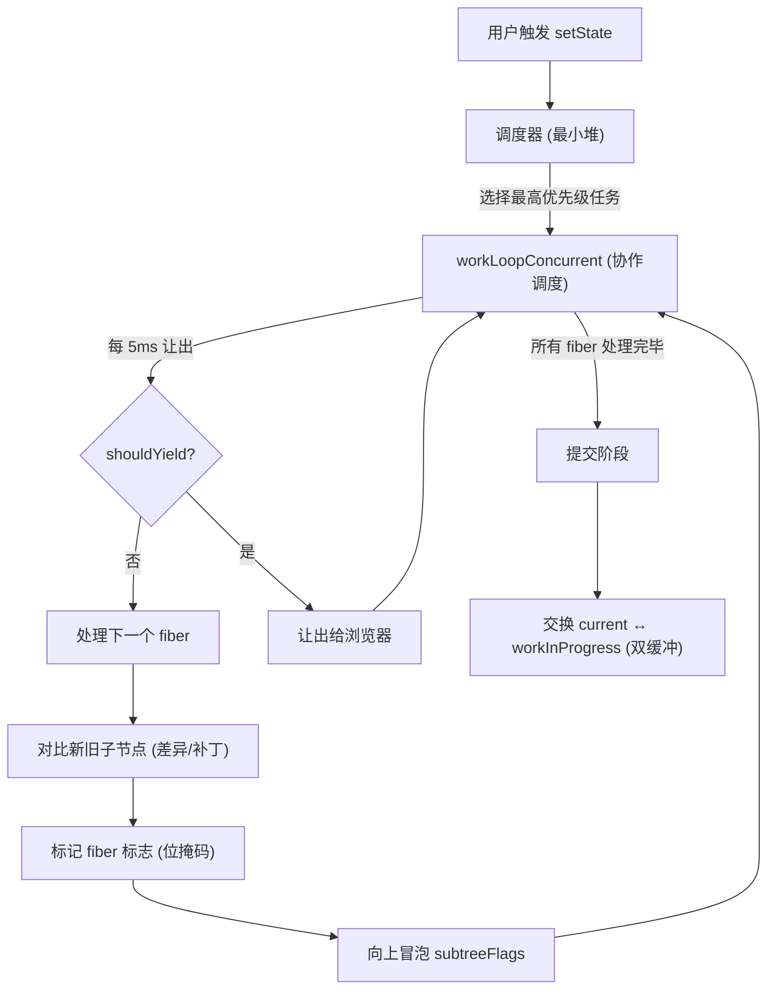

# 模式如何协作

这些模式不是孤立存在的。最有价值的洞察是生产系统如何将它们**组合**在一起。

## React：一个系统中的五个模式

React 的协调器是模式组合的典范。以下是本集合中五个模式如何在一次渲染周期中协同工作：

| 步骤 | 模式 | 发生了什么 |
|------|------|-----------|
| 1 | **最小堆** | `setState` 将更新入队。调度器的最小堆选择过期时间最早的任务。 |
| 2 | **协作调度** | `workLoopConcurrent` 逐个处理 fiber，每轮检查 `shouldYieldToHost()`。如果超过 5ms 就让出并重新调度。 |
| 3 | **差异/补丁** | 对每个 fiber，`reconcileChildFibers` 对比新旧子节点，决定保留、插入还是删除。 |
| 4 | **位掩码** | 副作用以位标志记录（`Placement \| Update \| Ref`）。`subtreeFlags` 通过 OR 向上冒泡，让提交阶段能跳过干净的子树。 |
| 5 | **双缓冲** | React 维护两棵 fiber 树——`current` 和 `workInProgress`。所有工作完成后原子交换。旧 current 变成新 workInProgress（回收，不被 GC）。 |

## 为什么这很重要

理解单个模式有用。理解它们如何**组合**才是区分高级工程师和初级工程师的关键。

当你遇到性能问题时，你不会想"我需要一个位掩码"。你会想"我需要低成本追踪多个状态（位掩码）、跳过未变更的部分（子树标志）、增量处理工作（协作调度）、优先处理紧急任务（最小堆）、在热路径上避免分配（双缓冲）。"

这就是 React 团队构建的。这就是你可以从这里学到的。
