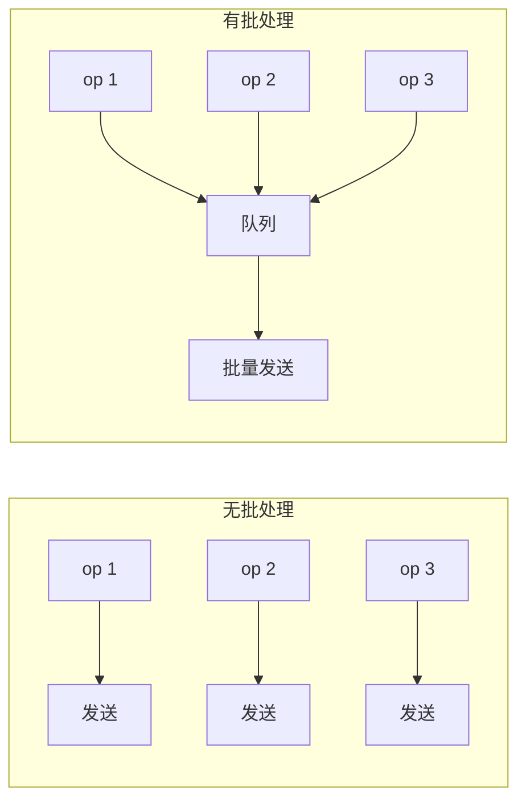

# 模式：批处理 (Batch Processing)

## 一句话

累积单个操作并作为一组执行，将每次操作的开销分摊到整个批次。

<DifficultyBadge /> <DemoBadge />

## 现实类比

装洗碗机。你不会洗一个盘子就开一次机——整天的碗碟攒起来，一次洗完。每个盘子分摊的水、电、时间成本因此降低。

## 核心思想

不逐个处理每个项（N 次往返、N 次上下文切换），而是收集后一次性处理。代价：单个项略高延迟；收益：整体吞吐量大幅提升。



**动手试试** — 添加项目并观察它们批量积累，然后一起刷写：

<BatchProcessingViz />

## 生产验证

| 项目 | 源码 | 用途 |
|------|------|------|
| Apache Kafka | [RecordAccumulator.java#L69-L120](https://github.com/apache/kafka/blob/trunk/clients/src/main/java/org/apache/kafka/clients/producer/internals/RecordAccumulator.java#L69-L120) | Kafka 生产者按分区累积记录为批次。`append()` 添加记录，sender 线程排空就绪批次。这是 Kafka 实现百万消息/秒的关键。 |

::: info
React 的 `setState` 批处理是另一个知名例子——同一事件处理器中的多次 `setState` 被批处理为一次重渲染。
:::

## 实现

::: code-group

```typescript [TypeScript]
class SyncBatchProcessor<T, R> {
  private queue: T[] = [];
  constructor(private process: (items: T[]) => R[], private maxSize: number) {}
  add(item: T): R[] | null {
    this.queue.push(item);
    if (this.queue.length >= this.maxSize) return this.flush();
    return null;
  }
  flush(): R[] {
    const batch = this.queue.splice(0);
    return batch.length ? this.process(batch) : [];
  }
}
```

```python [Python]
class BatchProcessor:
    def __init__(self, process, max_size):
        self._process = process
        self._max_size = max_size
        self._queue = []

    def add(self, item):
        self._queue.append(item)
        if len(self._queue) >= self._max_size:
            return self.flush()
        return None

    def flush(self):
        batch = self._queue[:]
        self._queue.clear()
        return self._process(batch) if batch else []
```

```go [Go]
type BatchProcessor[T any, R any] struct {
	queue   []batchEntry[T, R]
	process func([]T) []R
	maxSize int
	mu      sync.Mutex
}

type batchEntry[T any, R any] struct {
	item T
	ch   chan R
}

func (bp *BatchProcessor[T, R]) Add(item T) R {
	bp.mu.Lock()
	ch := make(chan R, 1)
	bp.queue = append(bp.queue, batchEntry[T, R]{item, ch})
	if len(bp.queue) >= bp.maxSize {
		bp.flush()
	}
	bp.mu.Unlock()
	return <-ch
}

func (bp *BatchProcessor[T, R]) flush() {
	items := make([]T, len(bp.queue))
	for i, e := range bp.queue { items[i] = e.item }
	results := bp.process(items)
	for i, e := range bp.queue { e.ch <- results[i] }
	bp.queue = bp.queue[:0]
}
```

:::

## 练习

| 难度 | 练习 | 文件 |
|------|------|------|
| 基础 | 实现基于大小的批处理器 | `exercises/typescript/batch-processing/01-basic.test.ts` |
| 进阶 | 超时刷新 — 按大小或时间触发刷新 | `exercises/typescript/batch-processing/02-intermediate.test.ts` |

运行练习：`pnpm test`（TypeScript）· `cargo test`（Rust）· `go test ./...`（Go）· `pytest`（Python）

Exercise files: Rust `exercises/rust/src/batch_processing.rs` · Go `exercises/go/batch_processing_test.go` · Python `exercises/python/test_batch_processing.py`

## 何时使用

- **数据库写入** — 批量 INSERT 替代 N 次单条 INSERT
- **API 调用** — 批量请求减少往返
- **消息队列** — Kafka、SQS 批量发送/接收
- **UI 更新** — React 批量 setState

## 何时不用

- **延迟敏感** — 批处理增加延迟
- **小量级** — 很少超过 1 个项时，批处理增加复杂性无收益

## 更多生产案例

- React `unstable_batchedUpdates`
- [DataLoader](https://github.com/graphql/dataloader) — GraphQL N+1
- [Redis](https://github.com/redis/redis) — Pipeline
- [Elasticsearch](https://github.com/elastic/elasticsearch) — Bulk API

## 相关模式

| 模式 | 关系 |
|---------|-------------|
| [环形缓冲区 (Ring Buffer)](/zh/patterns/ring-buffer/) | 环形缓冲区累积项目供批量消费 |
| [背压 / 流控 (Backpressure)](/zh/patterns/backpressure/) | 批处理平滑突发输入，与背压机制协同工作 |
| [指数退避重试 (Retry with Backoff)](/zh/patterns/retry-backoff/) | 单个批处理项在失败时可以进行指数退避重试 |

## 挑战题

::: details Q1: 你的批处理器使用 maxSize=100 和 maxWaitMs=50ms。流量降到每秒 1 个请求。会发生什么？如何修复？
**答案：** 每个请求都要等待完整的 50ms 超时才刷新一个只有 1 条数据的批次，增加了不必要的延迟。

因为批次永远达不到 100 条，超时会在队列中只有一条数据时触发。修复方法是让批次大小和/或超时自适应——例如，当队列空闲时立即刷新，或者当队列深度较低时使用更短的超时。Kafka 的 `linger.ms` 就是这样工作的：它只在预期还有更多记录时才延迟。
:::

::: details Q2: 一个包含 100 条数据库插入的批次失败了，因为第 57 行违反了唯一约束。其余 99 行应该怎么处理？
**答案：** 取决于你是否需要原子性。如果批次在单个事务中运行，所有 100 行都会回滚。如果不是，你需要逐条错误处理。

常见的生产方案是返回一个包含每条数据成功/失败状态的结果数组（就像 Elasticsearch 的 Bulk API 那样）。这样调用方只需重试失败的条目。如果你为了原子性将整个批次包在一个事务中，一条坏数据就会让整个批次失败——虽然更简单但浪费了工作。
:::

::: details Q3: 你同时设置了数量触发器（maxSize=50）和时间触发器（maxWaitMs=100ms）。一个 200 条数据的突发在 10ms 内到达。会触发多少个批次？何时触发？
**答案：** 4 个各 50 条的批次会立即触发，全部在那 10ms 的突发期内。时间触发器永远不会激活。

每当队列达到 maxSize 时，数量触发器会优先触发。随着数据涌入，队列达到 50，刷新，再达到 50，再刷新，以此类推。计时器只在队列有数据但未达到 maxSize 时才有意义——它是"不要永远等待"的安全网，而非高负载下的主要触发器。
:::

::: details Q4: 为什么 Kafka 按分区批处理，而不是使用跨所有分区的单一全局批次？
**答案：** 因为每个分区是特定 broker 上的独立追加日志。单一的跨分区批次在发送时无论如何都需要拆分。

按分区批处理意味着每个批次精确映射到对一个 broker 的一次网络请求，保持 I/O 路径简洁。它还保留了每分区的顺序保证。全局批次在刷新时需要按目标分组，增加了复杂度但没有吞吐量收益。
:::
