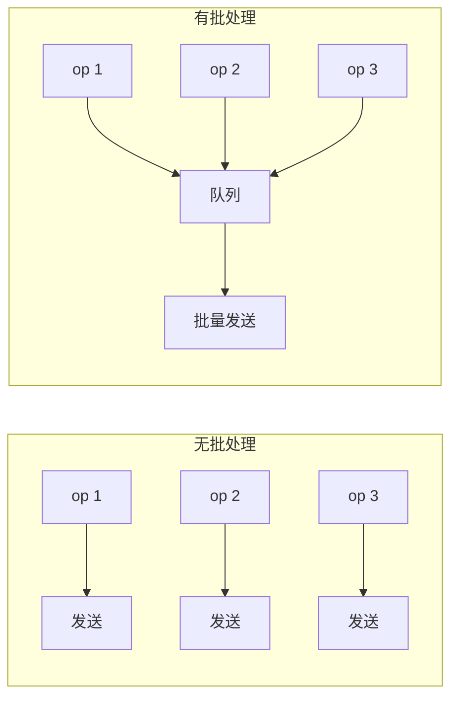

# 模式：批处理 (Batch Processing)

## 一句话

累积单个操作并作为一组执行，将每次操作的开销分摊到整个批次。

## 核心思想

不逐个处理每个项（N 次往返、N 次上下文切换），而是收集后一次性处理。代价：单个项略高延迟；收益：整体吞吐量大幅提升。



## 生产验证

| 项目 | 源码 | 用途 |
|------|------|------|
| Apache Kafka | [RecordAccumulator.java#L69-L120](https://github.com/apache/kafka/blob/trunk/clients/src/main/java/org/apache/kafka/clients/producer/internals/RecordAccumulator.java#L69-L120) | Kafka 生产者按分区累积记录为批次。`append()` 添加记录，sender 线程排空就绪批次。这是 Kafka 实现百万消息/秒的关键。 |

::: info
React 的 `setState` 批处理是另一个知名例子——同一事件处理器中的多次 `setState` 被批处理为一次重渲染。
:::

## 实现

::: code-group

```typescript [TypeScript]
class SyncBatchProcessor<T, R> {
  private queue: T[] = [];
  constructor(private process: (items: T[]) => R[], private maxSize: number) {}
  add(item: T): R[] | null {
    this.queue.push(item);
    if (this.queue.length >= this.maxSize) return this.flush();
    return null;
  }
  flush(): R[] {
    const batch = this.queue.splice(0);
    return batch.length ? this.process(batch) : [];
  }
}
```

```python [Python]
class BatchProcessor:
    def __init__(self, process, max_size):
        self._process = process
        self._max_size = max_size
        self._queue = []

    def add(self, item):
        self._queue.append(item)
        if len(self._queue) >= self._max_size:
            return self.flush()
        return None

    def flush(self):
        batch = self._queue[:]
        self._queue.clear()
        return self._process(batch) if batch else []
```

:::

## 练习

| 难度 | 练习 | 文件 |
|------|------|------|
| 基础 | 实现基于大小的批处理器 | `exercises/typescript/batch-processing/01-basic.test.ts` |
| 进阶 | 超时刷新 — 按大小或时间触发刷新 | `exercises/typescript/batch-processing/02-intermediate.test.ts` |

## 何时使用

- **数据库写入** — 批量 INSERT 替代 N 次单条 INSERT
- **API 调用** — 批量请求减少往返
- **消息队列** — Kafka、SQS 批量发送/接收
- **UI 更新** — React 批量 setState

## 何时不用

- **延迟敏感** — 批处理增加延迟
- **小量级** — 很少超过 1 个项时，批处理增加复杂性无收益

## 更多生产案例

- React `unstable_batchedUpdates`
- [DataLoader](https://github.com/graphql/dataloader) — GraphQL N+1
- [Redis](https://github.com/redis/redis) — Pipeline
- [Elasticsearch](https://github.com/elastic/elasticsearch) — Bulk API

## 挑战题

::: details Q1: Your batch processor uses maxSize=100 and maxWaitMs=50ms. Traffic drops to 1 request/second. What happens, and how do you fix it?
**Answer:** Each request waits the full 50ms timeout before flushing a batch of 1, adding unnecessary latency.

The timeout triggers with just a single item in the queue because the batch never reaches 100 items. The fix is to make the batch size and/or timeout adaptive -- for example, flush immediately when the queue has been idle, or use a shorter timeout when the queue depth is low. Kafka's `linger.ms` works this way: it only delays if there are more records expected.
:::

::: details Q2: A batch of 100 database inserts fails because row 57 violates a unique constraint. What should happen to the other 99 rows?
**Answer:** It depends on whether you need atomicity. If the batch runs in a single transaction, all 100 rows roll back. If not, you need per-item error handling.

The common production approach is to return a result array with per-item success/failure status (like Elasticsearch's Bulk API does). This lets callers retry only the failed items. If you wrap the entire batch in one transaction for atomicity, a single bad row kills the whole batch -- which is simpler but wastes work.
:::

::: details Q3: You have both a size trigger (maxSize=50) and a time trigger (maxWaitMs=100ms). A burst of 200 items arrives in 10ms. How many batches fire, and when?
**Answer:** Four batches of 50 fire immediately, all within that 10ms burst. The time trigger never activates.

The size trigger takes priority whenever the queue reaches maxSize. As items pour in, the queue hits 50, flushes, hits 50 again, flushes, and so on. The timer is only relevant when the queue has items but hasn't reached maxSize -- it's a "don't wait forever" safety net, not the primary trigger under load.
:::

::: details Q4: Why does Kafka batch per-partition rather than using a single global batch across all partitions?
**Answer:** Because each partition is an independent append-only log on a specific broker. A single cross-partition batch would need to be split at send time anyway.

Batching per-partition means each batch maps to exactly one network request to one broker, keeping the I/O path simple. It also preserves per-partition ordering guarantees. A global batch would require grouping by destination at flush time, adding complexity with no throughput benefit.
:::
