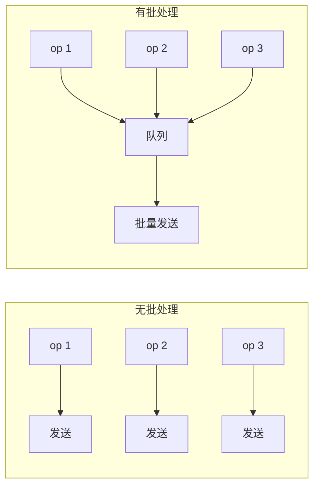

# 模式：批处理 (Batch Processing)

## 一句话

累积单个操作并作为一组执行，将每次操作的开销分摊到整个批次。

## 核心思想

不逐个处理每个项（N 次往返、N 次上下文切换），而是收集后一次性处理。代价：单个项略高延迟；收益：整体吞吐量大幅提升。



## 生产验证

| 项目 | 源码 | 用途 |
|------|------|------|
| Apache Kafka | [RecordAccumulator.java#L69-L120](https://github.com/apache/kafka/blob/trunk/clients/src/main/java/org/apache/kafka/clients/producer/internals/RecordAccumulator.java#L69-L120) | Kafka 生产者按分区累积记录为批次。`append()` 添加记录，sender 线程排空就绪批次。这是 Kafka 实现百万消息/秒的关键。 |

::: info
React 的 `setState` 批处理是另一个知名例子——同一事件处理器中的多次 `setState` 被批处理为一次重渲染。
:::

## 实现

::: code-group

```typescript [TypeScript]
class SyncBatchProcessor<T, R> {
  private queue: T[] = [];
  constructor(private process: (items: T[]) => R[], private maxSize: number) {}
  add(item: T): R[] | null {
    this.queue.push(item);
    if (this.queue.length >= this.maxSize) return this.flush();
    return null;
  }
  flush(): R[] {
    const batch = this.queue.splice(0);
    return batch.length ? this.process(batch) : [];
  }
}
```

```python [Python]
class BatchProcessor:
    def __init__(self, process, max_size):
        self._process = process
        self._max_size = max_size
        self._queue = []

    def add(self, item):
        self._queue.append(item)
        if len(self._queue) >= self._max_size:
            return self.flush()
        return None

    def flush(self):
        batch = self._queue[:]
        self._queue.clear()
        return self._process(batch) if batch else []
```

:::

## 练习

| 难度 | 练习 | 文件 |
|------|------|------|
| 基础 | 实现基于大小的批处理器 | `exercises/typescript/batch-processing/01-basic.test.ts` |

## 何时使用

- **数据库写入** — 批量 INSERT 替代 N 次单条 INSERT
- **API 调用** — 批量请求减少往返
- **消息队列** — Kafka、SQS 批量发送/接收
- **UI 更新** — React 批量 setState

## 何时不用

- **延迟敏感** — 批处理增加延迟
- **小量级** — 很少超过 1 个项时，批处理增加复杂性无收益

## 其他使用者

React `unstable_batchedUpdates`, DataLoader (GraphQL N+1), Redis Pipeline, Elasticsearch Bulk API.
