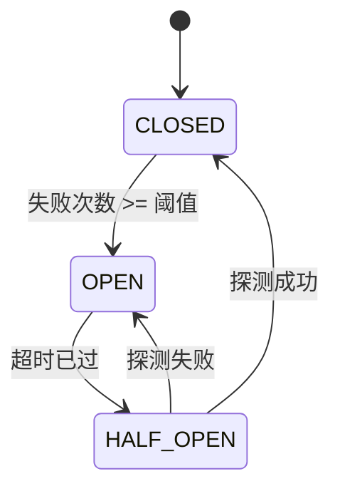

# 模式：熔断器 (Circuit Breaker)

## 一句话

通过跟踪错误次数自动跳闸——快速失败，而不是堆积超时等待。

## 核心思想

熔断器用状态机包装远程调用，有三种状态。**关闭 (CLOSED)** 状态下调用正常通过。连续失败达到阈值后，熔断器**跳闸 (OPEN)**，所有调用立即失败而不尝试操作。冷却期过后，进入**半开 (HALF_OPEN)** 状态，允许一次探测调用以测试下游服务是否恢复。



| 状态 | 行为 |
|------|------|
| CLOSED | 调用正常通过，计数连续失败 |
| OPEN | 调用立即失败（`CircuitOpenError`），计时器运行中 |
| HALF_OPEN | 允许一次探测调用。成功 → CLOSED，失败 → OPEN |

## 生产验证

| 项目 | 源码 | 用途 |
|------|------|------|
| Netflix Hystrix | [HystrixCircuitBreaker.java#L138-L289](https://github.com/Netflix/Hystrix/blob/master/hystrix-core/src/main/java/com/netflix/hystrix/HystrixCircuitBreaker.java#L138-L289) | `HystrixCircuitBreakerImpl` — 经典熔断器实现。三态枚举（L142），`markSuccess`/`markNonSuccess` 驱动 HALF_OPEN 转换（L204-L224），`attemptExecution` 通过 `compareAndSet` 在睡眠窗口后实现 OPEN→HALF_OPEN（L264-L289）。Netflix 全部微服务架构使用。 |
| Sony gobreaker | [gobreaker.go#L117-L131](https://github.com/sony/gobreaker/blob/master/gobreaker.go#L117-L131) | `CircuitBreaker` 结构体，含状态、代计数器、计数和互斥锁。`onSuccess`/`onFailure`（L310-L332）驱动状态转换；基于代的过期检测（L334-L380）防止对过期状态读取进行操作。Sony 生产环境使用。 |

## 实现

::: code-group

```typescript [TypeScript]
type State = 'CLOSED' | 'OPEN' | 'HALF_OPEN';

class CircuitBreaker {
  private state: State = 'CLOSED';
  private failureCount = 0;
  private lastFailureTime = 0;

  constructor(
    private threshold: number,
    private resetTimeout: number,
  ) {}

  getState(): State {
    if (this.state === 'OPEN' && Date.now() - this.lastFailureTime >= this.resetTimeout) {
      this.state = 'HALF_OPEN';
    }
    return this.state;
  }

  async call<T>(fn: () => Promise<T>): Promise<T> {
    if (this.getState() === 'OPEN') throw new Error('Circuit is OPEN');
    try {
      const result = await fn();
      this.failureCount = 0;
      this.state = 'CLOSED';
      return result;
    } catch (err) {
      this.failureCount++;
      this.lastFailureTime = Date.now();
      if (this.failureCount >= this.threshold) this.state = 'OPEN';
      throw err;
    }
  }
}
```

```go [Go]
type State int

const (
	StateClosed   State = iota
	StateOpen
	StateHalfOpen
)

type CircuitBreaker struct {
	threshold    int
	resetTimeout int64
	state        State
	failureCount int
	lastFailure  int64
}

func NewCircuitBreaker(threshold int, resetTimeoutMs int64) *CircuitBreaker {
	return &CircuitBreaker{threshold: threshold, resetTimeout: resetTimeoutMs}
}

func now() int64 { return time.Now().UnixMilli() }

func (cb *CircuitBreaker) GetState() State {
	if cb.state == StateOpen && now()-cb.lastFailure >= cb.resetTimeout {
		cb.state = StateHalfOpen
	}
	return cb.state
}

func (cb *CircuitBreaker) Call(fn func() error) error {
	if cb.GetState() == StateOpen {
		return fmt.Errorf("circuit is OPEN")
	}
	if err := fn(); err != nil {
		cb.failureCount++
		cb.lastFailure = now()
		if cb.failureCount >= cb.threshold {
			cb.state = StateOpen
		}
		return err
	}
	cb.failureCount = 0
	cb.state = StateClosed
	return nil
}
```

```python [Python]
import time

class CircuitBreaker:
    def __init__(self, threshold: int = 5, reset_timeout: float = 30.0):
        self.threshold = threshold
        self.reset_timeout = reset_timeout
        self.state = "CLOSED"
        self.failure_count = 0
        self.last_failure_time = 0.0

    def get_state(self) -> str:
        if self.state == "OPEN" and time.time() - self.last_failure_time >= self.reset_timeout:
            self.state = "HALF_OPEN"
        return self.state

    def call(self, fn):
        if self.get_state() == "OPEN":
            raise RuntimeError("Circuit is OPEN")
        try:
            result = fn()
            self.failure_count = 0
            self.state = "CLOSED"
            return result
        except Exception:
            self.failure_count += 1
            self.last_failure_time = time.time()
            if self.failure_count >= self.threshold:
                self.state = "OPEN"
            raise
```

```rust [Rust]
use std::time::Instant;

pub enum State { Closed, Open, HalfOpen }

pub struct CircuitBreaker {
    threshold: u32,
    reset_timeout_ms: u128,
    state: State,
    failure_count: u32,
    last_failure: Option<Instant>,
}

impl CircuitBreaker {
    pub fn new(threshold: u32, reset_timeout_ms: u128) -> Self {
        CircuitBreaker {
            threshold, reset_timeout_ms,
            state: State::Closed, failure_count: 0, last_failure: None,
        }
    }

    pub fn get_state(&mut self) -> &State {
        if let State::Open = self.state {
            if let Some(t) = self.last_failure {
                if t.elapsed().as_millis() >= self.reset_timeout_ms {
                    self.state = State::HalfOpen;
                }
            }
        }
        &self.state
    }

    pub fn call<T, E>(&mut self, f: impl FnOnce() -> Result<T, E>) -> Result<T, String>
    where E: std::fmt::Display {
        if matches!(self.get_state(), State::Open) {
            return Err("Circuit is OPEN".into());
        }
        match f() {
            Ok(v) => { self.failure_count = 0; self.state = State::Closed; Ok(v) }
            Err(e) => {
                self.failure_count += 1;
                self.last_failure = Some(Instant::now());
                if self.failure_count >= self.threshold { self.state = State::Open; }
                Err(e.to_string())
            }
        }
    }
}
```

:::

## 练习

| 难度 | 练习 | 文件 |
|------|------|------|
| 基础 | 实现包含三种状态的熔断器 | `exercises/typescript/circuit-breaker/01-basic.test.ts` |
| 进阶 | 基于失败率和滚动窗口的熔断器 | `exercises/typescript/circuit-breaker/02-intermediate.test.ts` |

## 何时使用

- **微服务调用** — 防止下游服务宕机时的级联故障
- **数据库连接** — 在数据库过载时停止持续请求
- **外部 API** — 优雅处理第三方服务中断
- **共享资源** — 保护任何可能暂时不可用的共享资源

## 何时不用

- **进程内调用** — 熔断器增加开销，本地函数调用直接用错误处理即可
- **非幂等操作** — 如果半开后重试可能产生重复数据，先加去重
- **单消费者系统** — 只有一个调用者时，退避/重试比完整状态机更简单
- **发射后不管** — 如果不等待响应，就没有需要熔断的东西

## 更多生产案例

- [resilience4j](https://github.com/resilience4j/resilience4j) — Java 熔断器库，适用于 Spring/Micronaut
- [Polly](https://github.com/App-vNext/Polly) — .NET 弹性库，含熔断策略
- [Envoy Proxy](https://github.com/envoyproxy/envoy) — 异常检测充当分布式熔断器
- [AWS SDK](https://github.com/aws/aws-sdk-js-v3) — 带熔断的服务端点重试

## 挑战题

::: details Q1: Your circuit breaker has a 30-second reset timeout. The downstream service has an average recovery time of 5 seconds. A colleague suggests lowering the timeout to 5 seconds so requests resume faster. What's the tradeoff?
**Answer:** A shorter timeout means you'll probe the service sooner, but if it hasn't recovered, each failed probe resets the timer and generates additional load on an already-struggling service.

The reset timeout is a tradeoff between recovery speed and protection. If you probe too early and fail, you reopen the circuit and wait another full timeout. Meanwhile, the failed probe adds load to the unhealthy service. A good timeout should be longer than the typical recovery time — 2-3x is common — to give the downstream service breathing room. Some implementations use exponential backoff on the timeout itself.
:::

::: details Q2: Service A calls Service B, which calls Service C. Service C goes down. Without circuit breakers, what happens to Service A even though it doesn't directly depend on C?
**Answer:** Service A's threads pile up waiting for Service B, which is itself blocked waiting for Service C — this is a cascading failure.

Each call from A to B occupies a thread (or connection) while B waits for C's timeout. As B's threads exhaust, B starts timing out too, causing A's threads to pile up. Soon A appears down to its own callers. This is exactly why Netflix built Hystrix: a circuit breaker on each service boundary would let B fail fast on C calls and return errors to A immediately, keeping A's threads free. Without it, one downstream failure can topple an entire call chain.
:::

::: details Q3: Your circuit breaker enters HALF_OPEN and allows one probe request. But in a high-traffic system, 200 concurrent requests arrive in the same millisecond. All 200 see the state as HALF_OPEN and send probe requests simultaneously. How would you prevent this thundering herd?
**Answer:** Use an atomic compare-and-swap (CAS) to transition from OPEN to HALF_OPEN, ensuring only one request becomes the probe while all others fail fast.

Netflix Hystrix solves this with `compareAndSet` on the state flag — exactly one thread wins the CAS and sends the probe. Sony's gobreaker uses a mutex with a generation counter for similar single-probe guarantees. The key insight is that HALF_OPEN is not a state you "read" passively — the transition to it should be an atomic operation that grants probe rights to exactly one caller.
:::

::: details Q4: Your team uses a circuit breaker for database calls. A developer notices the breaker trips open during a routine database migration that causes 5 seconds of elevated latency but zero actual errors. Should the circuit breaker be tracking latency, not just errors?
**Answer:** Yes, but carefully. Latency-based tripping protects callers from slow responses, but you need distinct thresholds for "slow" vs "failed" to avoid false trips during normal variance.

A request that takes 10 seconds and eventually succeeds still ties up a thread for 10 seconds. In a thread-pool model, slow responses are functionally equivalent to failures because they exhaust capacity. Hystrix tracked both errors and timeouts as failures. The nuance is choosing the latency threshold: set it too low and normal P99 variance trips the breaker; set it too high and it provides no protection.
:::
