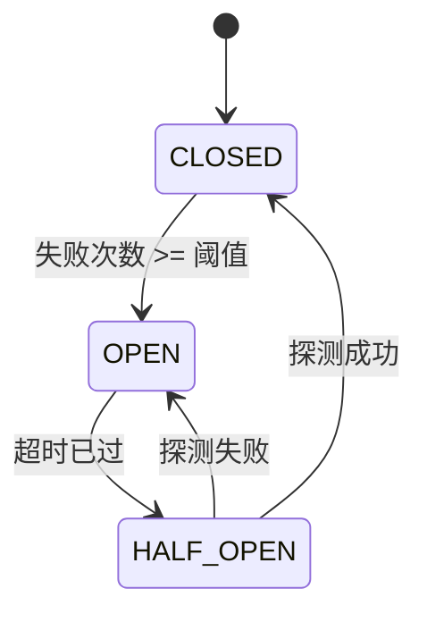

# 模式：熔断器 (Circuit Breaker)

<DifficultyBadge />

## 一句话

通过跟踪错误次数自动跳闸——快速失败，而不是堆积超时等待。

<DemoBadge />

## 现实类比

家里的保险丝。电流过大（反复故障）时，保险丝熔断，立即切断电路——保护线路。冷却后（超时），你可以复位再试。

## 核心思想

熔断器用状态机包装远程调用，有三种状态。**关闭 (CLOSED)** 状态下调用正常通过。连续失败达到阈值后，熔断器**跳闸 (OPEN)**，所有调用立即失败而不尝试操作。冷却期过后，进入**半开 (HALF_OPEN)** 状态，允许一次探测调用以测试下游服务是否恢复。



| 状态 | 行为 |
|------|------|
| CLOSED | 调用正常通过，计数连续失败 |
| OPEN | 调用立即失败（`CircuitOpenError`），计时器运行中 |
| HALF_OPEN | 允许一次探测调用。成功 → CLOSED，失败 → OPEN |

| 属性 | 值 |
|------|---|
| 调用检查 | O(1) — 比较状态 + 失败计数器 |
| 状态转换 | O(1) — 原子状态变更 |
| 状态数 | 3 — 关闭、打开、半开 |
| 空间 | O(1) — 计数器 + 定时器 + 状态枚举 |

**动手试试** — 发送成功和失败请求，观察状态机转换过程：

<CircuitBreakerViz />

## 生产验证

| 项目 | 源码 | 用途 |
|------|------|------|
| Netflix Hystrix | [HystrixCircuitBreaker.java#L138-L289](https://github.com/Netflix/Hystrix/blob/5ce3bc58c38e7ca60ef2fe0e516e390e294ad941/hystrix-core/src/main/java/com/netflix/hystrix/HystrixCircuitBreaker.java#L138-L289) | `HystrixCircuitBreakerImpl` — 经典熔断器实现。三态枚举（L142），`markSuccess`/`markNonSuccess` 驱动 HALF_OPEN 转换（L204-L224），`attemptExecution` 通过 `compareAndSet` 在睡眠窗口后实现 OPEN→HALF_OPEN（L264-L289）。Netflix 全部微服务架构使用。 |
| Sony gobreaker | [gobreaker.go#L117-L131](https://github.com/sony/gobreaker/blob/fed8e9eb35f9cd3e5c2a67842c924346c3e1fbdd/gobreaker.go#L117-L131) | `CircuitBreaker` 结构体，含状态、代计数器、计数和互斥锁。`onSuccess`/`onFailure`（L310-L332）驱动状态转换；基于代的过期检测（L334-L380）防止对过期状态读取进行操作。Sony 生产环境使用。 |

## 实现

::: code-group

```typescript [TypeScript]
type State = 'CLOSED' | 'OPEN' | 'HALF_OPEN';

class CircuitBreaker {
  private state: State = 'CLOSED';
  private failureCount = 0;
  private lastFailureTime = 0;

  constructor(
    private threshold: number,
    private resetTimeout: number,
  ) {}

  getState(): State {
    if (this.state === 'OPEN' && Date.now() - this.lastFailureTime >= this.resetTimeout) {
      this.state = 'HALF_OPEN';
    }
    return this.state;
  }

  async call<T>(fn: () => Promise<T>): Promise<T> {
    if (this.getState() === 'OPEN') throw new Error('Circuit is OPEN');
    try {
      const result = await fn();
      this.failureCount = 0;
      this.state = 'CLOSED';
      return result;
    } catch (err) {
      this.failureCount++;
      this.lastFailureTime = Date.now();
      if (this.failureCount >= this.threshold) this.state = 'OPEN';
      throw err;
    }
  }
}
```

```rust [Rust]
use std::time::Instant;

pub enum State { Closed, Open, HalfOpen }

pub struct CircuitBreaker {
    threshold: u32,
    reset_timeout_ms: u128,
    state: State,
    failure_count: u32,
    last_failure: Option<Instant>,
}

impl CircuitBreaker {
    pub fn new(threshold: u32, reset_timeout_ms: u128) -> Self {
        CircuitBreaker {
            threshold, reset_timeout_ms,
            state: State::Closed, failure_count: 0, last_failure: None,
        }
    }

    pub fn get_state(&mut self) -> &State {
        if let State::Open = self.state {
            if let Some(t) = self.last_failure {
                if t.elapsed().as_millis() >= self.reset_timeout_ms {
                    self.state = State::HalfOpen;
                }
            }
        }
        &self.state
    }

    pub fn call<T, E>(&mut self, f: impl FnOnce() -> Result<T, E>) -> Result<T, String>
    where E: std::fmt::Display {
        if matches!(self.get_state(), State::Open) {
            return Err("Circuit is OPEN".into());
        }
        match f() {
            Ok(v) => { self.failure_count = 0; self.state = State::Closed; Ok(v) }
            Err(e) => {
                self.failure_count += 1;
                self.last_failure = Some(Instant::now());
                if self.failure_count >= self.threshold { self.state = State::Open; }
                Err(e.to_string())
            }
        }
    }
}
```

```go [Go]
type State int

const (
	StateClosed   State = iota
	StateOpen
	StateHalfOpen
)

type CircuitBreaker struct {
	threshold    int
	resetTimeout int64
	state        State
	failureCount int
	lastFailure  int64
}

func NewCircuitBreaker(threshold int, resetTimeoutMs int64) *CircuitBreaker {
	return &CircuitBreaker{threshold: threshold, resetTimeout: resetTimeoutMs}
}

func now() int64 { return time.Now().UnixMilli() }

func (cb *CircuitBreaker) GetState() State {
	if cb.state == StateOpen && now()-cb.lastFailure >= cb.resetTimeout {
		cb.state = StateHalfOpen
	}
	return cb.state
}

func (cb *CircuitBreaker) Call(fn func() error) error {
	if cb.GetState() == StateOpen {
		return fmt.Errorf("circuit is OPEN")
	}
	if err := fn(); err != nil {
		cb.failureCount++
		cb.lastFailure = now()
		if cb.failureCount >= cb.threshold {
			cb.state = StateOpen
		}
		return err
	}
	cb.failureCount = 0
	cb.state = StateClosed
	return nil
}
```

```python [Python]
import time

class CircuitBreaker:
    def __init__(self, threshold: int = 5, reset_timeout: float = 30.0):
        self.threshold = threshold
        self.reset_timeout = reset_timeout
        self.state = "CLOSED"
        self.failure_count = 0
        self.last_failure_time = 0.0

    def get_state(self) -> str:
        if self.state == "OPEN" and time.time() - self.last_failure_time >= self.reset_timeout:
            self.state = "HALF_OPEN"
        return self.state

    def call(self, fn):
        if self.get_state() == "OPEN":
            raise RuntimeError("Circuit is OPEN")
        try:
            result = fn()
            self.failure_count = 0
            self.state = "CLOSED"
            return result
        except Exception:
            self.failure_count += 1
            self.last_failure_time = time.time()
            if self.failure_count >= self.threshold:
                self.state = "OPEN"
            raise
```

:::

## 练习

| 难度 | 练习 | 文件 |
|------|------|------|
| 基础 | 实现包含三种状态的熔断器 | `exercises/typescript/circuit-breaker/01-basic.test.ts` |
| 进阶 | 基于失败率和滚动窗口的熔断器 | `exercises/typescript/circuit-breaker/02-intermediate.test.ts` |

运行练习：`pnpm test`（TypeScript）· `cargo test`（Rust）· `go test ./...`（Go）· `pytest`（Python）

练习文件： Rust `exercises/rust/src/circuit_breaker/mod.rs` · Go `exercises/go/circuit_breaker/circuit_breaker_test.go` · Python `exercises/python/circuit_breaker/test_circuit_breaker.py`

## 何时使用

- **微服务调用** — 防止下游服务宕机时的级联故障
- **数据库连接** — 在数据库过载时停止持续请求
- **外部 API** — 优雅处理第三方服务中断
- **共享资源** — 保护任何可能暂时不可用的共享资源

## 何时不用

- **进程内调用** — 熔断器增加开销，本地函数调用直接用错误处理即可
- **非幂等操作** — 如果半开后重试可能产生重复数据，先加去重
- **单消费者系统** — 只有一个调用者时，退避/重试比完整状态机更简单
- **发射后不管** — 如果不等待响应，就没有需要熔断的东西

## 更多生产案例

- [resilience4j](https://github.com/resilience4j/resilience4j) — Java 熔断器库，适用于 Spring/Micronaut
- [Polly](https://github.com/App-vNext/Polly) — .NET 弹性库，含熔断策略
- [Envoy Proxy](https://github.com/envoyproxy/envoy) — 异常检测充当分布式熔断器
- [AWS SDK](https://github.com/aws/aws-sdk-js-v3) — 带熔断的服务端点重试

## 相关模式

| 模式 | 关系 |
|---------|-------------|
| [指数退避重试 (Retry with Backoff)](/zh/patterns/retry-backoff/) | 熔断器在服务已知不可用时阻止重试 |
| [状态机 (State Machine)](/zh/patterns/state-machine/) | 熔断器是一个状态机：关闭 -> 打开 -> 半开 |
| [限流器 / 令牌桶 (Rate Limiter)](/zh/patterns/rate-limiter/) | 两者都保护服务——限流器控制吞吐量，熔断器停止故障 |

## 挑战题

::: details Q1: 你的熔断器有 30 秒的重置超时。下游服务的平均恢复时间是 5 秒。一位同事建议将超时降低到 5 秒以便更快恢复请求。这个权衡是什么？
**答案：** 更短的超时意味着你会更早探测服务，但如果服务还没恢复，每次失败的探测都会重置计时器并给已经处于困境中的服务增加额外负载。

重置超时是恢复速度与保护之间的权衡。如果你探测得太早且失败了，你会重新打开熔断器并等待又一个完整的超时周期。同时，失败的探测给不健康的服务增加了负载。好的超时应该长于典型恢复时间——通常是 2-3 倍——给下游服务喘息空间。一些实现对超时本身使用指数退避。
:::

::: details Q2: 服务 A 调用服务 B，服务 B 调用服务 C。服务 C 宕机了。没有熔断器的话，尽管服务 A 并不直接依赖 C，它会发生什么？
**答案：** 服务 A 的线程堆积等待服务 B，而服务 B 本身也阻塞在等待服务 C——这就是级联故障。

从 A 到 B 的每次调用都在 B 等待 C 超时时占用一个线程（或连接）。当 B 的线程耗尽后，B 也开始超时，导致 A 的线程堆积。很快 A 对它自己的调用者来说也像是宕机了。这正是 Netflix 构建 Hystrix 的原因：在每个服务边界上的熔断器会让 B 对 C 的调用快速失败并立即返回错误给 A，保持 A 的线程空闲。没有它，一个下游故障可以推倒整个调用链。
:::

::: details Q3: 你的熔断器进入 HALF_OPEN 状态并允许一个探测请求。但在高流量系统中，200 个并发请求在同一毫秒内到达。所有 200 个都看到状态为 HALF_OPEN 并同时发送探测请求。你如何防止这种惊群效应？
**答案：** 使用原子性的比较并交换（CAS）操作从 OPEN 转换到 HALF_OPEN，确保只有一个请求成为探测者，其余所有请求快速失败。

Netflix Hystrix 通过对状态标志使用 `compareAndSet` 来解决这个问题——恰好一个线程赢得 CAS 并发送探测。Sony 的 gobreaker 使用带代计数器的互斥锁实现类似的单探测保证。关键洞察是 HALF_OPEN 不是一个你被动"读取"的状态——转换到该状态应该是一个原子操作，仅授予一个调用者探测权。
:::

::: details Q4: 你的团队对数据库调用使用熔断器。一个开发者注意到在例行数据库迁移期间（导致 5 秒的延迟升高但零实际错误），熔断器被触发断开。熔断器是否应该追踪延迟而不仅仅是错误？
**答案：** 是的，但需要谨慎。基于延迟的触发保护调用者免受慢响应的影响，但你需要为"慢"和"失败"设置不同的阈值，以避免在正常波动时误触发。

一个耗时 10 秒但最终成功的请求仍然会占用一个线程 10 秒。在线程池模型中，慢响应在功能上等同于失败，因为它们耗尽了容量。Hystrix 将错误和超时都视为失败。微妙之处在于选择延迟阈值：设得太低，正常的 P99 方差就会触发熔断器；设得太高则无法提供保护。
:::
