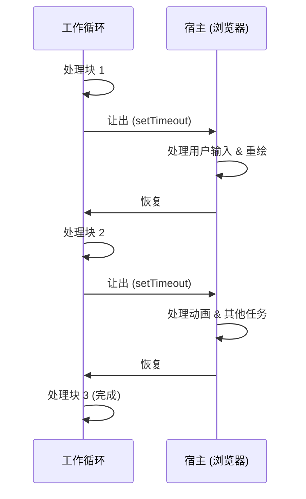

# 模式：协作调度 (Cooperative Scheduling)

## 一句话

将长时间运行的任务拆分为小块，在每块之间让出控制权，以保持系统响应。

## 核心思想

在协作调度中，任务主动检查是否应该暂停并让其他工作运行。与抢占式调度（由操作系统强制中断）不同，协作调度依赖任务自身在安全点让出。



模式：运行循环，每个工作单元后检查截止时间，超时则 `yield`。

**动手试试** — 启动任务，观察协作式轮询调度和让出控制权：

<CooperativeSchedulingViz />

## 生产验证

| 项目 | 源码 | 用途 |
|------|------|------|
| React | [Scheduler.js#L188-L258](https://github.com/facebook/react/blob/main/packages/scheduler/src/forks/Scheduler.js#L188-L258) | `workLoop` 从最小堆中处理任务，每轮调用 `shouldYieldToHost()`（~行447）检查 5ms 时间片是否耗尽。 |
| Go Runtime | [proc.go#L4143-L4200](https://github.com/golang/go/blob/master/src/runtime/proc.go#L4143-L4200) | `schedule()` 是调度器主循环。`Gosched()`（行394）是主动让出点，`goschedImpl`（行4315）处理协作式上下文切换。 |

## 实现

::: code-group

```typescript [TypeScript]
type Task = () => boolean; // 返回 true 表示还有更多工作

function createScheduler(yieldInterval: number = 5) {
  const queue: Task[] = [];
  let isRunning = false;

  function shouldYield(startTime: number): boolean {
    return performance.now() - startTime >= yieldInterval;
  }

  function workLoop(): void {
    const startTime = performance.now();
    while (queue.length > 0) {
      if (shouldYield(startTime)) {
        setTimeout(workLoop, 0); // 让出后继续
        return;
      }
      const task = queue[0]!;
      if (!task()) queue.shift();
    }
    isRunning = false;
  }

  return {
    scheduleTask(task: Task) {
      queue.push(task);
      if (!isRunning) {
        isRunning = true;
        setTimeout(workLoop, 0);
      }
    },
  };
}
```

```rust [Rust]
use std::time::{Duration, Instant};

pub struct CooperativeScheduler {
    yield_interval: Duration,
}

impl CooperativeScheduler {
    pub fn new(yield_ms: u64) -> Self {
        CooperativeScheduler {
            yield_interval: Duration::from_millis(yield_ms),
        }
    }

    pub fn run<F>(&self, mut work_units: Vec<F>) -> Vec<F>
    where
        F: FnMut() -> bool,
    {
        let start = Instant::now();
        while !work_units.is_empty() {
            if start.elapsed() >= self.yield_interval {
                return work_units; // 让出：返回剩余工作
            }
            if (work_units[0])() {
                work_units.remove(0);
            }
        }
        work_units
    }
}
```

```go [Go]
package scheduling

import "time"

type Task func() bool

type Scheduler struct {
	YieldInterval time.Duration
	queue         []Task
}

func (s *Scheduler) WorkLoop() bool {
	start := time.Now()
	for len(s.queue) > 0 {
		if time.Since(start) >= s.YieldInterval {
			return false // 让出
		}
		if s.queue[0]() {
			s.queue = s.queue[1:]
		}
	}
	return true // 全部完成
}
```

:::

## 练习

| 难度 | 练习 | 文件 |
|------|------|------|
| 基础 | 实现带让出检查的时间片工作循环 | `exercises/typescript/cooperative-scheduling/01-basic.test.ts` |
| 进阶 | 构建按优先级调度并让出的调度器 | `exercises/typescript/cooperative-scheduling/02-priority-scheduler.test.ts` |

## 何时使用

- **UI 线程工作** — 处理大数据集时保持动画和输入响应
- **批处理** — 分块处理元素，中间暂停让其他系统工作运行
- **长计算** — 将递归树遍历或列表操作拆为可恢复的块
- **并发运行时** — 实现绿色线程或协程调度

## 何时不用

- **短任务** — 如果工作在 1ms 内完成，让出的开销不值得
- **实时保证** — 协作调度无法保证截止时间；使用抢占式调度
- **CPU 密集且无交互** — 如果没有其他东西需要线程，让出浪费时间
- **`requestIdleCallback` 足够时** — 对于非紧急工作，浏览器内置 API 可能就够了

## 更多生产案例

- [Lua](https://github.com/lua/lua) — coroutines
- Python [asyncio](https://github.com/python/cpython/tree/main/Lib/asyncio)
- Erlang/BEAM VM — reduction counting
- Unity — coroutines

## 相关模式

| 模式 | 关系 |
|---------|-------------|
| [事件循环 / 反应器 (Event Loop / Reactor)](/zh/patterns/event-loop/) | 事件循环依赖协作调度——长任务必须让出以保持 I/O 流畅 |
| [工作窃取 (Work Stealing)](/zh/patterns/work-stealing/) | 协作调度在线程内工作；工作窃取在线程间分配 |
| [最小堆 / 优先队列 (Min Heap)](/zh/patterns/min-heap/) | React 调度器使用最小堆选择下一个运行的协作任务 |

## 挑战题

::: details Q1: React 每 5ms 让出控制权。如果你将其增加到 50ms 会怎样？如果减少到 0.5ms 呢？
**答案：** 50ms 会导致可见的 UI 卡顿（在 60fps 下丢 3 帧）；0.5ms 会将大部分时间浪费在让出的开销上而不是有用的工作。

5ms 是一个最佳平衡点：足够短，一帧 16ms 的预算还有余量留给浏览器绑制和输入处理；又足够长，调度器在每个时间片内能完成有意义的工作。50ms 时，用户输入和动画会明显冻结。0.5ms 时，检查时钟、调度 `MessageChannel` 回调和重新进入工作循环的开销占主导——你花在调度上的时间比工作还多。
:::

::: details Q2: 一个协作调度的任务有一个 bug，它永远不会返回 `true`（永远不发出完成信号）。系统会发生什么？
**答案：** 该任务永远垄断每个时间片，饿死所有其他排队的任务。

与抢占式调度不同，调度器无法强制移除行为异常的任务。工作循环在每个时间片给这个有 bug 的任务 CPU 时间，它运行 5ms，让出，再次被选中——无限循环。队列中的其他任务永远不会执行。这是协作调度的根本弱点：它信任任务会正常行为。生产级调度器通过超时或饥饿检测来缓解此问题，可以取消或降低卡住任务的优先级。
:::

::: details Q3: 为什么 React 使用 `MessageChannel` 而不是 `setTimeout(fn, 0)` 来让出控制权？
**答案：** `setTimeout(fn, 0)` 在多次嵌套调用后，浏览器会强制至少 4ms 的延迟，对于 5ms 的时间片来说太慢了。

大约 5 次嵌套 `setTimeout` 调用后，浏览器会将延迟钳制到至少 4ms（HTML 规范）。这意味着 5ms 的时间片加上 4ms 的让出间隔，几乎浪费了一半的时间。`MessageChannel` 发送一个宏任务而不受 4ms 的钳制——浏览器可以在宏任务之间插入绑制和输入处理，然后通常在 1ms 内分发回调。这使调度器保持响应而不会在人为延迟上浪费空闲时间。
:::

::: details Q4: 一位同事说"直接用 Web Workers 代替协作调度就好了——它们可以并行运行。"为什么这不能替代？
**答案：** Web Workers 无法访问 DOM，因此它们无法执行像 React 协调这样的 UI 渲染工作。

React 的协作调度之所以存在，正是因为协调过程必须读写 DOM 状态，而 DOM 只在主线程上可用。Workers 非常适合纯计算（解析、压缩、图像处理），但任何涉及 DOM、测量布局或更新 UI 的任务都必须在主线程上运行。协作调度是你在渲染、输入处理和应用逻辑之间公平共享单线程的方式。
:::
