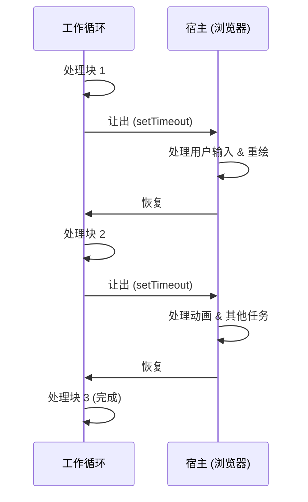

# 模式：协作调度 (Cooperative Scheduling)

## 一句话

将长时间运行的任务拆分为小块，在每块之间让出控制权，以保持系统响应。

## 核心思想

在协作调度中，任务主动检查是否应该暂停并让其他工作运行。与抢占式调度（由操作系统强制中断）不同，协作调度依赖任务自身在安全点让出。



模式：运行循环，每个工作单元后检查截止时间，超时则 `yield`。

## 生产验证

| 项目 | 源码 | 用途 |
|------|------|------|
| React | [Scheduler.js#L188-L258](https://github.com/facebook/react/blob/main/packages/scheduler/src/forks/Scheduler.js#L188-L258) | `workLoop` 从最小堆中处理任务，每轮调用 `shouldYieldToHost()`（~行447）检查 5ms 时间片是否耗尽。 |
| Go Runtime | [proc.go#L4143-L4200](https://github.com/golang/go/blob/master/src/runtime/proc.go#L4143-L4200) | `schedule()` 是调度器主循环。`Gosched()`（行394）是主动让出点，`goschedImpl`（行4315）处理协作式上下文切换。 |

## 实现

::: code-group

```typescript [TypeScript]
type Task = () => boolean; // 返回 true 表示还有更多工作

function createScheduler(yieldInterval: number = 5) {
  const queue: Task[] = [];
  let isRunning = false;

  function shouldYield(startTime: number): boolean {
    return performance.now() - startTime >= yieldInterval;
  }

  function workLoop(): void {
    const startTime = performance.now();
    while (queue.length > 0) {
      if (shouldYield(startTime)) {
        setTimeout(workLoop, 0); // 让出后继续
        return;
      }
      const task = queue[0]!;
      if (!task()) queue.shift();
    }
    isRunning = false;
  }

  return {
    scheduleTask(task: Task) {
      queue.push(task);
      if (!isRunning) {
        isRunning = true;
        setTimeout(workLoop, 0);
      }
    },
  };
}
```

```rust [Rust]
use std::time::{Duration, Instant};

pub struct CooperativeScheduler {
    yield_interval: Duration,
}

impl CooperativeScheduler {
    pub fn new(yield_ms: u64) -> Self {
        CooperativeScheduler {
            yield_interval: Duration::from_millis(yield_ms),
        }
    }

    pub fn run<F>(&self, mut work_units: Vec<F>) -> Vec<F>
    where
        F: FnMut() -> bool,
    {
        let start = Instant::now();
        while !work_units.is_empty() {
            if start.elapsed() >= self.yield_interval {
                return work_units; // 让出：返回剩余工作
            }
            if (work_units[0])() {
                work_units.remove(0);
            }
        }
        work_units
    }
}
```

```go [Go]
package scheduling

import "time"

type Task func() bool

type Scheduler struct {
	YieldInterval time.Duration
	queue         []Task
}

func (s *Scheduler) WorkLoop() bool {
	start := time.Now()
	for len(s.queue) > 0 {
		if time.Since(start) >= s.YieldInterval {
			return false // 让出
		}
		if s.queue[0]() {
			s.queue = s.queue[1:]
		}
	}
	return true // 全部完成
}
```

:::

## 练习

| 难度 | 练习 | 文件 |
|------|------|------|
| 基础 | 实现带让出检查的时间片工作循环 | `exercises/typescript/cooperative-scheduling/01-basic.test.ts` |
| 进阶 | 构建按优先级调度并让出的调度器 | `exercises/typescript/cooperative-scheduling/02-priority-scheduler.test.ts` |

## 何时使用

- **UI 线程工作** — 处理大数据集时保持动画和输入响应
- **批处理** — 分块处理元素，中间暂停让其他系统工作运行
- **长计算** — 将递归树遍历或列表操作拆为可恢复的块
- **并发运行时** — 实现绿色线程或协程调度

## 何时不用

- **短任务** — 如果工作在 1ms 内完成，让出的开销不值得
- **实时保证** — 协作调度无法保证截止时间；使用抢占式调度
- **CPU 密集且无交互** — 如果没有其他东西需要线程，让出浪费时间
- **`requestIdleCallback` 足够时** — 对于非紧急工作，浏览器内置 API 可能就够了

## 更多生产案例

- [Lua](https://github.com/lua/lua) — coroutines
- Python [asyncio](https://github.com/python/cpython/tree/main/Lib/asyncio)
- Erlang/BEAM VM — reduction counting
- Unity — coroutines
