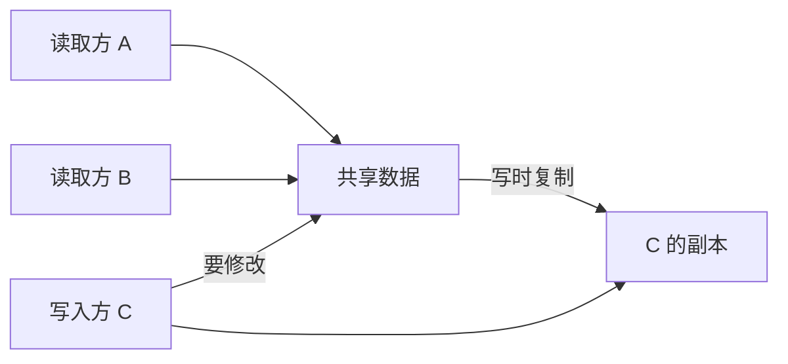

# 模式：写时复制 (Copy-on-Write)

<DifficultyBadge />

## 一句话

通过引用共享数据，直到有人修改时才创建私有副本——为读多写少的场景节省内存和分配开销。

<DemoBadge />

## 现实类比

一个设为「仅查看」的共享 Google 文档链接。所有人读的都是同一份文档。当有人想编辑时，系统为他创建一份副本。在写操作发生之前，只存在一份。

## 核心思想

写时复制将复制的开销推迟到实际发生修改时。多个读取方可以共享同一份数据。当写入方需要修改时，系统为该写入方创建副本，其他引用不受影响。



核心洞察：**大多数数据被读取的次数远多于被写入的次数**。CoW 利用这种不对称——读取免费共享，写入按需付费。

| 属性 | 值 |
|------|------|
| 读取（共享） | O(1) — 直接引用，无需复制 |
| 写入（首次修改） | O(n) — 完整复制数据 |
| 写入（已拥有） | O(1) — 原地修改 |
| 空间（无写入时） | O(1) — 所有读者共享一份拷贝 |

**动手试试** — 点击任意读者的"Write"按钮触发写时复制，观察引用计数的变化：

<CopyOnWriteViz />

## 生产验证

| 项目 | 源码 | 用途 |
|------|------|------|
| Git | [object-file.c#L719-L730](https://github.com/git/git/blob/1ff279f3404a482a83fb04c7457e41ab26884aea/object-file.c#L719-L730) | Git 对象是不可变的内容寻址 blob。分支时不复制文件——共享相同对象。新 commit 只为变更的文件创建新对象。 |
| Rust 标准库 | [borrow.rs#L169-L220](https://github.com/rust-lang/rust/blob/d56483a91d6cf5041351a3208b8d08f98f0c8b56/library/alloc/src/borrow.rs#L169-L220) | `Cow<'a, B>` — 持有 `Borrowed` 引用或 `Owned` 值的枚举。`to_mut()` 仅在当前是借用时才克隆。广泛用于零拷贝解析。 |

## 实现

::: code-group

```typescript [TypeScript]
class Cow<T extends object> {
  private data: T;
  private shared: boolean;

  constructor(data: T) {
    this.data = data;
    this.shared = false;
  }

  static from<T extends object>(data: T): Cow<T> {
    const cow = new Cow(data);
    cow.shared = true;
    return cow;
  }

  read(): Readonly<T> {
    return this.data;
  }

  write(): T {
    if (this.shared) {
      this.data = structuredClone(this.data);
      this.shared = false;
    }
    return this.data;
  }

  isOwned(): boolean {
    return !this.shared;
  }
}
```

```rust [Rust]
use std::borrow::Cow;

fn process(input: &str) -> Cow<'_, str> {
    if input.contains("bad") {
        // Only allocate when modification needed
        Cow::Owned(input.replace("bad", "good"))
    } else {
        // Zero-copy: just borrow the original
        Cow::Borrowed(input)
    }
}

// Usage
let clean = process("hello world");     // Borrowed, no allocation
let fixed = process("hello bad world"); // Owned, allocated
```

```go [Go]
type CowSlice[T any] struct {
	data   []T
	shared bool
}

func Share[T any](data []T) *CowSlice[T] {
	return &CowSlice[T]{data: data, shared: true}
}

func (c *CowSlice[T]) Read() []T {
	return c.data
}

func (c *CowSlice[T]) Write() []T {
	if c.shared {
		copied := make([]T, len(c.data))
		copy(copied, c.data)
		c.data = copied
		c.shared = false
	}
	return c.data
}
```

```python [Python]
import copy

class Cow:
    """Copy-on-Write wrapper."""
    def __init__(self, data, shared=False):
        self._data = data
        self._shared = shared

    @classmethod
    def share(cls, data):
        return cls(data, shared=True)

    def read(self):
        return self._data

    def write(self):
        if self._shared:
            self._data = copy.deepcopy(self._data)
            self._shared = False
        return self._data

# Usage
original = {"users": ["alice", "bob"]}
view = Cow.share(original)
print(view.read() is original)  # True — same object, no copy

mutable = view.write()          # NOW it copies
mutable["users"].append("charlie")
print(original["users"])        # ["alice", "bob"] — unchanged
```

:::

## 练习

| 难度 | 练习 | 文件 |
|------|------|------|
| 基础 | 实现写时复制包装器 | `exercises/typescript/copy-on-write/01-basic.test.ts` |
| 进阶 | 带 CoW fork 的版本化配置存储 | `exercises/typescript/copy-on-write/02-intermediate.test.ts` |

运行练习：`pnpm test`（TypeScript）· `cargo test`（Rust）· `go test ./...`（Go）· `pytest`（Python）

练习文件： Rust `exercises/rust/src/copy_on_write/mod.rs` · Go `exercises/go/copy_on_write/copy_on_write_test.go` · Python `exercises/python/copy_on_write/test_copy_on_write.py`

## 何时使用

- **读多写少** — 配置对象、解析后的 AST、缓存响应
- **分支/版本控制** — Git 对象模型、数据库快照
- **零拷贝解析** — Rust 的 `Cow<str>` 在输入已有效时避免分配
- **撤销系统** — 共享状态快照，仅在修改时复制
- **不可变优先架构** — React state、Redux reducers

## 何时不用

- **写多读少** — 每次写入触发复制，抵消收益
- **小数据** — 复制小结构比 CoW 记账更便宜
- **并发写入** — CoW 不解决并发修改问题
- **深层结构** — 浅 CoW 可能导致共享可变子对象

## 更多生产案例

- [Linux fork()](https://github.com/torvalds/linux/blob/acb7500801e98639f6d8c2d796ed9f64cba83d3a/kernel/fork.c#L580-L620) — 通过 `copy_page_range` 实现页表 CoW
- [Swift](https://github.com/swiftlang/swift) — value types
- [Redis](https://github.com/redis/redis) — `BGSAVE`
- [ZFS](https://github.com/openzfs/zfs) / Btrfs — filesystem snapshots

## 相关模式

| 模式 | 关系 |
|---------|-------------|
| [双缓冲 (Double Buffering)](/zh/patterns/double-buffering/) | 两者都延迟成本——CoW 在写入时复制，双缓冲准备第二份副本 |
| [享元 / 驻留 (Flyweight / Interning)](/zh/patterns/flyweight/) | 享元共享不可变数据；CoW 共享可变数据直到修改 |
| [Merkle 树 (Merkle Tree)](/zh/patterns/merkle-tree/) | Merkle 树实现高效 CoW——只需重新哈希从变更节点到根的路径 |
| [引用计数 (Reference Counting)](/zh/patterns/reference-counting/) | 引用计数追踪 CoW 共享——当引用计数 > 1 且写入时复制 |
| [检查点 (Checkpointing)](/zh/patterns/checkpointing/) | 检查点捕获 CoW 快照——CoW 使快照创建为 O(1) |
| [差分与补丁 (Diff & Patch)](/zh/patterns/diff-patch/) | 差分补丁计算 CoW 快照之间的变更以实现增量更新 |
| [多版本并发控制 (MVCC)](/zh/patterns/mvcc/) | MVCC 使用 CoW 为并发读者创建版本快照 |

## 挑战题

::: details Q1: 你的 CoW 包装器在写入时进行浅拷贝。读者和写者共享一个嵌套对象 `{ users: [{ name: "alice" }] }`。写者调用 `write()` 并修改 `users[0].name`。读者会看到这个修改吗？
**答案：** 会的——浅拷贝只复制顶层对象，因此嵌套的 `users` 数组及其元素仍然是共享引用。

这就是"浅 CoW 陷阱"。`write()` 之后，写者有了一个新的顶层对象，但 `writer.users === reader.users` 仍然成立。修改 `users[0].name` 会影响双方。要实现真正的隔离，你需要深拷贝（代价高）、结构共享（像 immutable.js 那样只复制修改路径的骨干）或规定 CoW 对象只包含原始类型。React 和 Redux 通过要求不可变更新模式来解决这个问题：`{ ...state, users: [...state.users] }`。
:::

::: details Q2: Linux `fork()` 使用 CoW 处理进程内存页。子进程立即调用 `exec()` 替换其内存。为什么 CoW 在这里至关重要？
**答案：** 没有 CoW 的话，`fork()` 会复制整个父进程地址空间，然后在 `exec()` 加载新程序时立即丢弃——巨大的浪费。

`fork()` + `exec()` 模式是 Unix 中最常见的操作之一。父进程可能有数 GB 的内存。CoW 使得 `fork()` 几乎是瞬时的：它只是复制页表条目并将所有页面标记为只读。当 `exec()` 运行时，它无论如何都会替换所有映射，因此没有页面真正需要复制。没有 CoW，从大型应用（如 web 服务器 fork 工作进程）中生成进程将会慢得无法接受且内存密集。
:::

::: details Q3: 一个系统对配置对象使用 CoW。100 个读者共享配置；一个写者每秒更新一次。在什么工作负载模式下，CoW 比简单的互斥锁保护的共享对象更浪费内存？
**答案：** 当每次读取后都跟着一次写入（100% 写入比率）时，CoW 在每次访问时都创建完整副本，使用的内存比一个锁保护的单一共享对象更多。

CoW 的优势与读写比成正比。99% 读取时，100 个读者共享一份副本，只有偶尔的写者才为克隆付出代价——非常好。50% 读取时，一半的访问触发复制——收益微乎其微。100% 写入时，每次访问都会复制——你把单一共享对象变成了 N 个独立副本，没有任何共享优势，还加上了追踪共享状态的开销。平衡点取决于对象大小，但原则不变：CoW 适用于读多写少的工作负载。
:::

::: details Q4: Rust 的 `Cow<'a, str>` 是一个枚举，包含 `Borrowed(&'a str)` 和 `Owned(String)`。为什么这比总是克隆字符串更有用？
**答案：** 它让函数在输入已经是正确形式时无需分配就能接受和返回字符串数据，在常见情况下实现零拷贝。

考虑一个 URL 解码器：大多数 URL 没有百分号编码字符，可以原样返回（`Borrowed`）。只有包含 `%20` 等的 URL 才需要新的 `String`（`Owned`）。使用 `Cow` 时，函数签名是 `fn decode(input: &str) -> Cow<str>`——调用者在 90% 的情况下得到原始引用，零分配。没有 `Cow`，你要么总是克隆（浪费），要么手动返回一个枚举（这正是 `Cow` 本身，还有标准库集成）。
:::
