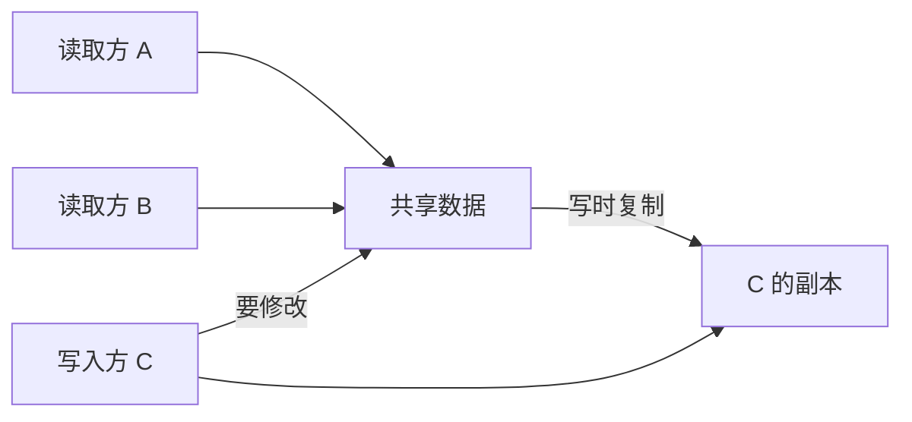

# 模式：写时复制 (Copy-on-Write)

## 一句话

通过引用共享数据，直到有人修改时才创建私有副本——为读多写少的场景节省内存和分配开销。

## 核心思想

写时复制将复制的开销推迟到实际发生修改时。多个读取方可以共享同一份数据。当写入方需要修改时，系统为该写入方创建副本，其他引用不受影响。



核心洞察：**大多数数据被读取的次数远多于被写入的次数**。CoW 利用这种不对称——读取免费共享，写入按需付费。

## 生产验证

| 项目 | 源码 | 用途 |
|------|------|------|
| Git | [object-file.c#L719-L730](https://github.com/git/git/blob/master/object-file.c#L719-L730) | Git 对象是不可变的内容寻址 blob。分支时不复制文件——共享相同对象。新 commit 只为变更的文件创建新对象。 |
| Rust 标准库 | [borrow.rs#L169-L220](https://github.com/rust-lang/rust/blob/main/library/alloc/src/borrow.rs#L169-L220) | `Cow<'a, B>` — 持有 `Borrowed` 引用或 `Owned` 值的枚举。`to_mut()` 仅在当前是借用时才克隆。广泛用于零拷贝解析。 |

## 实现

::: code-group

```typescript [TypeScript]
class Cow<T extends object> {
  private data: T;
  private shared: boolean;

  constructor(data: T) { this.data = data; this.shared = false; }

  static from<T extends object>(data: T): Cow<T> {
    const cow = new Cow(data);
    cow.shared = true;
    return cow;
  }

  read(): Readonly<T> { return this.data; }

  write(): T {
    if (this.shared) {
      this.data = structuredClone(this.data);
      this.shared = false;
    }
    return this.data;
  }
}
```

```python [Python]
import copy

class Cow:
    def __init__(self, data, shared=False):
        self._data = data
        self._shared = shared

    @classmethod
    def share(cls, data):
        return cls(data, shared=True)

    def read(self):
        return self._data

    def write(self):
        if self._shared:
            self._data = copy.deepcopy(self._data)
            self._shared = False
        return self._data
```

:::

## 练习

| 难度 | 练习 | 文件 |
|------|------|------|
| 基础 | 实现写时复制包装器 | `exercises/typescript/copy-on-write/01-basic.test.ts` |
| 进阶 | 带 CoW fork 的版本化配置存储 | `exercises/typescript/copy-on-write/02-intermediate.test.ts` |

## 何时使用

- **读多写少** — 配置对象、解析后的 AST、缓存响应
- **分支/版本控制** — Git 对象模型、数据库快照
- **零拷贝解析** — Rust 的 `Cow<str>` 在输入已有效时避免分配
- **撤销系统** — 共享状态快照，仅在修改时复制

## 何时不用

- **写多读少** — 每次写入触发复制，抵消收益
- **小数据** — 复制小结构比 CoW 记账更便宜
- **并发写入** — CoW 不解决并发修改问题

## 更多生产案例

- Linux `fork()` — page table CoW
- [Swift](https://github.com/swiftlang/swift) — value types
- [Redis](https://github.com/redis/redis) — `BGSAVE`
- [ZFS](https://github.com/openzfs/zfs) / Btrfs — filesystem snapshots

## 挑战题

::: details Q1: Your CoW wrapper does a shallow copy on write. A reader and writer share a nested object `{ users: [{ name: "alice" }] }`. The writer calls `write()` and mutates `users[0].name`. Does the reader see the mutation?
**Answer:** Yes — a shallow copy only duplicates the top-level object, so the nested `users` array and its elements are still shared references.

This is the "shallow CoW trap." After `write()`, the writer has a new top-level object, but `writer.users === reader.users` still holds. Mutating `users[0].name` affects both. To get true isolation, you need either a deep copy (expensive), structural sharing (copy the spine of the path to the mutation, like immutable.js), or a rule that CoW objects only contain primitives. React and Redux solve this by requiring immutable update patterns: `{ ...state, users: [...state.users] }`.
:::

::: details Q2: Linux `fork()` uses CoW for process memory pages. A child process immediately calls `exec()` to replace its memory. Why is CoW essential here?
**Answer:** Without CoW, `fork()` would copy the entire parent address space only to discard it immediately when `exec()` loads a new program — a massive waste.

The `fork()` + `exec()` pattern is one of the most common operations in Unix. The parent may have gigabytes of memory. CoW means `fork()` is nearly instant: it just duplicates the page table entries and marks all pages read-only. When `exec()` runs, it replaces all mappings anyway, so no pages ever needed copying. Without CoW, spawning a process from a large application (like a web server forking a worker) would be prohibitively slow and memory-intensive.
:::

::: details Q3: A system uses CoW for configuration objects. 100 readers share the config; a writer updates it every second. Under what workload pattern does CoW waste memory compared to a simple mutex-protected shared object?
**Answer:** When every read is followed by a write (100% write ratio), CoW creates a full copy on every access, using more memory than a single shared object protected by a lock.

CoW's advantage is proportional to the read/write ratio. At 99% reads, 100 readers share one copy and only the rare writer pays for a clone — excellent. At 50% reads, half the accesses trigger copies — the benefit is marginal. At 100% writes, every access copies — you've turned a single shared object into N independent copies with no sharing benefit, plus the overhead of tracking shared state. The break-even point depends on object size, but the principle holds: CoW is for read-heavy workloads.
:::

::: details Q4: Rust's `Cow<'a, str>` is an enum with `Borrowed(&'a str)` and `Owned(String)`. Why is this more useful than just always cloning the string?
**Answer:** It lets functions accept and return string data without allocating when the input is already in the right form, achieving zero-copy in the common case.

Consider a URL decoder: most URLs have no percent-encoded characters and can be returned as-is (`Borrowed`). Only URLs with `%20` etc. need a new `String` (`Owned`). With `Cow`, the function signature is `fn decode(input: &str) -> Cow<str>` — callers get the original reference back 90% of the time with zero allocation. Without `Cow`, you'd either always clone (wasteful) or return an enum manually (which is exactly what `Cow` already is, with standard library integration).
:::
