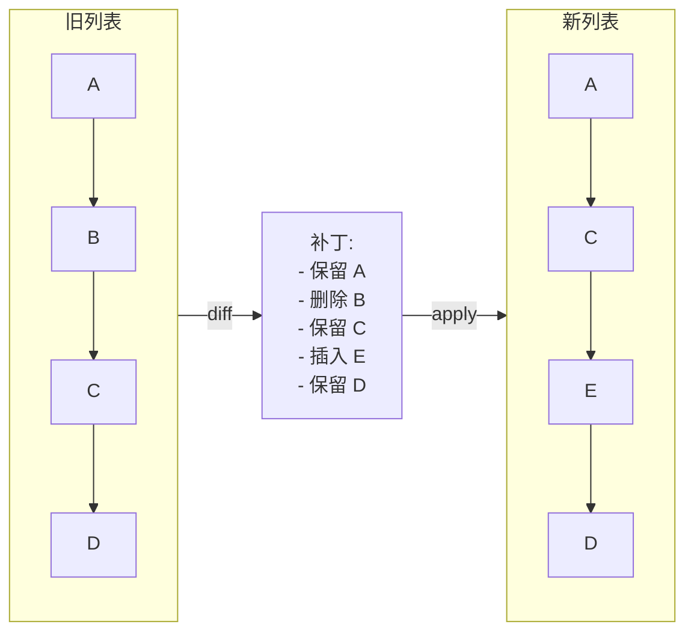

# 模式：差异/补丁 (Diff / Patch)

## 一句话

比较两个序列，计算将一个转换为另一个所需的最小操作集（插入、删除、移动）。

<DemoBadge />

## 核心思想

给定旧列表和新列表，diff 算法确定哪些元素被添加、删除或移动。结果是一个"补丁"— 一组最小的变更操作。



React 的协调器用此确定要创建、更新或删除哪些 DOM 节点。Git 用此显示提交之间的变更。

**动手试试** — 编辑新旧文本，然后计算并应用差异：

<DiffPatchViz />

## 生产验证

| 项目 | 源码 | 用途 |
|------|------|------|
| React | [ReactChildFiber.js#L1169-L1340](https://github.com/facebook/react/blob/main/packages/react-reconciler/src/ReactChildFiber.js#L1169-L1340) | `reconcileChildrenArray` 对比新旧子节点，~行1294 调用 `mapRemainingChildren` 构建 key→fiber 映射，检测移动、插入和删除。 |
| Git | [diff.c#L5020-L5060](https://github.com/git/git/blob/master/diff.c#L5020-L5060) | `run_diff` 分派文件对比，`builtin_diff`（行3839）处理实际 diff。Git 内部使用优化版 Myers 算法（在 `xdiff/` 中）。 |

## 实现

::: info 关于算法
下面的实现使用**贪心前向扫描**——简单清晰，适合学习。生产系统如 Git 使用 [Myers 差异算法](https://blog.jcoglan.com/2017/02/12/the-myers-diff-algorithm-part-1/)保证最小编辑序列。React 使用基于 key 的方法，专为 UI 列表协调优化。
:::

::: code-group

```typescript [TypeScript]
type Op<T> =
  | { type: 'keep'; value: T }
  | { type: 'insert'; value: T }
  | { type: 'delete'; value: T };

function diff<T>(oldList: T[], newList: T[]): Op<T>[] {
  const ops: Op<T>[] = [];
  let oi = 0, ni = 0;
  while (oi < oldList.length && ni < newList.length) {
    if (oldList[oi] === newList[ni]) {
      ops.push({ type: 'keep', value: oldList[oi]! }); oi++; ni++;
    } else if (!newList.slice(ni).includes(oldList[oi]!)) {
      ops.push({ type: 'delete', value: oldList[oi]! }); oi++;
    } else {
      ops.push({ type: 'insert', value: newList[ni]! }); ni++;
    }
  }
  while (oi < oldList.length) { ops.push({ type: 'delete', value: oldList[oi]! }); oi++; }
  while (ni < newList.length) { ops.push({ type: 'insert', value: newList[ni]! }); ni++; }
  return ops;
}

function patch<T>(ops: Op<T>[]): T[] {
  return ops.filter(op => op.type !== 'delete').map(op => op.value);
}
```

```rust [Rust]
#[derive(Debug, PartialEq)]
pub enum Op<T> { Keep(T), Insert(T), Delete(T) }

pub fn diff<T: PartialEq + Clone>(old: &[T], new: &[T]) -> Vec<Op<T>> {
    let mut ops = Vec::new();
    let (mut oi, mut ni) = (0, 0);
    while oi < old.len() && ni < new.len() {
        if old[oi] == new[ni] {
            ops.push(Op::Keep(old[oi].clone())); oi += 1; ni += 1;
        } else if !new[ni..].contains(&old[oi]) {
            ops.push(Op::Delete(old[oi].clone())); oi += 1;
        } else {
            ops.push(Op::Insert(new[ni].clone())); ni += 1;
        }
    }
    while oi < old.len() { ops.push(Op::Delete(old[oi].clone())); oi += 1; }
    while ni < new.len() { ops.push(Op::Insert(new[ni].clone())); ni += 1; }
    ops
}
```

```python [Python]
from typing import TypeVar, List, Tuple, Literal

T = TypeVar("T")
Op = Tuple[Literal["keep", "insert", "delete"], T]

def diff(old: List[T], new: List[T]) -> List[Op]:
    ops: List[Op] = []
    oi, ni = 0, 0

    while oi < len(old) and ni < len(new):
        if old[oi] == new[ni]:
            ops.append(("keep", old[oi]))
            oi += 1; ni += 1
        elif old[oi] not in new[ni:]:
            ops.append(("delete", old[oi]))
            oi += 1
        else:
            ops.append(("insert", new[ni]))
            ni += 1

    while oi < len(old): ops.append(("delete", old[oi])); oi += 1
    while ni < len(new): ops.append(("insert", new[ni])); ni += 1
    return ops

def patch(ops: List[Op]) -> List[T]:
    return [val for op_type, val in ops if op_type != "delete"]

# Usage
ops = diff(["a", "b", "c", "d"], ["a", "c", "e", "d"])
assert patch(ops) == ["a", "c", "e", "d"]
```

:::

## 练习

| 难度 | 练习 | 文件 |
|------|------|------|
| 基础 | 实现产生 keep/insert/delete 操作的列表 diff | `exercises/typescript/diff-patch/01-basic.test.ts` |
| 进阶 | 应用补丁从旧列表重建新列表 | `exercises/typescript/diff-patch/02-patch-apply.test.ts` |

运行练习：`pnpm test`（TypeScript）· `cargo test`（Rust）· `go test ./...`（Go）· `pytest`（Python）

Exercise files: Rust `exercises/rust/src/diff_patch.rs` · Go `exercises/go/diff_patch_test.go` · Python `exercises/python/test_diff_patch.py`

## 何时使用

- **UI 协调** — 通过 diff 虚拟树最小化 DOM 变更
- **版本控制** — 计算提交之间的文件变更
- **协同编辑** — 通过操作转换或 CRDT diff 合并并发编辑
- **状态同步** — 通过网络仅发送增量而非完整状态

## 何时不用

- **完全不同的列表** — 如果超过 80% 的元素变化，直接替换整个列表
- **无序集合** — diff 假设顺序重要；对集合使用交集/差集
- **大列表无 key** — 没有稳定标识符时，diff 退化为 O(n²)

## 更多生产案例

- [VS Code](https://github.com/microsoft/vscode) — text buffer diff
- [jsdiff](https://github.com/kpdecker/jsdiff)
- [Vue 3](https://github.com/vuejs/core) — template diff

## 相关模式

| 模式 | 关系 |
|---------|-------------|
| [写时复制 (Copy-on-Write)](/zh/patterns/copy-on-write/) | 差异/补丁计算变更内容；CoW 将实际复制延迟到需要时 |
| [Merkle 树 (Merkle Tree)](/zh/patterns/merkle-tree/) | Merkle 树识别哪些子树发生了变化，缩小差异比较范围 |
| [双缓冲 (Double Buffering)](/zh/patterns/double-buffering/) | React 将当前树与正在进行的双缓冲进行差异比较 |

## 挑战题

::: details Q1: React 的 diff 生成插入/删除/更新操作，但没有"移动"操作。它如何处理仅仅重新排序的列表？
**答案：** React 不发出显式的"移动"操作。它通过 `insertBefore` 复用现有 DOM 节点并重新定位。

没有 key 时，React 按位置比较子元素——重新排序看起来像每个元素都变了。有 key 时，React 构建 `key -> fiber` 的映射，按 key 匹配新旧子元素，复用现有 DOM 节点。它追踪 `lastPlacedIndex` 并标记需要重新定位的 fiber——浏览器移动 DOM 节点而不是销毁并重建。这比计算最小编辑距离的移动序列更简单，但对于典型 UI 列表能产生接近最优的 DOM 变更。
:::

::: details Q2: 本模式中的贪心 diff 算法最坏情况为 O(n*m)。是什么导致了这种情况？Myers 算法如何改进？
**答案：** 贪心算法的 `some()` 调用为每个旧元素扫描剩余的新列表，产生 O(n*m) 次比较。Myers 算法的复杂度为 O((n+m) * d)，其中 d 是编辑距离。

Myers 的关键洞察是通过在编辑图中探索对角线来搜索最短编辑脚本。当两个列表相似（d 较小）时，它近似以 O(n+m) 运行。贪心方法没有这种优化——它不最小化编辑序列，当列表中有很多分散的差异时退化严重。
:::

::: details Q3: 两个开发者独立编辑同一个文件。开发者 A 删除了第 5 行；开发者 B 修改了第 5 行。基于 diff 的合并如何处理这个冲突？
**答案：** 这是一个真正的冲突，无法自动解决——合并工具必须标记它供人工审查。

三路合并计算两个 diff：（基准 -> A）和（基准 -> B）。如果两个 diff 都涉及同一区域，就产生冲突。A 的 diff 说"删除第 5 行"，B 的 diff 说"替换第 5 行"。这是同一个代码块上的互斥操作。合并工具插入冲突标记（`<<<<<<<`、`=======`、`>>>>>>>`），由开发者决定。不同区域的非重叠变更可以干净地合并。
:::

::: details Q4: 你需要在服务器和 10,000 个连接的客户端之间同步状态。你应该对完整状态做 diff 并发送补丁，还是使用不同的方法？
**答案：** 对每个客户端做完整状态的 diff 无法扩展。使用事件溯源或操作转换，在变更发生时发送单个变更操作。

计算 diff 需要同时持有新旧状态，且 diff 成本与状态大小成正比。有 10,000 个客户端时，每次更新你要计算 10,000 个 diff。相反，将每个变更捕获为小操作（例如"set user.name = X"）并广播。客户端增量应用操作。Diff-patch 更适合周期性对账（如 React 的渲染周期）或离线同步，不适合实时高扇出分发。
:::
