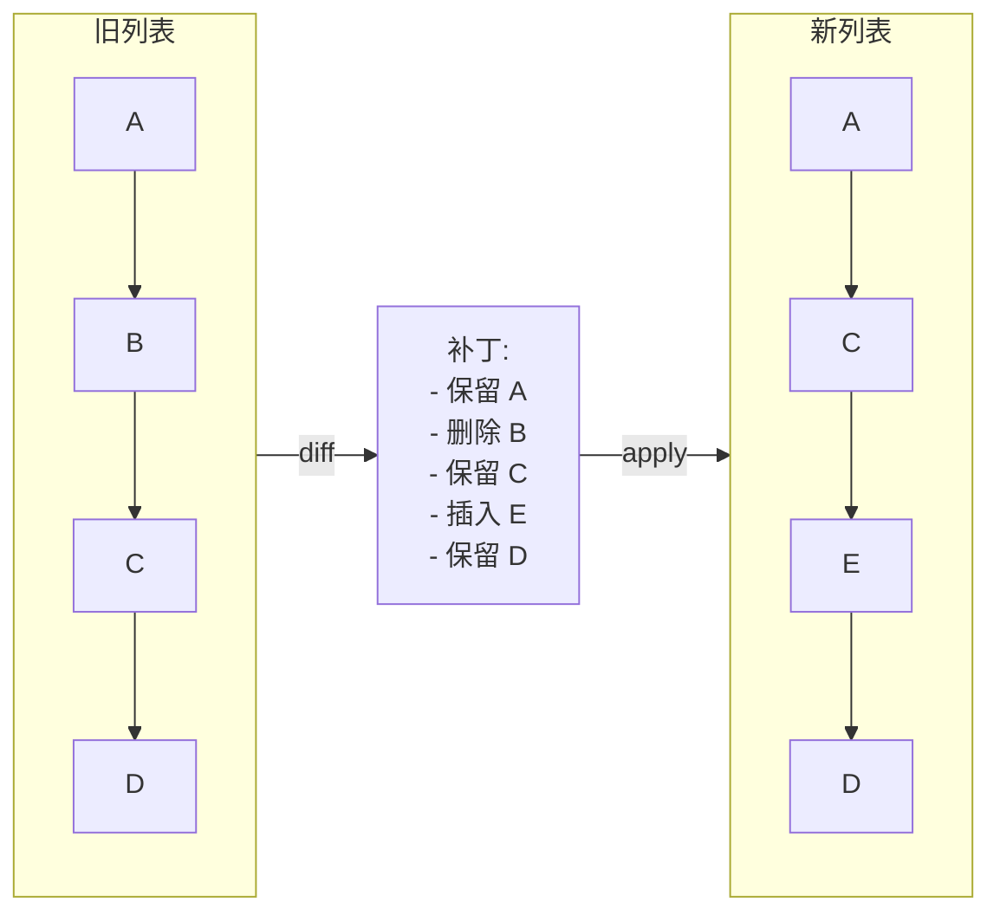

# 模式：差异/补丁 (Diff / Patch)

## 一句话

比较两个序列，计算将一个转换为另一个所需的最小操作集（插入、删除、移动）。

## 核心思想

给定旧列表和新列表，diff 算法确定哪些元素被添加、删除或移动。结果是一个"补丁"— 一组最小的变更操作。



React 的协调器用此确定要创建、更新或删除哪些 DOM 节点。Git 用此显示提交之间的变更。

## 生产验证

| 项目 | 源码 | 用途 |
|------|------|------|
| React | [ReactChildFiber.js#L1169-L1340](https://github.com/facebook/react/blob/main/packages/react-reconciler/src/ReactChildFiber.js#L1169-L1340) | `reconcileChildrenArray` 对比新旧子节点，~行1294 调用 `mapRemainingChildren` 构建 key→fiber 映射，检测移动、插入和删除。 |
| Git | [diff.c#L5020-L5060](https://github.com/git/git/blob/master/diff.c#L5020-L5060) | `run_diff` 分派文件对比，`builtin_diff`（行3839）处理实际 diff。Git 内部使用优化版 Myers 算法（在 `xdiff/` 中）。 |

## 实现

::: info 关于算法
下面的实现使用**贪心前向扫描**——简单清晰，适合学习。生产系统如 Git 使用 [Myers 差异算法](https://blog.jcoglan.com/2017/02/12/the-myers-diff-algorithm-part-1/)保证最小编辑序列。React 使用基于 key 的方法，专为 UI 列表协调优化。
:::

::: code-group

```typescript [TypeScript]
type Op<T> =
  | { type: 'keep'; value: T }
  | { type: 'insert'; value: T }
  | { type: 'delete'; value: T };

function diff<T>(oldList: T[], newList: T[]): Op<T>[] {
  const ops: Op<T>[] = [];
  let oi = 0, ni = 0;
  while (oi < oldList.length && ni < newList.length) {
    if (oldList[oi] === newList[ni]) {
      ops.push({ type: 'keep', value: oldList[oi]! }); oi++; ni++;
    } else if (!newList.slice(ni).includes(oldList[oi]!)) {
      ops.push({ type: 'delete', value: oldList[oi]! }); oi++;
    } else {
      ops.push({ type: 'insert', value: newList[ni]! }); ni++;
    }
  }
  while (oi < oldList.length) { ops.push({ type: 'delete', value: oldList[oi]! }); oi++; }
  while (ni < newList.length) { ops.push({ type: 'insert', value: newList[ni]! }); ni++; }
  return ops;
}

function patch<T>(ops: Op<T>[]): T[] {
  return ops.filter(op => op.type !== 'delete').map(op => op.value);
}
```

```rust [Rust]
#[derive(Debug, PartialEq)]
pub enum Op<T> { Keep(T), Insert(T), Delete(T) }

pub fn diff<T: PartialEq + Clone>(old: &[T], new: &[T]) -> Vec<Op<T>> {
    let mut ops = Vec::new();
    let (mut oi, mut ni) = (0, 0);
    while oi < old.len() && ni < new.len() {
        if old[oi] == new[ni] {
            ops.push(Op::Keep(old[oi].clone())); oi += 1; ni += 1;
        } else if !new[ni..].contains(&old[oi]) {
            ops.push(Op::Delete(old[oi].clone())); oi += 1;
        } else {
            ops.push(Op::Insert(new[ni].clone())); ni += 1;
        }
    }
    while oi < old.len() { ops.push(Op::Delete(old[oi].clone())); oi += 1; }
    while ni < new.len() { ops.push(Op::Insert(new[ni].clone())); ni += 1; }
    ops
}
```

:::

## 练习

| 难度 | 练习 | 文件 |
|------|------|------|
| 基础 | 实现产生 keep/insert/delete 操作的列表 diff | `exercises/typescript/diff-patch/01-basic.test.ts` |
| 进阶 | 应用补丁从旧列表重建新列表 | `exercises/typescript/diff-patch/02-patch-apply.test.ts` |

## 何时使用

- **UI 协调** — 通过 diff 虚拟树最小化 DOM 变更
- **版本控制** — 计算提交之间的文件变更
- **协同编辑** — 通过操作转换或 CRDT diff 合并并发编辑
- **状态同步** — 通过网络仅发送增量而非完整状态

## 何时不用

- **完全不同的列表** — 如果超过 80% 的元素变化，直接替换整个列表
- **无序集合** — diff 假设顺序重要；对集合使用交集/差集
- **大列表无 key** — 没有稳定标识符时，diff 退化为 O(n²)

## 更多生产案例

- [VS Code](https://github.com/microsoft/vscode) — text buffer diff
- [jsdiff](https://github.com/kpdecker/jsdiff)
- [Vue 3](https://github.com/vuejs/core) — template diff
