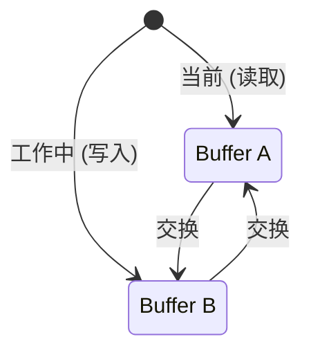

# 模式：双缓冲 (Double Buffering)

<DifficultyBadge />

## 一句话

维护两份状态副本，在它们之间原子切换，让读取方始终看到一致的快照。

<DemoBadge />

## 现实类比

有两个出餐窗口的餐厅厨房。厨师在一边准备下一单，服务员从另一边取走当前的单。新的做好了就交换——顾客永远看不到做了一半的菜。

## 核心思想

双缓冲保持数据结构的两个版本：一个"当前"（正在被读取）和一个"工作中"（正在被写入）。写入完成后，两者原子交换。读取方永远不会看到写到一半的状态。



交换后：旧"当前"变为新"工作中"（被复用，不会被 GC）。同样的两个对象永远被回收利用 — 热路径上**零分配**。

| 属性 | 值 |
|------|------|
| 交换 | O(1) — 指针/引用交换 |
| 热路径分配 | 零 — 两个缓冲区预分配并循环使用 |
| 内存 | 2× 单缓冲区 — 恰好两份拷贝 |
| 撕裂 | 不可能 — 读者看到一致的快照 |

**动手试试** — 绘制帧并交换缓冲区，观察双缓冲如何防止画面撕裂：

<DoubleBufferingViz />

## 生产验证

| 项目 | 源码 | 用途 |
|------|------|------|
| React | [ReactFiber.js#L327-L355](https://github.com/facebook/react/blob/34b78a2897cc208260a88e6b62ecaf9ca2a9dfe4/packages/react-reconciler/src/ReactFiber.js#L327-L355) | `createWorkInProgress` — 创建或复用 alternate fiber。注释写道：*"We use a double buffering pooling technique because we know that we'll only ever need at most two versions of a tree."* |
| SDL | [SDL_render.c#L5535-L5570](https://github.com/libsdl-org/SDL/blob/14b0e9d922da78001223e563efd2f54f473a4115/src/render/SDL_render.c#L5535-L5570) | `SDL_RenderPresent` — 刷新排队的渲染命令，调用后端的 `RenderPresent` 交换前后缓冲区实现无撕裂帧呈现，处理 vsync 模拟。 |

## 实现

::: code-group

```typescript [TypeScript]
class DoubleBuffer<T> {
  private buffers: [T, T];
  private currentIndex: 0 | 1 = 0;

  constructor(createBuffer: () => T) {
    this.buffers = [createBuffer(), createBuffer()];
  }

  current(): T {
    return this.buffers[this.currentIndex];
  }

  next(): T {
    return this.buffers[this.currentIndex === 0 ? 1 : 0];
  }

  swap(): void {
    this.currentIndex = this.currentIndex === 0 ? 1 : 0;
  }
}

// React-style fiber double buffering
interface Fiber {
  tag: string;
  pendingProps: Record<string, unknown>;
  memoizedState: unknown;
  alternate: Fiber | null;
}

function createWorkInProgress(current: Fiber, pendingProps: Record<string, unknown>): Fiber {
  let wip = current.alternate;

  if (wip === null) {
    // First render: create the alternate
    wip = {
      tag: current.tag,
      pendingProps,
      memoizedState: current.memoizedState,
      alternate: current,
    };
    current.alternate = wip;
  } else {
    // Subsequent renders: reuse the alternate (zero allocation)
    wip.pendingProps = pendingProps;
    wip.memoizedState = current.memoizedState;
  }

  return wip;
}
```

```rust [Rust]
pub struct DoubleBuffer<T> {
    buffers: [T; 2],
    current: usize,
}

impl<T: Default + Clone> DoubleBuffer<T> {
    pub fn new(init: T) -> Self {
        DoubleBuffer {
            buffers: [init.clone(), init],
            current: 0,
        }
    }

    pub fn current(&self) -> &T {
        &self.buffers[self.current]
    }

    pub fn next(&mut self) -> &mut T {
        &mut self.buffers[1 - self.current]
    }

    pub fn swap(&mut self) {
        self.current = 1 - self.current;
    }
}
```

```go [Go]
type DoubleBuffer[T any] struct {
	buffers [2]T
	current int
}

func NewDoubleBuffer[T any](init T, clone func(T) T) *DoubleBuffer[T] {
	return &DoubleBuffer[T]{
		buffers: [2]T{clone(init), init},
		current: 0,
	}
}

func (db *DoubleBuffer[T]) Current() *T {
	return &db.buffers[db.current]
}

func (db *DoubleBuffer[T]) Next() *T {
	return &db.buffers[1-db.current]
}

func (db *DoubleBuffer[T]) Swap() {
	db.current = 1 - db.current
}
```

```python [Python]
class DoubleBuffer:
    def __init__(self, create_buffer):
        self._buffers = [create_buffer(), create_buffer()]
        self._current = 0

    def current(self):
        return self._buffers[self._current]

    def next(self):
        return self._buffers[1 - self._current]

    def swap(self):
        self._current = 1 - self._current

# Usage
buf = DoubleBuffer(lambda: {"pixels": [0, 0]})
buf.next()["pixels"] = [255, 128]  # write to back buffer
assert buf.current()["pixels"] == [0, 0]  # front unchanged
buf.swap()
assert buf.current()["pixels"] == [255, 128]  # now visible
```

:::

## 练习

| 难度 | 练习 | 文件 |
|------|------|------|
| 基础 | 实现通用双缓冲与交换 | `exercises/typescript/double-buffering/01-basic.test.ts` |
| 进阶 | 构建 React 风格的 fiber alternate | `exercises/typescript/double-buffering/02-fiber-alternate.test.ts` |

运行练习：`pnpm test`（TypeScript）· `cargo test`（Rust）· `go test ./...`（Go）· `pytest`（Python）

练习文件： Rust `exercises/rust/src/double_buffering/mod.rs` · Go `exercises/go/double_buffering/double_buffering_test.go` · Python `exercises/python/double_buffering/test_double_buffering.py`

## 何时使用

- **渲染管线** — GPU 前后 buffer、游戏帧渲染
- **并发读写** — 读取方看到一致状态，写入方准备下一版本
- **树协调** — React 的 fiber 架构用此来 diff 新旧树
- **零分配热路径** — 永远复用两个 buffer 而非分配新的
- **数据库 MVCC** — 读取方看到快照，写入方准备新版本

## 何时不用

- **简单状态更新** — 如果状态是单值且更新是原子的，双缓冲增加了不必要的复杂性
- **内存受限环境** — 需要 2 倍内存开销
- **需要实时读取进行中的写入** — 双缓冲会隐藏更新直到交换完成

## 更多生产案例

- [OpenGL](https://www.khronos.org/opengl/) / Vulkan — swap chains
- [PostgreSQL](https://github.com/postgres/postgres) — MVCC snapshot isolation
- [Godot Engine](https://github.com/godotengine/godot/blob/ec67cbe92628bdaf979b10594359ba6f02cf8838/servers/rendering/renderer_rd/renderer_scene_render_rd.cpp) — 双缓冲帧渲染
- [Linux fbdev](https://github.com/torvalds/linux/blob/acb7500801e98639f6d8c2d796ed9f64cba83d3a/drivers/video/fbdev/core/fbmem.c) — 帧缓冲双缓冲，用于控制台和显示输出

## 相关模式

| 模式 | 关系 |
|---------|-------------|
| [写时复制 (Copy-on-Write)](/zh/patterns/copy-on-write/) | 两者都延迟变更成本——双缓冲交换整份副本，CoW 在写入时复制 |
| [环形缓冲区 (Ring Buffer)](/zh/patterns/ring-buffer/) | 环形缓冲区可视为双缓冲的多槽位泛化 |
| [脏标记 (Dirty Flag)](/zh/patterns/dirty-flag/) | 脏标记追踪哪个缓冲区已变更并需要交换 |
| [位掩码 (Bitmask)](/zh/patterns/bitmask/) | 位掩码可以追踪双缓冲方案中哪个缓冲区处于活跃状态 |
| [差分与补丁 (Diff & Patch)](/zh/patterns/diff-patch/) | 差分补丁可以计算前后缓冲区之间的差异 |

## 挑战题

::: details Q1: 如果双缓冲消除了撕裂，为什么 GPU 还要使用三缓冲？
**答案：** 三缓冲将交换时机与 vsync 解耦，在不重新引入撕裂的情况下降低输入延迟。

在启用 vsync 的双缓冲中，如果 GPU 提前完成一帧，它必须等到下一个 vsync 间隔才能交换——CPU/GPU 管线停滞。第三个缓冲区让 GPU 可以继续渲染到备用后缓冲区，同时前缓冲区等待 vsync。显示器总是得到最近完成的帧，所以延迟降低而撕裂仍然被消除。
:::

::: details Q2: 一个初级开发者提议在写入后缓冲区的过程中调用 `swap()` 来"发布部分进展"。会出什么问题？
**答案：** 这会重新引入双缓冲设计用来防止的撕裂问题。

双缓冲的要点在于交换只在后缓冲区完全写入后才发生。如果你在写入中途交换，读者会看到一个半更新的缓冲区——一些像素来自旧帧，一些来自新帧。不变量是：后缓冲区在交换使其原子性公开之前，对写者是私有的。
:::

::: details Q3: React 的 fiber 树使用双缓冲，但它实际上从不交换两个屏幕缓冲区。被"交换"的是什么？为什么它仍然符合双缓冲模式？
**答案：** React 通过重新赋值单个指针（`root.current = finishedWork`）来交换哪棵 fiber 树是"当前的"、哪棵是"进行中的"。

这个模式是结构性的，而非视觉性的。React 通过 `.alternate` 维护两棵关联的 fiber 树。渲染期间，它构建进行中的树而不影响当前显示的内容。提交时，它原子性地将 WIP 树指定为"当前"。旧的当前树变成下一个 WIP 树（回收利用，不是 GC）。这与 GPU 缓冲区交换是同一个原理：私密准备，原子发布，回收旧版本。
:::

::: details Q4: 双缓冲使用 2 倍内存。在什么条件下这个开销实际上变为零？
**答案：** 当你无论如何都需要一个单独的"草稿"缓冲区来准备下一个状态时。

如果双缓冲的替代方案是每帧分配一个新缓冲区然后丢弃旧的，那么双缓冲通过永远复用两个固定缓冲区实际上节省了内存。2 倍的开销只在与原地更新场景比较时才显得痛苦——而原地更新有撕裂风险。因此真正的比较是：2 个持久缓冲区 vs N 个短生命周期的分配加上 GC 压力。
:::
