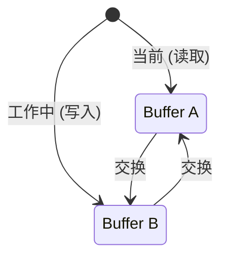

# 模式：双缓冲 (Double Buffering)

## 一句话

维护两份状态副本，在它们之间原子切换，让读取方始终看到一致的快照。

## 核心思想

双缓冲保持数据结构的两个版本：一个"当前"（正在被读取）和一个"工作中"（正在被写入）。写入完成后，两者原子交换。读取方永远不会看到写到一半的状态。



交换后：旧"当前"变为新"工作中"（被复用，不会被 GC）。同样的两个对象永远被回收利用 — 热路径上**零分配**。

## 生产验证

| 项目 | 源码 | 用途 |
|------|------|------|
| React | [ReactFiber.js#L327-L355](https://github.com/facebook/react/blob/main/packages/react-reconciler/src/ReactFiber.js#L327-L355) | `createWorkInProgress` — 创建或复用 alternate fiber。注释写道：*"We use a double buffering pooling technique because we know that we'll only ever need at most two versions of a tree."* |
| SDL | [SDL_render.c](https://github.com/libsdl-org/SDL/blob/main/src/render/SDL_render.c) | SDL 渲染器使用前后 buffer 交换实现无撕裂的帧呈现。（文件级链接——swap 逻辑跨多个渲染后端。） |

## 实现

::: code-group

```typescript [TypeScript]
class DoubleBuffer<T> {
  private buffers: [T, T];
  private currentIndex: 0 | 1 = 0;

  constructor(createBuffer: () => T) {
    this.buffers = [createBuffer(), createBuffer()];
  }

  current(): T {
    return this.buffers[this.currentIndex];
  }

  next(): T {
    return this.buffers[this.currentIndex === 0 ? 1 : 0];
  }

  swap(): void {
    this.currentIndex = this.currentIndex === 0 ? 1 : 0;
  }
}
```

```rust [Rust]
pub struct DoubleBuffer<T> {
    buffers: [T; 2],
    current: usize,
}

impl<T: Default + Clone> DoubleBuffer<T> {
    pub fn new(init: T) -> Self {
        DoubleBuffer {
            buffers: [init.clone(), init],
            current: 0,
        }
    }

    pub fn current(&self) -> &T {
        &self.buffers[self.current]
    }

    pub fn next(&mut self) -> &mut T {
        &mut self.buffers[1 - self.current]
    }

    pub fn swap(&mut self) {
        self.current = 1 - self.current;
    }
}
```

```go [Go]
type DoubleBuffer[T any] struct {
	buffers [2]T
	current int
}

func (db *DoubleBuffer[T]) Current() *T {
	return &db.buffers[db.current]
}

func (db *DoubleBuffer[T]) Next() *T {
	return &db.buffers[1-db.current]
}

func (db *DoubleBuffer[T]) Swap() {
	db.current = 1 - db.current
}
```

:::

## 练习

| 难度 | 练习 | 文件 |
|------|------|------|
| 基础 | 实现通用双缓冲与交换 | `exercises/typescript/double-buffering/01-basic.test.ts` |
| 进阶 | 构建 React 风格的 fiber alternate | `exercises/typescript/double-buffering/02-fiber-alternate.test.ts` |

## 何时使用

- **渲染管线** — GPU 前后 buffer、游戏帧渲染
- **并发读写** — 读取方看到一致状态，写入方准备下一版本
- **树协调** — React 的 fiber 架构用此来 diff 新旧树
- **零分配热路径** — 永远复用两个 buffer 而非分配新的
- **数据库 MVCC** — 读取方看到快照，写入方准备新版本

## 何时不用

- **简单状态更新** — 如果状态是单值且更新是原子的，双缓冲增加了不必要的复杂性
- **内存受限环境** — 需要 2 倍内存开销
- **需要实时读取进行中的写入** — 双缓冲会隐藏更新直到交换完成

## 更多生产案例

- [OpenGL](https://www.khronos.org/opengl/) / Vulkan — swap chains
- [PostgreSQL](https://github.com/postgres/postgres) — MVCC snapshot isolation
- Unreal Engine — frame rendering
