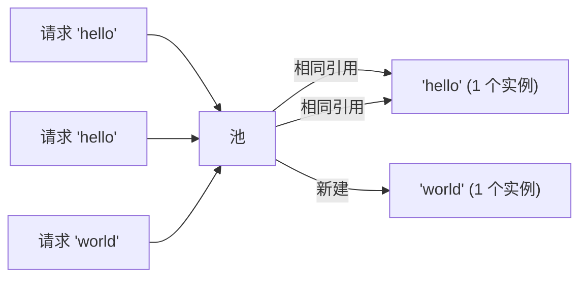

# 模式：享元 / 驻留 (Flyweight / Interning)

<DifficultyBadge />

## 一句话

共享相同的不可变对象而非创建重复实例，用查找开销换取大量内存节省。

<DemoBadge />

## 现实类比

剧团的戏服衣橱。只有一套海盗服、一件王袍、一身农夫装。每个演这个角色的演员穿同一套共享戏服，而不是每人做一套私人定制的。

## 核心思想

当成千上万对象有相同值时，逐个分配浪费内存。Flyweight 维护一个规范实例池，对相同值返回相同引用。



| 属性 | 值 |
|------|------|
| 查找/驻留 | O(1) 摊销 — 哈希表查找 |
| 内存节省 | O(唯一值) 而非 O(总实例数) |
| 相等性检查 | O(1) — 指针比较代替值比较 |
| 权衡 | 池内存 + 查找成本 vs. 逐对象分配成本 |

**动手试试** — 添加字符，观察享元对象如何被共享复用：

<FlyweightViz />

## 生产验证

| 项目 | 源码 | 用途 |
|------|------|------|
| Python (CPython) | [longobject.c#L61-L75](https://github.com/python/cpython/blob/main/Objects/longobject.c#L61-L75) | `get_small_int` 返回 -5 到 256 的预缓存整数对象。`a = 42; b = 42; a is b` 为 `True`。 |
| Go 标准库 | [pool.go#L52-L97](https://github.com/golang/go/blob/master/src/sync/pool.go#L52-L97) | `sync.Pool` — 临时对象的享元模式。`Get()` 返回缓存实例，`Put()` 归还复用。广泛用于 `fmt`、`encoding/json`。 |

::: info 说明
Java 的 `String.intern()`、JavaScript 引擎字符串表（V8）和 Rust 的 `&'static str` 都实现了此模式的变体。JVM 自动驻留所有字符串字面量。
:::

## 实现

::: code-group

```typescript [TypeScript]
class Interner<T> {
  private pool = new Map<string, T>();

  intern(key: string, create: () => T): T {
    if (this.pool.has(key)) {
      return this.pool.get(key)!;
    }
    const value = create();
    this.pool.set(key, value);
    return value;
  }

  has(key: string): boolean {
    return this.pool.has(key);
  }

  get size(): number {
    return this.pool.size;
  }
}
```

```rust [Rust]
use std::collections::HashMap;

pub struct Interner {
    pool: HashMap<String, usize>,
    strings: Vec<String>,
}

impl Interner {
    pub fn new() -> Self {
        Interner { pool: HashMap::new(), strings: Vec::new() }
    }

    pub fn intern(&mut self, s: &str) -> usize {
        if let Some(&id) = self.pool.get(s) {
            return id;
        }
        let id = self.strings.len();
        self.strings.push(s.to_string());
        self.pool.insert(s.to_string(), id);
        id
    }

    pub fn resolve(&self, id: usize) -> &str {
        &self.strings[id]
    }
}
```

```python [Python]
import sys

class Interner:
    def __init__(self):
        self._pool: dict[str, object] = {}

    def intern(self, key: str, factory=None):
        if key in self._pool:
            return self._pool[key]
        value = factory() if factory else key
        self._pool[key] = value
        return value

    @property
    def size(self) -> int:
        return len(self._pool)

# Python already interns small integers:
a = 256
b = 256
print(a is b)  # True — same object, flyweight!
print(sys.getrefcount(256))  # many references to the same int
```

```go [Go]
type Interner struct {
	pool map[string]int
	data []string
}

func NewInterner() *Interner {
	return &Interner{pool: make(map[string]int)}
}

func (in *Interner) Intern(s string) int {
	if id, ok := in.pool[s]; ok {
		return id
	}
	id := len(in.data)
	in.data = append(in.data, s)
	in.pool[s] = id
	return id
}

func (in *Interner) Resolve(id int) string {
	return in.data[id]
}
```

:::

## 练习

| 难度 | 练习 | 文件 |
|------|------|------|
| 基础 | 实现字符串驻留器 | `exercises/typescript/flyweight/01-basic.test.ts` |
| 进阶 | 按名称去重的图标注册表 | `exercises/typescript/flyweight/02-intermediate.test.ts` |

运行练习：`pnpm test`（TypeScript）· `cargo test`（Rust）· `go test ./...`（Go）· `pytest`（Python）

Exercise files: Rust `exercises/rust/src/flyweight.rs` · Go `exercises/go/flyweight_test.go` · Python `exercises/python/test_flyweight.py`

## 何时使用

- **重复相同值** — 字符串、颜色、类型标签
- **编译器/解释器** — 符号表、字符串驻留
- **游戏引擎** — 共享网格、纹理、材质

## 何时不用

- **值全部唯一** — 池增加查找开销
- **可变对象** — 享元假设共享对象不可变

## 更多生产案例

- [Java String.intern()](https://github.com/openjdk/jdk/blob/master/src/java.base/share/classes/java/lang/String.java) — JVM 字符串池去重相同的字符串字面量
- [Python small int cache](https://github.com/python/cpython/blob/main/Objects/longobject.c) — CPython 预分配 -5 到 256 的整数
- [Rust string_cache](https://crates.io/crates/string_cache) crate
- [.NET string interning](https://github.com/dotnet/runtime/blob/main/src/libraries/System.Private.CoreLib/src/System/String.cs) — `String.Intern()` 维护 CLR 级别的驻留池
- [Chromium CSS](https://github.com/chromium/chromium/blob/main/third_party/blink/renderer/core/css/) — Blink 渲染引擎中的 CSS 值去重

## 相关模式

| 模式 | 关系 |
|---------|-------------|
| [驻留 / 符号表 (Interning / Symbol Table)](/zh/patterns/interning/) | 驻留是实现享元的机制——去重相同的值 |
| [写时复制 (Copy-on-Write)](/zh/patterns/copy-on-write/) | 两者都共享数据——享元共享不可变对象，CoW 共享直到变更 |
| [LRU 缓存 (LRU Cache)](/zh/patterns/lru-cache/) | LRU 缓存可以存储享元实例，淘汰最少使用的共享对象 |

## 挑战题

::: details Q1: 有人对一个可变对象（比如配置字典）进行了驻留，然后又修改了它。会出什么问题？
**答案：** 所有共享该引用的消费者都会看到这个修改，导致系统中不相关的部分出现不可预测的行为。

Flyweight 的整个前提是共享实例是相同的和可互换的。如果一个调用者修改了共享对象，所有其他调用者都会无声地获取到修改后的值。这就是为什么驻留/Flyweight 对象必须是不可变的。如果你需要修改，使用写时复制或不要驻留。
:::

::: details Q2: Python 将 -5 到 256 的整数缓存为 Flyweight。为什么不缓存所有整数？
**答案：** 因为预分配所有可能整数的内存开销远超共享带来的节省。缓存只在频繁出现的值上才有回报。

-5 到 256 的范围是经验选择的——涵盖了循环计数器、数组索引、布尔类值和常见常量。缓存 `1_000_000` 会浪费内存，因为大多数大整数只出现一次。Flyweight 模式只在重复项常见时才能节省内存。
:::

::: details Q3: 你为编译器构建了一个字符串驻留器。处理 10,000 个源文件后，驻留器持有 200 万个字符串并使用了 500MB。出了什么问题？
**答案：** 驻留器从不淘汰条目，因此它积累了所有曾经见过的字符串——包括那些一次性的标识符和再也不会被引用的字符串字面量。

生产级驻留器需要一个作用域策略：要么按编译单元清除，要么使用弱引用以便未引用的字符串被回收，要么只对标识符（频繁重复）进行驻留而跳过任意字符串字面量。无限增长是 Flyweight 的经典陷阱。
:::

::: details Q4: 两个线程同时调用 `intern("hello")`，且都发现池中没有该条目。会出什么问题？
**答案：** 两个线程各自创建一个新实例并插入，导致同一个键对应两个不同的对象——破坏了"相同值相同引用"的保证。

没有同步机制时，你会遇到竞态：线程 A 检查池，没找到，创建对象；线程 B 在 A 插入之前做了同样的事。现在不同线程上的消费者持有 `"hello"` 的不同引用，身份比较（`===` / `is`）失效。修复方法是在检查和插入操作周围加锁，或使用支持 `putIfAbsent` 语义的并发 map。
:::
