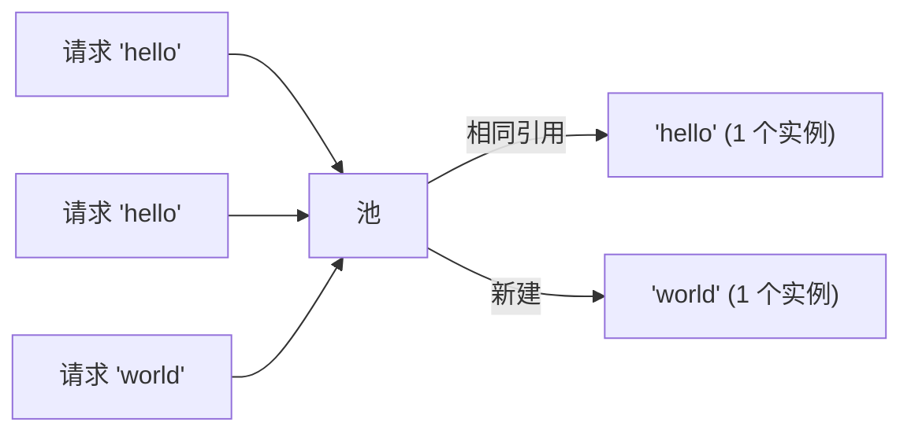

# 模式：享元 / 驻留 (Flyweight / Interning)

## 一句话

共享相同的不可变对象而非创建重复实例，用查找开销换取大量内存节省。

## 核心思想

当成千上万对象有相同值时，逐个分配浪费内存。Flyweight 维护一个规范实例池，对相同值返回相同引用。



## 生产验证

| 项目 | 源码 | 用途 |
|------|------|------|
| Python (CPython) | [longobject.c#L61-L75](https://github.com/python/cpython/blob/main/Objects/longobject.c#L61-L75) | `get_small_int` 返回 -5 到 256 的预缓存整数对象。`a = 42; b = 42; a is b` 为 `True`。 |
| Go 标准库 | [pool.go#L52-L97](https://github.com/golang/go/blob/master/src/sync/pool.go#L52-L97) | `sync.Pool` — 临时对象的享元模式。`Get()` 返回缓存实例，`Put()` 归还复用。广泛用于 `fmt`、`encoding/json`。 |

## 实现

::: code-group

```typescript [TypeScript]
class Interner<T> {
  private pool = new Map<string, T>();
  intern(key: string, create: () => T): T {
    if (this.pool.has(key)) return this.pool.get(key)!;
    const v = create();
    this.pool.set(key, v);
    return v;
  }
  get size() { return this.pool.size; }
}
```

```python [Python]
class Interner:
    def __init__(self):
        self._pool = {}
    def intern(self, key, factory=None):
        if key in self._pool: return self._pool[key]
        self._pool[key] = factory() if factory else key
        return self._pool[key]

# Python 已内置小整数驻留：
a = 256; b = 256
print(a is b)  # True — 享元！
```

:::

## 练习

| 难度 | 练习 | 文件 |
|------|------|------|
| 基础 | 实现字符串驻留器 | `exercises/typescript/flyweight/01-basic.test.ts` |
| 进阶 | 按名称去重的图标注册表 | `exercises/typescript/flyweight/02-intermediate.test.ts` |

## 何时使用

- **重复相同值** — 字符串、颜色、类型标签
- **编译器/解释器** — 符号表、字符串驻留
- **游戏引擎** — 共享网格、纹理、材质

## 何时不用

- **值全部唯一** — 池增加查找开销
- **可变对象** — 享元假设共享对象不可变

## 更多生产案例

- Java `String.intern()`
- Python small int cache (-5..256)
- Rust [string_cache](https://crates.io/crates/string_cache) crate
- .NET string interning
- CSS value deduplication in browsers

## 挑战题

::: details Q1: Someone interns a mutable object (say, a config map) and later modifies it. What breaks?
**Answer:** Every consumer sharing that reference sees the mutation, causing unpredictable behavior across unrelated parts of the system.

Flyweight's entire premise is that shared instances are identical and interchangeable. If one caller mutates the shared object, all other callers silently get the changed value. This is why interned/flyweight objects must be immutable. If you need mutation, clone-on-write or don't intern.
:::

::: details Q2: Python caches integers -5 to 256 as flyweights. Why not cache all integers?
**Answer:** Because the memory cost of pre-allocating every possible integer far exceeds the savings from sharing. The cache only pays off for values that appear frequently.

The range -5 to 256 was chosen empirically -- these cover loop counters, array indices, boolean-like values, and common constants. Caching `1_000_000` would waste memory since most large integers appear only once. The flyweight pattern only saves memory when duplicates are common.
:::

::: details Q3: You build a string interner for a compiler. After processing 10,000 source files, the interner holds 2 million strings and uses 500MB. What went wrong?
**Answer:** The interner never evicts entries, so it accumulates every string ever seen -- including one-off identifiers and string literals that are never referenced again.

A production interner needs a strategy for scope: either clear it per-compilation-unit, use weak references so unreferenced strings get collected, or limit interning to identifiers (which repeat frequently) and skip arbitrary string literals. Unbounded growth is the classic flyweight pitfall.
:::

::: details Q4: Two threads simultaneously call `intern("hello")` and both see it as missing from the pool. What can go wrong?
**Answer:** Both threads create a new instance and insert it, resulting in two different objects for the same key -- breaking the "same reference for same value" guarantee.

Without synchronization, you get a race: thread A checks the pool, finds nothing, creates the object; thread B does the same before A inserts. Now consumers on different threads hold different references for `"hello"`, defeating identity comparison (`===` / `is`). The fix is a lock around the check-and-insert, or a concurrent map with `putIfAbsent` semantics.
:::
