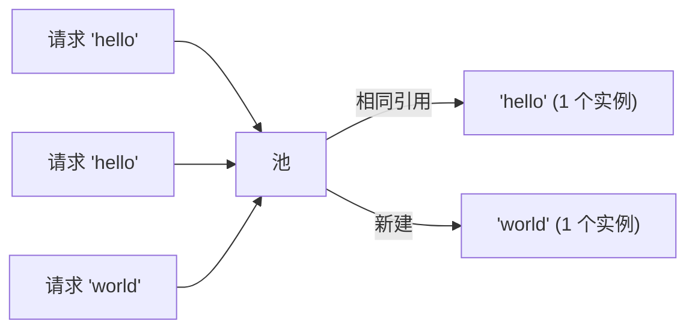

# 模式：享元 / 驻留 (Flyweight / Interning)

## 一句话

共享相同的不可变对象而非创建重复实例，用查找开销换取大量内存节省。

## 核心思想

当成千上万对象有相同值时，逐个分配浪费内存。Flyweight 维护一个规范实例池，对相同值返回相同引用。



## 生产验证

| 项目 | 源码 | 用途 |
|------|------|------|
| Python (CPython) | [longobject.c#L61-L75](https://github.com/python/cpython/blob/main/Objects/longobject.c#L61-L75) | `get_small_int` 返回 -5 到 256 的预缓存整数对象。`a = 42; b = 42; a is b` 为 `True`。 |
| Go 标准库 | [pool.go#L52-L97](https://github.com/golang/go/blob/master/src/sync/pool.go#L52-L97) | `sync.Pool` — 临时对象的享元模式。`Get()` 返回缓存实例，`Put()` 归还复用。广泛用于 `fmt`、`encoding/json`。 |

## 实现

::: code-group

```typescript [TypeScript]
class Interner<T> {
  private pool = new Map<string, T>();
  intern(key: string, create: () => T): T {
    if (this.pool.has(key)) return this.pool.get(key)!;
    const v = create();
    this.pool.set(key, v);
    return v;
  }
  get size() { return this.pool.size; }
}
```

```python [Python]
class Interner:
    def __init__(self):
        self._pool = {}
    def intern(self, key, factory=None):
        if key in self._pool: return self._pool[key]
        self._pool[key] = factory() if factory else key
        return self._pool[key]

# Python 已内置小整数驻留：
a = 256; b = 256
print(a is b)  # True — 享元！
```

:::

## 练习

| 难度 | 练习 | 文件 |
|------|------|------|
| 基础 | 实现字符串驻留器 | `exercises/typescript/flyweight/01-basic.test.ts` |

## 何时使用

- **重复相同值** — 字符串、颜色、类型标签
- **编译器/解释器** — 符号表、字符串驻留
- **游戏引擎** — 共享网格、纹理、材质

## 何时不用

- **值全部唯一** — 池增加查找开销
- **可变对象** — 享元假设共享对象不可变

## 更多生产案例

- Java `String.intern()`
- Python small int cache (-5..256)
- Rust [string_cache](https://github.com/nicedoc/nicedoc.io) crate
- .NET string interning
- CSS value deduplication in browsers
