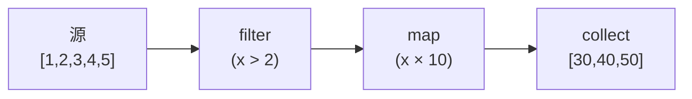

# 模式：迭代器 / 惰性求值 (Iterator)

## 一句话

逐个处理序列中的元素而不实例化整个集合，通过可组合的转换实现零中间分配。

## 核心思想

迭代器通过 `next()` 方法逐个产生值。转换（map、filter、fold）被惰性链式调用——直到终端操作（collect、for-each）驱动整个链。



**动手试试** — 逐步遍历数组和树迭代器，观察元素被逐个访问：

<IteratorViz />

## 生产验证

| 项目 | 源码 | 用途 |
|------|------|------|
| Rust 标准库 | [iterator.rs#L68-L112](https://github.com/rust-lang/rust/blob/main/library/core/src/iter/traits/iterator.rs#L68-L112) | `Iterator` trait — `next()` 是唯一必须方法。`map`、`filter`、`fold`、`collect` 都构建其上。Rust 零成本抽象的基础。 |
| Python | [genobject.c#L259-L374](https://github.com/python/cpython/blob/main/Objects/genobject.c#L259-L374) | `gen_send_ex2`（L259-L324）— 核心生成器 send：推送参数到帧栈，调用 `_PyEval_EvalFrame`，区分 yield 和 return。`gen_send_ex`（L329-L374）在委派前验证生成器状态。 |

## 实现

::: code-group

```typescript [TypeScript]
class Iter<T> {
  constructor(private source: () => Generator<T>) {}
  static from<T>(items: T[]): Iter<T> {
    return new Iter(function* () { yield* items; });
  }
  map<U>(fn: (x: T) => U): Iter<U> {
    const s = this.source;
    return new Iter(function* () { for (const i of s()) yield fn(i); });
  }
  filter(pred: (x: T) => boolean): Iter<T> {
    const s = this.source;
    return new Iter(function* () { for (const i of s()) if (pred(i)) yield i; });
  }
  collect(): T[] { return [...this.source()]; }
}
```

```python [Python]
def fibonacci():
    a, b = 0, 1
    while True:
        yield a
        a, b = b, a + b

evens = (x for x in fibonacci() if x % 2 == 0)
first_10 = [next(evens) for _ in range(10)]
```

:::

## 练习

| 难度 | 练习 | 文件 |
|------|------|------|
| 基础 | 实现带 map、filter、collect 的惰性迭代器 | `exercises/typescript/iterator/01-basic.test.ts` |
| 进阶 | 带 flatMap、take、reduce 的惰性管道 | `exercises/typescript/iterator/02-intermediate.test.ts` |

## 何时使用

- **大/无限序列** — 处理百万行数据无需全部加载到内存
- **可组合管线** — 链式转换无中间分配
- **提前终止** — 在十亿元素源上 `take(5)` 只处理 5 个

## 何时不用

- **随机访问** — 迭代器是顺序的，用数组做索引访问
- **多次遍历** — 大多数迭代器是一次性的

## 更多生产案例

- Java Streams
- C# LINQ
- Haskell lazy lists
- [Kotlin](https://github.com/JetBrains/kotlin) Sequences
- Swift `LazySequence`

## 挑战题

::: details Q1: 你创建了一个无限迭代器 `fibonacci()` 并对它调用 `.collect()`。会发生什么？
**答案：** 程序会一直运行直到耗尽内存并崩溃——`collect()` 试图将无限序列物化为有限数组。

无限迭代器只有在使用消费有界数量元素的操作时才是安全的：`take(n)`、`find()`、`any()`、`first()`。终端操作如 `collect()`、`count()` 或 `fold()` 会尝试消费每一个元素，在无限源上永远不会终止。这就是为什么惰性求值需要纪律：链式调用中必须在任何物化终端之前包含一个限界组合子。Rust 的类型系统无法阻止这种情况——这是一个运行时问题。
:::

::: details Q2: 你有 `iter.filter(expensiveCheck).take(5).collect()`。`expensiveCheck` 会对所有元素运行还是只运行到 5 个通过为止？
**答案：** `expensiveCheck` 只运行到 5 个元素通过过滤器为止——然后 `take` 停止从源拉取。

这就是惰性求值的威力：`take(5)` 从 `filter` 拉取，`filter` 从源拉取，每次一个元素。一旦 `take` 积累了 5 个通过的元素，它就停止请求更多。如果每 10 个元素只有 1 个通过过滤器，`expensiveCheck` 大约运行 50 次（找到 5 个通过的），而不是 100 万次。这种按需驱动的执行是惰性迭代器擅长提前终止的原因——没有浪费的工作。
:::

::: details Q3: 你尝试对同一个迭代器迭代两次。第二次循环没有产生任何元素。为什么？如何修复？
**答案：** 大多数迭代器是一次性的——消费完毕后，其内部游标在末尾，`next()` 永远返回 `None`/`done`。

迭代器是有状态的游标，不是集合。第一次循环耗尽后，状态就永久"完成"了。要迭代两次，你需要：(1) 从原始源创建新的迭代器（调用两次 `source.iter()`），(2) 先收集到集合中再迭代集合，或 (3) 使用"可重放"的抽象，如 Kotlin 的 `Sequence` 或 Rust 对集合的 `IntoIterator`（每次创建新的迭代器）。Python 的生成器也有同样的一次性约束。
:::

::: details Q4: 两个消费者需要处理同一个事件流——一个过滤错误，另一个统计总数。它们能共享一个迭代器吗？
**答案：** 不能，一个迭代器只有一个游标。你需要 `tee`（克隆迭代器）或广播模式（Observer）来向多个消费者提供数据。

Python 的 `itertools.tee` 通过缓冲一个消费者已读但其他消费者未读的元素，从一个源创建 N 个独立的迭代器。问题在于：如果一个消费者比另一个快得多，缓冲区会无限增长。对于真正独立地消费实时流，Observer/发布-订阅模式更合适——源向所有订阅者推送，而不是订阅者从共享游标拉取。迭代器从根本上是单消费者的；多消费者需要扇出机制。
:::
