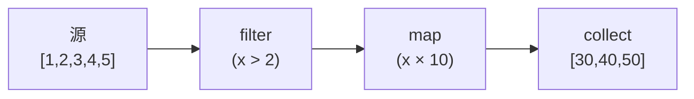

# 模式：迭代器 / 惰性求值 (Iterator)

## 一句话

逐个处理序列中的元素而不实例化整个集合，通过可组合的转换实现零中间分配。

## 核心思想

迭代器通过 `next()` 方法逐个产生值。转换（map、filter、fold）被惰性链式调用——直到终端操作（collect、for-each）驱动整个链。



## 生产验证

| 项目 | 源码 | 用途 |
|------|------|------|
| Rust 标准库 | [iterator.rs#L68-L112](https://github.com/rust-lang/rust/blob/main/library/core/src/iter/traits/iterator.rs#L68-L112) | `Iterator` trait — `next()` 是唯一必须方法。`map`、`filter`、`fold`、`collect` 都构建其上。Rust 零成本抽象的基础。 |
| Python | [genobject.c#L259-L374](https://github.com/python/cpython/blob/main/Objects/genobject.c#L259-L374) | `gen_send_ex2`（L259-L324）— 核心生成器 send：推送参数到帧栈，调用 `_PyEval_EvalFrame`，区分 yield 和 return。`gen_send_ex`（L329-L374）在委派前验证生成器状态。 |

## 实现

::: code-group

```typescript [TypeScript]
class Iter<T> {
  constructor(private source: () => Generator<T>) {}
  static from<T>(items: T[]): Iter<T> {
    return new Iter(function* () { yield* items; });
  }
  map<U>(fn: (x: T) => U): Iter<U> {
    const s = this.source;
    return new Iter(function* () { for (const i of s()) yield fn(i); });
  }
  filter(pred: (x: T) => boolean): Iter<T> {
    const s = this.source;
    return new Iter(function* () { for (const i of s()) if (pred(i)) yield i; });
  }
  collect(): T[] { return [...this.source()]; }
}
```

```python [Python]
def fibonacci():
    a, b = 0, 1
    while True:
        yield a
        a, b = b, a + b

evens = (x for x in fibonacci() if x % 2 == 0)
first_10 = [next(evens) for _ in range(10)]
```

:::

## 练习

| 难度 | 练习 | 文件 |
|------|------|------|
| 基础 | 实现带 map、filter、collect 的惰性迭代器 | `exercises/typescript/iterator/01-basic.test.ts` |
| 进阶 | 带 flatMap、take、reduce 的惰性管道 | `exercises/typescript/iterator/02-intermediate.test.ts` |

## 何时使用

- **大/无限序列** — 处理百万行数据无需全部加载到内存
- **可组合管线** — 链式转换无中间分配
- **提前终止** — 在十亿元素源上 `take(5)` 只处理 5 个

## 何时不用

- **随机访问** — 迭代器是顺序的，用数组做索引访问
- **多次遍历** — 大多数迭代器是一次性的

## 更多生产案例

- Java Streams
- C# LINQ
- Haskell lazy lists
- [Kotlin](https://github.com/JetBrains/kotlin) Sequences
- Swift `LazySequence`

## 挑战题

::: details Q1: You create an infinite iterator `fibonacci()` and call `.collect()` on it. What happens?
**Answer:** The program runs until it exhausts memory and crashes — `collect()` tries to materialize an infinite sequence into a finite array.

Infinite iterators are only safe with operations that consume a bounded number of elements: `take(n)`, `find()`, `any()`, `first()`. Terminal operations like `collect()`, `count()`, or `fold()` attempt to consume every element and will never terminate on an infinite source. This is why lazy evaluation requires discipline: the chain must include a bounding combinator before any materializing terminal. Rust's type system does not prevent this — it's a runtime issue.
:::

::: details Q2: You have `iter.filter(expensiveCheck).take(5).collect()`. Does `expensiveCheck` run on all elements or only until 5 pass?
**Answer:** `expensiveCheck` runs only until 5 elements pass the filter — then `take` stops pulling from the source.

This is the power of lazy evaluation: `take(5)` pulls from `filter`, which pulls from the source, one element at a time. Once `take` has accumulated 5 passing elements, it stops requesting more. If only 1 in 10 elements passes the filter, `expensiveCheck` runs on roughly 50 elements (to find 5 that pass), not 1 million. This demand-driven execution is why lazy iterators excel at early termination — no wasted work.
:::

::: details Q3: You try to iterate over the same iterator twice. The second loop produces no elements. Why, and how do you fix it?
**Answer:** Most iterators are single-use — once consumed, their internal cursor is at the end and `next()` returns `None`/`done` forever.

An iterator is a stateful cursor, not a collection. After the first loop exhausts it, the state is permanently "finished." To iterate twice, you need either: (1) create a new iterator from the original source (`source.iter()` called twice), (2) collect into a collection first and iterate the collection, or (3) use a "replayable" abstraction like Kotlin's `Sequence` or Rust's `IntoIterator` on a collection (which creates a fresh iterator each time). Python generators have the same single-use constraint.
:::

::: details Q4: Two consumers need to process the same stream of events — one filters for errors, the other counts totals. Can they share a single iterator?
**Answer:** No, a single iterator has one cursor. You need either `tee` (clone the iterator) or a broadcast pattern (observer) to feed multiple consumers.

Python's `itertools.tee` creates N independent iterators from one source by buffering elements that one consumer has read but others haven't. The catch: if one consumer is much faster than the other, the buffer grows unboundedly. For truly independent consumption of a live stream, the observer/pub-sub pattern is more appropriate — the source pushes to all subscribers rather than subscribers pulling from a shared cursor. Iterators are fundamentally single-consumer; multiple consumers need a fan-out mechanism.
:::
