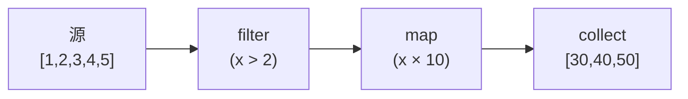

# 模式：迭代器 / 惰性求值 (Iterator)

## 一句话

逐个处理序列中的元素而不实例化整个集合，通过可组合的转换实现零中间分配。

## 核心思想

迭代器通过 `next()` 方法逐个产生值。转换（map、filter、fold）被惰性链式调用——直到终端操作（collect、for-each）驱动整个链。



## 生产验证

| 项目 | 源码 | 用途 |
|------|------|------|
| Rust 标准库 | [iterator.rs#L68-L112](https://github.com/rust-lang/rust/blob/main/library/core/src/iter/traits/iterator.rs#L68-L112) | `Iterator` trait — `next()` 是唯一必须方法。`map`、`filter`、`fold`、`collect` 都构建其上。Rust 零成本抽象的基础。 |
| Python | [genobject.c](https://github.com/python/cpython/blob/main/Objects/genobject.c) | 生成器对象 — Python 惰性求值的基本原语。`yield` 挂起执行并逐个产生值。 |

## 实现

::: code-group

```typescript [TypeScript]
class Iter<T> {
  constructor(private source: () => Generator<T>) {}
  static from<T>(items: T[]): Iter<T> {
    return new Iter(function* () { yield* items; });
  }
  map<U>(fn: (x: T) => U): Iter<U> {
    const s = this.source;
    return new Iter(function* () { for (const i of s()) yield fn(i); });
  }
  filter(pred: (x: T) => boolean): Iter<T> {
    const s = this.source;
    return new Iter(function* () { for (const i of s()) if (pred(i)) yield i; });
  }
  collect(): T[] { return [...this.source()]; }
}
```

```python [Python]
def fibonacci():
    a, b = 0, 1
    while True:
        yield a
        a, b = b, a + b

evens = (x for x in fibonacci() if x % 2 == 0)
first_10 = [next(evens) for _ in range(10)]
```

:::

## 练习

| 难度 | 练习 | 文件 |
|------|------|------|
| 基础 | 实现带 map、filter、collect 的惰性迭代器 | `exercises/typescript/iterator/01-basic.test.ts` |

## 何时使用

- **大/无限序列** — 处理百万行数据无需全部加载到内存
- **可组合管线** — 链式转换无中间分配
- **提前终止** — 在十亿元素源上 `take(5)` 只处理 5 个

## 何时不用

- **随机访问** — 迭代器是顺序的，用数组做索引访问
- **多次遍历** — 大多数迭代器是一次性的

## 更多生产案例

- Java Streams
- C# LINQ
- Haskell lazy lists
- [Kotlin](https://github.com/JetBrains/kotlin) Sequences
- Swift `LazySequence`
