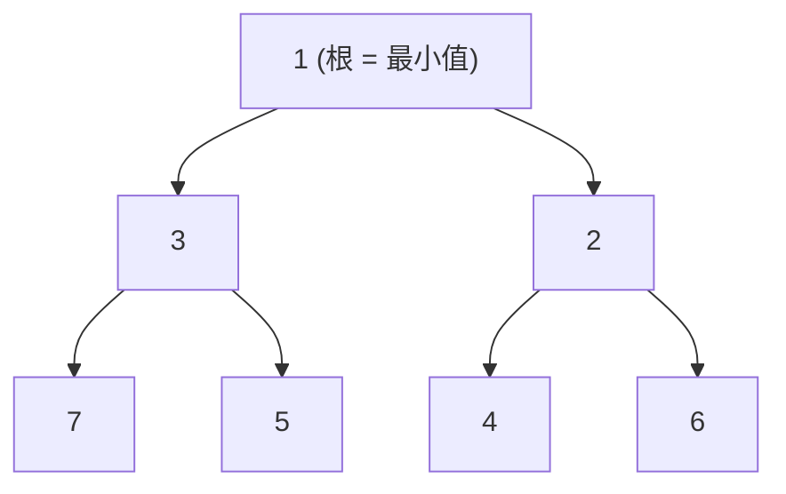

# 模式：最小堆 / 优先队列 (Min Heap)

## 一句话

存储在数组中的二叉树，最小元素始终在根节点，支持 O(1) 查看和 O(log n) 插入/删除。

## 核心思想

最小堆是一棵完全二叉树，每个父节点都小于其子节点。将其存储在扁平数组中（父在 `i`，子在 `2i+1` 和 `2i+2`），避免指针开销并获得缓存友好的访问。



两个操作维护不变式：

- **上浮 (sift up)** — 插入到末尾后，将元素向上冒泡直到父节点更小
- **下沉 (sift down)** — 移除根节点后（与最后一个元素交换），将新根向下推直到两个子节点都更大

## 生产验证

| 项目 | 源码 | 用途 |
|------|------|------|
| React | [SchedulerMinHeap.js#L17-L90](https://github.com/facebook/react/blob/main/packages/scheduler/src/SchedulerMinHeap.js#L17-L90) | React 调度器将任务存储在按 `sortIndex`（过期时间）排序的最小堆中。`peek()` 以 O(1) 返回最高优先级任务。整个实现约 75 行。 |
| Linux 内核 | [fair.c#L1407-L1460](https://github.com/torvalds/linux/blob/master/kernel/sched/fair.c#L1407-L1460) | CFS 的 `update_curr` 更新虚拟运行时间。`pick_next_task_fair`（行9234）从红黑树中选择最小 vruntime 的任务——与最小堆"始终访问最小值"原理相同。 |

## 实现

::: code-group

```typescript [TypeScript]
interface HeapNode {
  sortIndex: number;
  id: number;
}

class MinHeap {
  private heap: HeapNode[] = [];

  peek(): HeapNode | null { return this.heap[0] ?? null; }

  push(node: HeapNode): void {
    this.heap.push(node);
    this.siftUp(this.heap.length - 1);
  }

  pop(): HeapNode | null {
    if (this.heap.length === 0) return null;
    const first = this.heap[0]!;
    const last = this.heap.pop()!;
    if (this.heap.length > 0) { this.heap[0] = last; this.siftDown(0); }
    return first;
  }

  private siftUp(i: number): void {
    while (i > 0) {
      const parent = (i - 1) >>> 1;
      if (this.heap[i]!.sortIndex < this.heap[parent]!.sortIndex) {
        [this.heap[i], this.heap[parent]] = [this.heap[parent]!, this.heap[i]!];
        i = parent;
      } else break;
    }
  }

  private siftDown(i: number): void {
    const len = this.heap.length;
    while (true) {
      let smallest = i;
      const left = 2 * i + 1, right = 2 * i + 2;
      if (left < len && this.heap[left]!.sortIndex < this.heap[smallest]!.sortIndex) smallest = left;
      if (right < len && this.heap[right]!.sortIndex < this.heap[smallest]!.sortIndex) smallest = right;
      if (smallest !== i) {
        [this.heap[i], this.heap[smallest]] = [this.heap[smallest]!, this.heap[i]!];
        i = smallest;
      } else break;
    }
  }
}
```

```rust [Rust]
pub struct MinHeap<T: Ord> {
    data: Vec<T>,
}

impl<T: Ord> MinHeap<T> {
    pub fn new() -> Self { MinHeap { data: Vec::new() } }
    pub fn peek(&self) -> Option<&T> { self.data.first() }

    pub fn push(&mut self, val: T) {
        self.data.push(val);
        self.sift_up(self.data.len() - 1);
    }

    pub fn pop(&mut self) -> Option<T> {
        if self.data.is_empty() { return None; }
        let last = self.data.len() - 1;
        self.data.swap(0, last);
        let val = self.data.pop();
        if !self.data.is_empty() { self.sift_down(0); }
        val
    }

    // sift_up / sift_down 省略，参见完整实现
}
```

```go [Go]
type MinHeap struct {
	data []int
}

func (h *MinHeap) Push(val int) {
	h.data = append(h.data, val)
	h.siftUp(len(h.data) - 1)
}

func (h *MinHeap) Pop() (int, bool) {
	if len(h.data) == 0 { return 0, false }
	val := h.data[0]
	last := len(h.data) - 1
	h.data[0] = h.data[last]
	h.data = h.data[:last]
	if len(h.data) > 0 { h.siftDown(0) }
	return val, true
}
```

:::

## 练习

| 难度 | 练习 | 文件 |
|------|------|------|
| 基础 | 实现 push、pop、peek 和 sift 操作 | `exercises/typescript/min-heap/01-basic.test.ts` |
| 进阶 | 构建 React 风格的任务调度器 | `exercises/typescript/min-heap/02-task-scheduler.test.ts` |

## 何时使用

- **任务调度** — 始终处理最高优先级（最低截止时间）的任务
- **事件驱动系统** — 定时器堆用于在特定时间调度回调
- **图算法** — Dijkstra 最短路径、Prim 最小生成树
- **流式 Top-K** — 维护流中的 K 个最小/最大元素
- **操作系统调度器** — CFS 使用具有最小堆属性的树进行公平 CPU 分配

## 何时不用

- **需要 O(1) 任意查找** — 堆只保证 O(1) 获取最小值；查找用哈希表
- **排序迭代** — 如果需要所有元素有序，排序一次更好；反复 pop 是 O(n log n)
- **小规模固定集合** — 少于 10 个元素时，线性扫描更简单且通常更快

## 更多生产案例

- [Node.js libuv](https://github.com/libuv/libuv) — timer queue
- Java `PriorityQueue`
- Python [heapq](https://github.com/python/cpython/blob/main/Lib/heapq.py)
- Dijkstra / Prim graph algorithms
