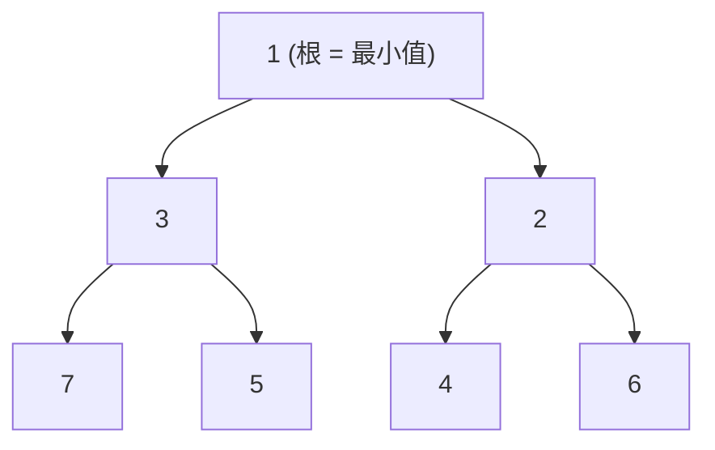

# 模式：最小堆 / 优先队列 (Min Heap)

<DifficultyBadge />

## 一句话

存储在数组中的二叉树，最小元素始终在根节点，支持 O(1) 查看和 O(log n) 插入/删除。

<DemoBadge />

## 现实类比

急诊室的分诊台。患者不是按到达顺序看诊——最危急的永远排第一。新患者按严重程度插入队列，系统始终知道谁最紧急，无需逐个扫描。

## 核心思想

最小堆是一棵完全二叉树，每个父节点都小于其子节点。将其存储在扁平数组中（父在 `i`，子在 `2i+1` 和 `2i+2`），避免指针开销并获得缓存友好的访问。



两个操作维护不变式：

- **上浮 (sift up)** — 插入到末尾后，将元素向上冒泡直到父节点更小
- **下沉 (sift down)** — 移除根节点后（与最后一个元素交换），将新根向下推直到两个子节点都更大

| 属性 | 值 |
|------|------|
| peek（获取最小值） | O(1) — 始终在索引 0 |
| push（插入） | O(log n) — 从底部上浮 |
| pop（提取最小值） | O(log n) — 根与末尾交换后下沉 |
| 空间 | O(n) — 扁平数组，无指针 |

**动手试试** — 插入值并提取最小值，观察上浮和下沉的过程：

<MinHeapViz />

## 生产验证

| 项目 | 源码 | 用途 |
|------|------|------|
| React | [SchedulerMinHeap.js#L17-L90](https://github.com/facebook/react/blob/34b78a2897cc208260a88e6b62ecaf9ca2a9dfe4/packages/scheduler/src/SchedulerMinHeap.js#L17-L90) | React 调度器将任务存储在按 `sortIndex`（过期时间）排序的最小堆中。`peek()` 以 O(1) 返回最高优先级任务。整个实现约 75 行。 |
| Linux 内核 | [fair.c#L1407-L1460](https://github.com/torvalds/linux/blob/acb7500801e98639f6d8c2d796ed9f64cba83d3a/kernel/sched/fair.c#L1407-L1460) | CFS 的 `update_curr` 更新虚拟运行时间。`pick_next_task_fair`（行9234）从红黑树中选择最小 vruntime 的任务——与最小堆"始终访问最小值"原理相同。 |

## 实现

::: code-group

```typescript [TypeScript]
interface HeapNode {
  sortIndex: number;
  id: number;
}

class MinHeap<T extends HeapNode> {
  private heap: T[] = [];

  peek(): T | null {
    return this.heap[0] ?? null;
  }

  push(node: T): void {
    this.heap.push(node);
    this.siftUp(this.heap.length - 1);
  }

  pop(): T | null {
    if (this.heap.length === 0) return null;
    const first = this.heap[0]!;
    const last = this.heap.pop()!;
    if (this.heap.length > 0) {
      this.heap[0] = last;
      this.siftDown(0);
    }
    return first;
  }

  get size(): number {
    return this.heap.length;
  }

  private siftUp(i: number): void {
    while (i > 0) {
      const parent = (i - 1) >>> 1;
      if (this.compare(this.heap[i]!, this.heap[parent]!) < 0) {
        this.swap(i, parent);
        i = parent;
      } else break;
    }
  }

  private siftDown(i: number): void {
    const len = this.heap.length;
    const half = len >>> 1;
    while (i < half) {
      let smallest = i;
      const left = 2 * i + 1;
      const right = 2 * i + 2;
      if (left < len && this.compare(this.heap[left]!, this.heap[smallest]!) < 0) smallest = left;
      if (right < len && this.compare(this.heap[right]!, this.heap[smallest]!) < 0) smallest = right;
      if (smallest !== i) {
        this.swap(i, smallest);
        i = smallest;
      } else break;
    }
  }

  private compare(a: T, b: T): number {
    const diff = a.sortIndex - b.sortIndex;
    return diff !== 0 ? diff : a.id - b.id;
  }

  private swap(i: number, j: number): void {
    [this.heap[i], this.heap[j]] = [this.heap[j]!, this.heap[i]!];
  }
}
```

```rust [Rust]
pub struct MinHeap<T: Ord> {
    data: Vec<T>,
}

impl<T: Ord> MinHeap<T> {
    pub fn new() -> Self { MinHeap { data: Vec::new() } }

    pub fn peek(&self) -> Option<&T> { self.data.first() }

    pub fn push(&mut self, val: T) {
        self.data.push(val);
        self.sift_up(self.data.len() - 1);
    }

    pub fn pop(&mut self) -> Option<T> {
        if self.data.is_empty() { return None; }
        let last = self.data.len() - 1;
        self.data.swap(0, last);
        let val = self.data.pop();
        if !self.data.is_empty() { self.sift_down(0); }
        val
    }

    fn sift_up(&mut self, mut i: usize) {
        while i > 0 {
            let parent = (i - 1) / 2;
            if self.data[i] < self.data[parent] {
                self.data.swap(i, parent);
                i = parent;
            } else { break; }
        }
    }

    fn sift_down(&mut self, mut i: usize) {
        let len = self.data.len();
        loop {
            let (left, right) = (2 * i + 1, 2 * i + 2);
            let mut smallest = i;
            if left < len && self.data[left] < self.data[smallest] { smallest = left; }
            if right < len && self.data[right] < self.data[smallest] { smallest = right; }
            if smallest != i { self.data.swap(i, smallest); i = smallest; }
            else { break; }
        }
    }
}
```

```go [Go]
type HeapNode struct {
	SortIndex int
	ID        int
}

type MinHeap struct {
	data []HeapNode
}

func (h *MinHeap) Peek() (HeapNode, bool) {
	if len(h.data) == 0 { return HeapNode{}, false }
	return h.data[0], true
}

func (h *MinHeap) Push(node HeapNode) {
	h.data = append(h.data, node)
	h.siftUp(len(h.data) - 1)
}

func (h *MinHeap) Pop() (HeapNode, bool) {
	if len(h.data) == 0 { return HeapNode{}, false }
	val := h.data[0]
	last := len(h.data) - 1
	h.data[0] = h.data[last]
	h.data = h.data[:last]
	if len(h.data) > 0 { h.siftDown(0) }
	return val, true
}

func (h *MinHeap) siftUp(i int) {
	for i > 0 {
		parent := (i - 1) / 2
		if h.less(i, parent) { h.data[i], h.data[parent] = h.data[parent], h.data[i]; i = parent } else { break }
	}
}

func (h *MinHeap) siftDown(i int) {
	n := len(h.data)
	for {
		left, right, smallest := 2*i+1, 2*i+2, i
		if left < n && h.less(left, smallest) { smallest = left }
		if right < n && h.less(right, smallest) { smallest = right }
		if smallest != i { h.data[i], h.data[smallest] = h.data[smallest], h.data[i]; i = smallest } else { break }
	}
}

func (h *MinHeap) less(i, j int) bool {
	if h.data[i].SortIndex != h.data[j].SortIndex { return h.data[i].SortIndex < h.data[j].SortIndex }
	return h.data[i].ID < h.data[j].ID
}
```

```python [Python]
import heapq

# Python's heapq module implements a min heap on a list
heap = []

heapq.heappush(heap, (10, "low-priority"))
heapq.heappush(heap, (1, "urgent"))
heapq.heappush(heap, (5, "medium"))

# peek: heap[0] is always the minimum
assert heap[0] == (1, "urgent")

# pop in priority order
assert heapq.heappop(heap) == (1, "urgent")
assert heapq.heappop(heap) == (5, "medium")
assert heapq.heappop(heap) == (10, "low-priority")

# Custom: from-scratch implementation
class MinHeap:
    def __init__(self):
        self._data = []

    def push(self, val):
        self._data.append(val)
        self._sift_up(len(self._data) - 1)

    def pop(self):
        if not self._data:
            return None
        self._data[0], self._data[-1] = self._data[-1], self._data[0]
        val = self._data.pop()
        if self._data:
            self._sift_down(0)
        return val

    def peek(self):
        return self._data[0] if self._data else None

    def _sift_up(self, i):
        while i > 0:
            parent = (i - 1) // 2
            if self._data[i] < self._data[parent]:
                self._data[i], self._data[parent] = self._data[parent], self._data[i]
                i = parent
            else:
                break

    def _sift_down(self, i):
        n = len(self._data)
        while True:
            smallest, left, right = i, 2*i+1, 2*i+2
            if left < n and self._data[left] < self._data[smallest]:
                smallest = left
            if right < n and self._data[right] < self._data[smallest]:
                smallest = right
            if smallest != i:
                self._data[i], self._data[smallest] = self._data[smallest], self._data[i]
                i = smallest
            else:
                break
```

:::

## 练习

| 难度 | 练习 | 文件 |
|------|------|------|
| 基础 | 实现 push、pop、peek 和 sift 操作 | `exercises/typescript/min-heap/01-basic.test.ts` |
| 进阶 | 构建 React 风格的任务调度器 | `exercises/typescript/min-heap/02-task-scheduler.test.ts` |

运行练习：`pnpm test:exercises`（TypeScript）· `cargo test`（Rust）· `go test ./...`（Go）· `pytest`（Python）

练习文件： Rust `exercises/rust/src/min_heap/mod.rs` · Go `exercises/go/min_heap/min_heap_test.go` · Python `exercises/python/min_heap/test_min_heap.py`

## 何时使用

- **任务调度** — 始终处理最高优先级（最低截止时间）的任务
- **事件驱动系统** — 定时器堆用于在特定时间调度回调
- **图算法** — Dijkstra 最短路径、Prim 最小生成树
- **流式 Top-K** — 维护流中的 K 个最小/最大元素
- **操作系统调度器** — CFS 使用具有最小堆属性的树进行公平 CPU 分配

## 何时不用

- **需要 O(1) 任意查找** — 堆只保证 O(1) 获取最小值；查找用哈希表
- **排序迭代** — 如果需要所有元素有序，排序一次更好；反复 pop 是 O(n log n)
- **小规模固定集合** — 少于 10 个元素时，线性扫描更简单且通常更快
- **需要稳定排序** — 相同优先级的元素在操作间可能改变顺序

## 更多生产案例

- [Node.js libuv](https://github.com/libuv/libuv) — timer queue
- [Java PriorityQueue](https://github.com/openjdk/jdk/blob/4b3ec455c85314d051800a8f46dd8f5c93881e3a/src/java.base/share/classes/java/util/PriorityQueue.java) — 二叉堆支撑的优先队列
- [Python heapq](https://github.com/python/cpython/blob/ff64d8de66ab7f8e56b5d410796a7d76c955280c/Lib/heapq.py)
- [Rust BinaryHeap](https://github.com/rust-lang/rust/blob/d56483a91d6cf5041351a3208b8d08f98f0c8b56/library/alloc/src/collections/binary_heap/mod.rs) — 标准库最大堆，可通过 `Reverse` 包装为最小堆

## 相关模式

| 模式 | 关系 |
|---------|-------------|
| [合并迭代器 (Merge Iterator / K-Way Merge)](/zh/patterns/merge-iterator/) | K 路合并使用最小堆从多个流中选取最小元素 |
| [协作调度 (Cooperative Scheduling)](/zh/patterns/cooperative-scheduling/) | React 调度器使用最小堆选择最高优先级任务 |
| [事件循环 / 反应器 (Event Loop / Reactor)](/zh/patterns/event-loop/) | 事件循环中的定时器队列通常使用最小堆实现最早截止时间调度 |
| [B+ 树 (B+ Tree)](/zh/patterns/b-plus-tree/) | 另一种有序结构——B+ 树优化磁盘访问，堆优化优先级访问 |

## 挑战题

::: details Q1: 如何在不改变数据结构的情况下将最小堆转换为最大堆？
**答案：** 在插入时取反排序键，在提取时再取反回来。

推入 `-priority` 而不是 `priority`。最小堆将最负的值（原始最高优先级）放在根部。弹出时再次取反键以恢复原始值。这之所以可行，是因为对取反值的最小堆等价于对原始值的最大堆。Python 的 `heapq` 社区使用这个技巧，因为标准库只提供最小堆。
:::

::: details Q2: 为什么 React 使用最小堆来调度而不是有序数组？
**答案：** 有序数组的插入是 O(n)（需要移动元素），而最小堆的插入是 O(log n)，查看最小值是 O(1)。

React 的调度器频繁插入具有不同过期时间的新任务，并且总是需要最早过期的任务。有序数组给出 O(1) 的最小值访问但 O(n) 的插入成本（二分搜索 + 移动）。最小堆给出 O(1) 的 peek 和 O(log n) 的插入/移除——对于任务不断添加和移除的动态队列来说，这是更好的权衡。对于静态的一次性排序，有序数组更优。
:::

::: details Q3: 平衡 BST（如红黑树）也能提供 O(log n) 的插入和 O(log n) 的查找最小值。为什么 Linux CFS 使用红黑树而 React 使用最小堆？
**答案：** CFS 需要在进程退出时移除任意任务（不仅是最小值），BST 处理这个操作是 O(log n)，而堆是 O(n)。

最小堆只能高效移除根节点。删除任意元素需要 O(n) 搜索 + O(log n) 筛选。红黑树支持 O(log n) 删除任意节点。CFS 经常移除退出或改变优先级的进程，因此 BST 是合理的。React 的调度器几乎只从前端弹出最高优先级的任务，使更简单的最小堆（具有更小的常数因子和缓存友好的数组布局）成为更好的选择。
:::

::: details Q4: 你有 10 亿条日志条目，需要找到最近的 10 条。应该使用最小堆还是最大堆？大小是多少？
**答案：** 使用大小为 10 的最小堆。对于每个条目，如果它比堆的最小值大，就弹出最小值并推入新条目。

这是"top-K"模式。大小为 K 的最小堆保持到目前为止看到的 K 个最大元素，其中 K 个里最小的在根部作为守门员。每个新元素与根比较，O(1)——如果更小，跳过；如果更大，替换根，O(log K)。总成本：O(n log K) 加上 O(K) 内存，而不是完全排序的 O(n log n)。
:::
