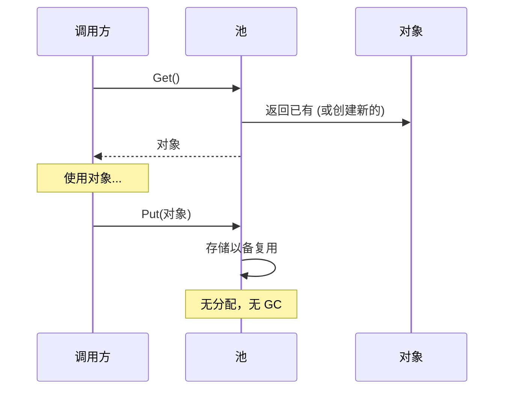

# 模式：对象池 (Object Pool)

<DifficultyBadge />

## 一句话

预分配一组可复用对象，避免热路径上重复分配和垃圾回收的开销。

<DemoBadge />

## 现实类比

共享单车站点。不用每次出行都买一辆新车，你从停靠点取一辆，骑完还回去。这些车是预先购置的，被很多骑行者复用。

## 核心思想

创建和销毁对象很昂贵——内存分配、构造逻辑、GC 压力。对象池维护一组预初始化的对象。需要时"获取"，用完"归还"而不是丢弃。



核心权衡：内存占用（空闲对象占着池）vs CPU/GC 节省（热路径零分配）。

| 属性 | 值 |
|------|------|
| Get（池有空闲） | O(1) — 返回已有对象 |
| Get（池为空） | O(alloc) — 创建新对象 |
| Put（归还） | O(1) — 推入空闲列表 + 重置 |
| 内存 | O(池大小) — 空闲对象保留在储备中 |

**动手试试** — 从池中获取连接，观察池耗尽时的等待行为：

<ObjectPoolViz />

## 生产验证

| 项目 | 源码 | 用途 |
|------|------|------|
| Go 标准库 | [pool.go#L52-L97](https://github.com/golang/go/blob/f5cdf4745455415c7a43cfc7d925214d4511489b/src/sync/pool.go#L52-L97) | `sync.Pool` — `Get()`（行132）先从 per-P 本地池取（无锁），回退到从其他 P 偷取。广泛用于 `fmt`、`encoding/json`、HTTP 处理器。 |
| Godot 引擎 | [pooled_list.h#L35-L100](https://github.com/godotengine/godot/blob/ec67cbe92628bdaf979b10594359ba6f02cf8838/core/templates/pooled_list.h#L35-L100) | `PooledList` — 基于 freelist 的对象池，元素在连续页中分配并通过 freelist 回收，避免每帧为实体、粒子、物理体分配内存。 |

## 实现

::: code-group

```typescript [TypeScript]
class ObjectPool<T> {
  private pool: T[] = [];
  private factory: () => T;
  private reset: (obj: T) => void;

  constructor(factory: () => T, reset: (obj: T) => void, initialSize = 0) {
    this.factory = factory;
    this.reset = reset;
    for (let i = 0; i < initialSize; i++) {
      this.pool.push(factory());
    }
  }

  get(): T {
    if (this.pool.length > 0) {
      return this.pool.pop()!;
    }
    return this.factory();
  }

  release(obj: T): void {
    this.reset(obj);
    this.pool.push(obj);
  }

  get size(): number {
    return this.pool.length;
  }
}
```

```rust [Rust]
pub struct ObjectPool<T> {
    pool: Vec<T>,
    factory: Box<dyn Fn() -> T>,
}

impl<T> ObjectPool<T> {
    pub fn new(factory: impl Fn() -> T + 'static, initial: usize) -> Self {
        let factory = Box::new(factory);
        let pool = (0..initial).map(|_| (factory)()).collect();
        ObjectPool { pool, factory }
    }

    pub fn get(&mut self) -> T {
        self.pool.pop().unwrap_or_else(|| (self.factory)())
    }

    pub fn release(&mut self, obj: T) {
        self.pool.push(obj);
    }
}
```

```go [Go]
package pool

import "sync"

// In production, use sync.Pool directly:
var bufPool = sync.Pool{
	New: func() any {
		return make([]byte, 0, 4096)
	},
}

func ProcessRequest(data []byte) []byte {
	buf := bufPool.Get().([]byte)
	buf = buf[:0] // reset length, keep capacity
	buf = append(buf, data...)
	// ... process ...
	result := make([]byte, len(buf))
	copy(result, buf)
	bufPool.Put(buf) // return to pool
	return result
}
```

```python [Python]
from typing import TypeVar, Callable, List

T = TypeVar("T")

class ObjectPool:
    def __init__(self, factory: Callable[[], T], reset: Callable[[T], None], initial: int = 0):
        self._factory = factory
        self._reset = reset
        self._pool: List[T] = [factory() for _ in range(initial)]

    def get(self) -> T:
        if self._pool:
            return self._pool.pop()
        return self._factory()

    def release(self, obj: T) -> None:
        self._reset(obj)
        self._pool.append(obj)
```

:::

## 练习

| 难度 | 练习 | 文件 |
|------|------|------|
| 基础 | 实现通用对象池 get/release | `exercises/typescript/object-pool/01-basic.test.ts` |
| 进阶 | 构建带最大连接数的连接池 | `exercises/typescript/object-pool/02-connection-pool.test.ts` |

运行练习：`pnpm test`（TypeScript）· `cargo test`（Rust）· `go test ./...`（Go）· `pytest`（Python）

练习文件： Rust `exercises/rust/src/object_pool/mod.rs` · Go `exercises/go/object_pool/object_pool_test.go` · Python `exercises/python/object_pool/test_object_pool.py`

## 何时使用

- **高频分配** — 游戏循环、请求处理、粒子系统
- **昂贵构造** — 数据库连接、线程上下文、大缓冲区
- **GC 敏感** — 实时系统、游戏引擎、低延迟服务
- **固定资源限制** — 连接池、线程池、文件描述符池

## 何时不用

- **廉价对象** — 如果分配快且 GC 不是问题，池增加了不必要的复杂性
- **不同生命周期** — 如果对象被持有较长且不可预测的时间，池帮不上忙
- **小规模** — 少量对象时，池的开销超过节省
- **不可变对象** — 池只对需要重置的可变对象有意义

## 更多生产案例

- [Java ThreadPoolExecutor](https://github.com/openjdk/jdk/blob/4b3ec455c85314d051800a8f46dd8f5c93881e3a/src/java.base/share/classes/java/util/concurrent/ThreadPoolExecutor.java) — 带核心/最大线程数和可配置拒绝策略的线程池
- [.NET ArrayPool\<T\>](https://github.com/dotnet/runtime/blob/bee7953796edc09e516e847e3c9006b486ab0f6d/src/libraries/System.Private.CoreLib/src/System/Buffers/ArrayPool.cs) — 可复用数组的共享池
- [HikariCP](https://github.com/brettwooldridge/HikariCP) — JDBC connection pool
- [Unity ObjectPool](https://github.com/Unity-Technologies/UnityCsReference) — `ObjectPool<T>` 用于可复用的游戏对象

## 相关模式

| 模式 | 关系 |
|---------|-------------|
| [空闲链表 (Free List)](/zh/patterns/free-list/) | 空闲链表管理池内部的槽位分配 |
| [Arena 分配器 (Arena Allocator)](/zh/patterns/arena-allocator/) | Arena 分配器为池对象批量分配；两者都避免逐对象 malloc |
| [信号量 / 有界并发 (Semaphore)](/zh/patterns/semaphore/) | 池大小充当信号量限制并发对象使用 |
| [引用计数 (Reference Counting)](/zh/patterns/reference-counting/) | 引用计数追踪何时可以将池化对象归还到池中 |
| [工作窃取 (Work Stealing)](/zh/patterns/work-stealing/) | 工作窃取队列可以池化任务对象以减少分配开销 |

## 挑战题

::: details Q1: 你的池初始化了 10 个对象，但峰值负载时需要 100 个。池应该动态增长还是拒绝超过 10 个的请求？
**答案：** 取决于资源类型。对于廉价对象（缓冲区）动态增长；对于昂贵/有限资源（数据库连接）强制硬上限。

缓冲区池应该按需增长并在空闲时可选地缩小——分配额外缓冲区的成本很低。数据库连接池应该强制 `maxSize`，因为每个连接消耗服务器内存、文件描述符和认证状态。超过上限的请求应该排队等待（带超时）而不是创建无限连接导致数据库崩溃。HikariCP 正是因为这个原因默认最大 10 个连接。
:::

::: details Q2: 开发者调用了 `pool.get()` 但从未调用 `pool.release()`。这种"对象泄漏"如何表现？如何检测？
**答案：** 池逐渐变空并开始每次都分配新对象，失去了其作用并可能耗尽资源。

检测策略：(1) 使用 Set 追踪未归还对象，当数量超过阈值时记录警告，(2) 使用弱引用和终结器来检测被 GC 回收但未归还的对象，(3) 将池化对象包装在超时后自动释放的代理中。Go 的 `sync.Pool` 完全回避了这个问题——它不保证对象保留并让 GC 回收空闲的池条目，使泄漏不那么灾难性但池也不那么可预测。
:::

::: details Q3: 两个 goroutine 同时调用 `pool.Get()`。是什么使 Go 的 `sync.Pool` 在这里不需要显式的 mutex 就是安全的？
**答案：** `sync.Pool` 使用每 P（每处理器）的本地池进行无锁访问，只有当本地池为空时才回退到带 mutex 的共享池。

每个 P（Go 调度器中的逻辑处理器，不同于代表 OS 线程的 M）有自己的私有池槽。`Get()` 首先检查本地槽（不需要锁——一个 P 上一次只运行一个 goroutine）。如果为空，它在锁保护下从其他 P 的池中偷取。`Put()` 也先去本地槽。这种每 P 分片模式最大限度地减少了竞争。对于手工编写的多线程环境池，你需要 mutex 或像并发栈这样的无锁数据结构。
:::

::: details Q4: 你在 Node.js 服务器中为 HTTP 请求对象构建了一个对象池。性能分析后发现它比直接使用 `new Request()` 更慢。出了什么问题？
**答案：** 在 V8 的分代 GC 中，短生命周期的小对象几乎可以免费分配和回收——池的重置逻辑和簿记成本比它避免的分配还要高。

V8 的新生代 GC 使用指针碰撞分配（本质上是免费的）并通过复制存活者来收集短生命周期对象，而不是扫描垃圾。如果你的 `Request` 对象很小、按请求创建、立即丢弃，GC 能高效处理。池增加了额外开销：维护空闲链表、重置对象状态、阻止 V8 优化对象形状。对象池适用于昂贵的构造函数（数据库连接、编译后的正则表达式）或对 GC 暂停敏感的上下文（游戏循环），不适用于现代 GC 运行时中的廉价对象。
:::
