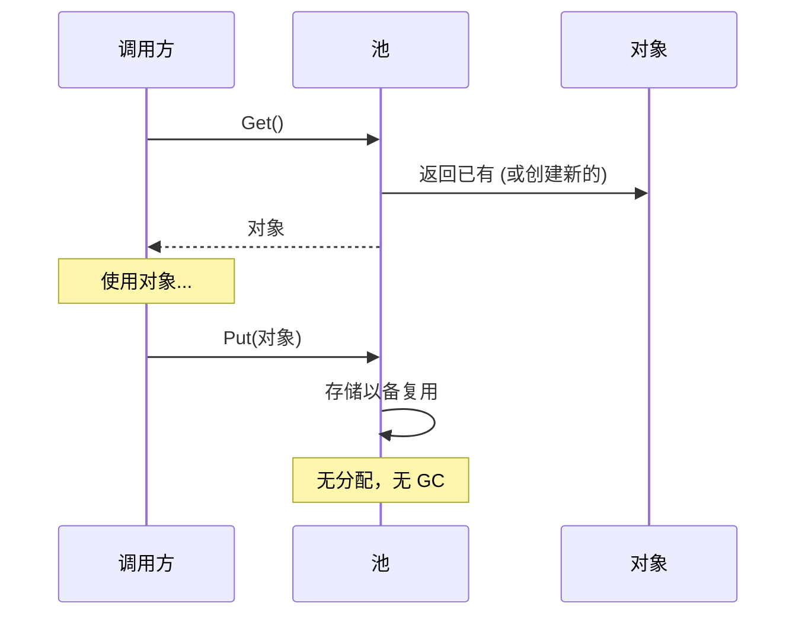

# 模式：对象池 (Object Pool)

## 一句话

预分配一组可复用对象，避免热路径上重复分配和垃圾回收的开销。

## 核心思想

创建和销毁对象很昂贵——内存分配、构造逻辑、GC 压力。对象池维护一组预初始化的对象。需要时"获取"，用完"归还"而不是丢弃。



核心权衡：内存占用（空闲对象占着池）vs CPU/GC 节省（热路径零分配）。

## 生产验证

| 项目 | 源码 | 用途 |
|------|------|------|
| Go 标准库 | [pool.go#L52-L97](https://github.com/golang/go/blob/master/src/sync/pool.go#L52-L97) | `sync.Pool` — `Get()`（行132）先从 per-P 本地池取（无锁），回退到从其他 P 偷取。广泛用于 `fmt`、`encoding/json`、HTTP 处理器。 |
| Godot 引擎 | [pooled_list.h#L35-L100](https://github.com/godotengine/godot/blob/master/core/templates/pooled_list.h#L35-L100) | `PooledList` — 基于 freelist 的对象池，元素在连续页中分配并通过 freelist 回收，避免每帧为实体、粒子、物理体分配内存。 |

## 实现

::: code-group

```typescript [TypeScript]
class ObjectPool<T> {
  private pool: T[] = [];
  private factory: () => T;
  private reset: (obj: T) => void;

  constructor(factory: () => T, reset: (obj: T) => void, initialSize = 0) {
    this.factory = factory;
    this.reset = reset;
    for (let i = 0; i < initialSize; i++) this.pool.push(factory());
  }

  get(): T {
    return this.pool.length > 0 ? this.pool.pop()! : this.factory();
  }

  release(obj: T): void {
    this.reset(obj);
    this.pool.push(obj);
  }
}
```

```go [Go]
import "sync"

var bufPool = sync.Pool{
	New: func() any { return make([]byte, 0, 4096) },
}

func Process(data []byte) []byte {
	buf := bufPool.Get().([]byte)
	buf = buf[:0]
	buf = append(buf, data...)
	result := make([]byte, len(buf))
	copy(result, buf)
	bufPool.Put(buf)
	return result
}
```

```python [Python]
class ObjectPool:
    def __init__(self, factory, reset, initial=0):
        self._factory = factory
        self._reset = reset
        self._pool = [factory() for _ in range(initial)]

    def get(self):
        return self._pool.pop() if self._pool else self._factory()

    def release(self, obj):
        self._reset(obj)
        self._pool.append(obj)
```

:::

## 练习

| 难度 | 练习 | 文件 |
|------|------|------|
| 基础 | 实现通用对象池 get/release | `exercises/typescript/object-pool/01-basic.test.ts` |
| 进阶 | 构建带最大连接数的连接池 | `exercises/typescript/object-pool/02-connection-pool.test.ts` |

## 何时使用

- **高频分配** — 游戏循环、请求处理、粒子系统
- **昂贵构造** — 数据库连接、线程上下文、大缓冲区
- **GC 敏感** — 实时系统、游戏引擎、低延迟服务

## 何时不用

- **廉价对象** — 如果分配快且 GC 不是问题，池增加了不必要的复杂性
- **不可变对象** — 池只对需要重置的可变对象有意义
- **小规模** — 少量对象时，池的开销超过节省

## 更多生产案例

- Java `ThreadPoolExecutor`
- .NET `ArrayPool<T>`
- [HikariCP](https://github.com/brettwooldridge/HikariCP) — JDBC connection pool
- Unity `ObjectPool<T>`
