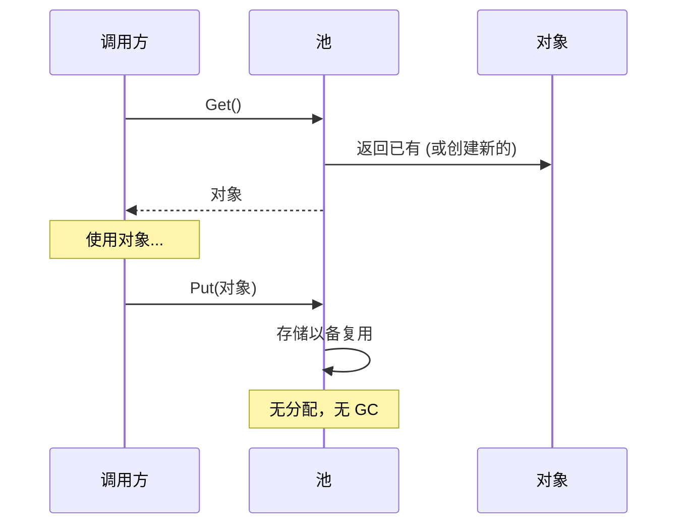

# 模式：对象池 (Object Pool)

## 一句话

预分配一组可复用对象，避免热路径上重复分配和垃圾回收的开销。

## 核心思想

创建和销毁对象很昂贵——内存分配、构造逻辑、GC 压力。对象池维护一组预初始化的对象。需要时"获取"，用完"归还"而不是丢弃。



核心权衡：内存占用（空闲对象占着池）vs CPU/GC 节省（热路径零分配）。

**动手试试** — 从池中获取连接，观察池耗尽时的等待行为：

<ObjectPoolViz />

## 生产验证

| 项目 | 源码 | 用途 |
|------|------|------|
| Go 标准库 | [pool.go#L52-L97](https://github.com/golang/go/blob/master/src/sync/pool.go#L52-L97) | `sync.Pool` — `Get()`（行132）先从 per-P 本地池取（无锁），回退到从其他 P 偷取。广泛用于 `fmt`、`encoding/json`、HTTP 处理器。 |
| Godot 引擎 | [pooled_list.h#L35-L100](https://github.com/godotengine/godot/blob/master/core/templates/pooled_list.h#L35-L100) | `PooledList` — 基于 freelist 的对象池，元素在连续页中分配并通过 freelist 回收，避免每帧为实体、粒子、物理体分配内存。 |

## 实现

::: code-group

```typescript [TypeScript]
class ObjectPool<T> {
  private pool: T[] = [];
  private factory: () => T;
  private reset: (obj: T) => void;

  constructor(factory: () => T, reset: (obj: T) => void, initialSize = 0) {
    this.factory = factory;
    this.reset = reset;
    for (let i = 0; i < initialSize; i++) this.pool.push(factory());
  }

  get(): T {
    return this.pool.length > 0 ? this.pool.pop()! : this.factory();
  }

  release(obj: T): void {
    this.reset(obj);
    this.pool.push(obj);
  }
}
```

```go [Go]
import "sync"

var bufPool = sync.Pool{
	New: func() any { return make([]byte, 0, 4096) },
}

func Process(data []byte) []byte {
	buf := bufPool.Get().([]byte)
	buf = buf[:0]
	buf = append(buf, data...)
	result := make([]byte, len(buf))
	copy(result, buf)
	bufPool.Put(buf)
	return result
}
```

```python [Python]
class ObjectPool:
    def __init__(self, factory, reset, initial=0):
        self._factory = factory
        self._reset = reset
        self._pool = [factory() for _ in range(initial)]

    def get(self):
        return self._pool.pop() if self._pool else self._factory()

    def release(self, obj):
        self._reset(obj)
        self._pool.append(obj)
```

:::

## 练习

| 难度 | 练习 | 文件 |
|------|------|------|
| 基础 | 实现通用对象池 get/release | `exercises/typescript/object-pool/01-basic.test.ts` |
| 进阶 | 构建带最大连接数的连接池 | `exercises/typescript/object-pool/02-connection-pool.test.ts` |

## 何时使用

- **高频分配** — 游戏循环、请求处理、粒子系统
- **昂贵构造** — 数据库连接、线程上下文、大缓冲区
- **GC 敏感** — 实时系统、游戏引擎、低延迟服务

## 何时不用

- **廉价对象** — 如果分配快且 GC 不是问题，池增加了不必要的复杂性
- **不可变对象** — 池只对需要重置的可变对象有意义
- **小规模** — 少量对象时，池的开销超过节省

## 更多生产案例

- Java `ThreadPoolExecutor`
- .NET `ArrayPool<T>`
- [HikariCP](https://github.com/brettwooldridge/HikariCP) — JDBC connection pool
- Unity `ObjectPool<T>`

## 挑战题

::: details Q1: 你的池初始化了 10 个对象，但峰值负载时需要 100 个。池应该动态增长还是拒绝超过 10 个的请求？
**答案：** 取决于资源类型。对于廉价对象（缓冲区）动态增长；对于昂贵/有限资源（数据库连接）强制硬上限。

缓冲区池应该按需增长并在空闲时可选地缩小——分配额外缓冲区的成本很低。数据库连接池应该强制 `maxSize`，因为每个连接消耗服务器内存、文件描述符和认证状态。超过上限的请求应该排队等待（带超时）而不是创建无限连接导致数据库崩溃。HikariCP 正是因为这个原因默认最大 10 个连接。
:::

::: details Q2: 开发者调用了 `pool.get()` 但从未调用 `pool.release()`。这种"对象泄漏"如何表现？如何检测？
**答案：** 池逐渐变空并开始每次都分配新对象，失去了其作用并可能耗尽资源。

检测策略：(1) 使用 Set 追踪未归还对象，当数量超过阈值时记录警告，(2) 使用弱引用和终结器来检测被 GC 回收但未归还的对象，(3) 将池化对象包装在超时后自动释放的代理中。Go 的 `sync.Pool` 完全回避了这个问题——它不保证对象保留并让 GC 回收空闲的池条目，使泄漏不那么灾难性但池也不那么可预测。
:::

::: details Q3: 两个 goroutine 同时调用 `pool.Get()`。是什么使 Go 的 `sync.Pool` 在这里不需要显式的 mutex 就是安全的？
**答案：** `sync.Pool` 使用每 P（每处理器）的本地池进行无锁访问，只有当本地池为空时才回退到带 mutex 的共享池。

每个 OS 线程（Go 调度器中的 P）有自己的私有池槽。`Get()` 首先检查本地槽（不需要锁——一个 P 上一次只运行一个 goroutine）。如果为空，它在锁保护下从其他 P 的池中偷取。`Put()` 也先去本地槽。这种每 P 分片模式最大限度地减少了竞争。对于手工编写的多线程环境池，你需要 mutex 或像并发栈这样的无锁数据结构。
:::

::: details Q4: 你在 Node.js 服务器中为 HTTP 请求对象构建了一个对象池。性能分析后发现它比直接使用 `new Request()` 更慢。出了什么问题？
**答案：** 在 V8 的分代 GC 中，短生命周期的小对象几乎可以免费分配和回收——池的重置逻辑和簿记成本比它避免的分配还要高。

V8 的新生代 GC 使用指针碰撞分配（本质上是免费的）并通过复制存活者来收集短生命周期对象，而不是扫描垃圾。如果你的 `Request` 对象很小、按请求创建、立即丢弃，GC 能高效处理。池增加了额外开销：维护空闲链表、重置对象状态、阻止 V8 优化对象形状。对象池适用于昂贵的构造函数（数据库连接、编译后的正则表达式）或对 GC 暂停敏感的上下文（游戏循环），不适用于现代 GC 运行时中的廉价对象。
:::
