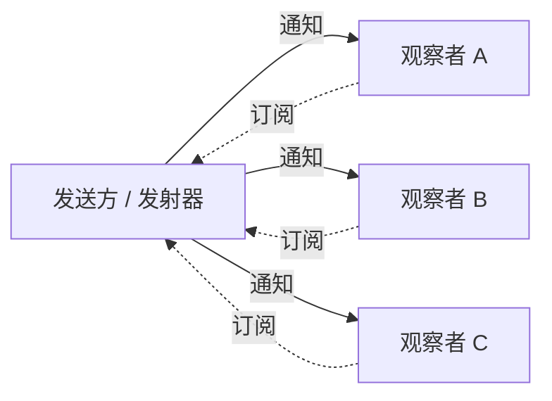

# 模式：观察者 / 发布-订阅 (Observer / Pub-Sub)

<DifficultyBadge />

## 一句话

让对象订阅事件并在事件发生时收到通知，实现生产者与消费者的解耦——发送方不需要知道谁在监听。

<DemoBadge />

## 现实类比

报纸订阅。你订阅一次，每天早上报纸就送到门口。你不需要跑到报摊去查——出版商主动推送给所有订阅者。随时可以取消。

## 核心思想

观察者模式创建一对多依赖：当主题状态改变时，所有注册的观察者都会收到通知。主题不知道观察者会做什么——只是调用它们。



这种解耦是该模式无处不在的原因：从 DOM `addEventListener` 到 Redux `store.subscribe` 到 Node.js `EventEmitter` 到 React 的 `useEffect` 清理模式。

| 属性 | 值 |
|------|------|
| 订阅 | O(1) — 添加到监听器集合 |
| 取消订阅 | O(1) — 从监听器集合移除 |
| 发射/通知 | O(n) — 调用 n 个监听器中的每一个 |
| 空间 | O(监听器数) 每事件类型 |

**动手试试** — 发射事件，观察它们扇出到所有订阅者：

<ObserverViz />

## 生产验证

| 项目 | 源码 | 用途 |
|------|------|------|
| Node.js | [events.js#L456-L520](https://github.com/nodejs/node/blob/main/lib/events.js#L456-L520) | `EventEmitter.prototype.emit` — 遍历注册的监听器并逐个调用。第 209 行定义了 EventEmitter 构造函数。Node 事件驱动架构的基础。 |
| Redux | [createStore.ts#L211-L280](https://github.com/reduxjs/redux/blob/master/src/createStore.ts#L211-L280) | `subscribe()` 添加监听器，`dispatch()`（第 280 行）执行 reducer 后调用所有监听器。Redux 在 dispatch 前快照监听器数组以安全处理订阅/取消。 |

## 实现

::: code-group

```typescript [TypeScript]
type Listener<T> = (data: T) => void;

class EventEmitter<Events extends Record<string, unknown>> {
  private listeners = new Map<keyof Events, Set<Listener<any>>>();

  on<K extends keyof Events>(event: K, listener: Listener<Events[K]>): () => void {
    if (!this.listeners.has(event)) {
      this.listeners.set(event, new Set());
    }
    this.listeners.get(event)!.add(listener);

    return () => this.off(event, listener);
  }

  off<K extends keyof Events>(event: K, listener: Listener<Events[K]>): void {
    this.listeners.get(event)?.delete(listener);
  }

  emit<K extends keyof Events>(event: K, data: Events[K]): void {
    this.listeners.get(event)?.forEach((listener) => listener(data));
  }

  listenerCount(event: keyof Events): number {
    return this.listeners.get(event)?.size ?? 0;
  }
}
```

```rust [Rust]
use std::collections::HashMap;

pub struct EventEmitter {
    listeners: HashMap<String, Vec<Box<dyn Fn(&str)>>>,
}

impl EventEmitter {
    pub fn new() -> Self {
        EventEmitter { listeners: HashMap::new() }
    }

    pub fn on(&mut self, event: &str, listener: impl Fn(&str) + 'static) {
        self.listeners
            .entry(event.to_string())
            .or_default()
            .push(Box::new(listener));
    }

    pub fn emit(&self, event: &str, data: &str) {
        if let Some(listeners) = self.listeners.get(event) {
            for listener in listeners {
                listener(data);
            }
        }
    }
}
```

```go [Go]
type Listener func(data any)

type EventEmitter struct {
	listeners map[string][]Listener
}

func NewEmitter() *EventEmitter {
	return &EventEmitter{listeners: make(map[string][]Listener)}
}

func (e *EventEmitter) On(event string, listener Listener) {
	e.listeners[event] = append(e.listeners[event], listener)
}

func (e *EventEmitter) Emit(event string, data any) {
	for _, listener := range e.listeners[event] {
		listener(data)
	}
}
```

```python [Python]
from collections import defaultdict
from typing import Callable, Any

class EventEmitter:
    def __init__(self):
        self._listeners: dict[str, list[Callable]] = defaultdict(list)

    def on(self, event: str, listener: Callable) -> Callable:
        self._listeners[event].append(listener)
        return lambda: self._listeners[event].remove(listener)

    def emit(self, event: str, data: Any = None) -> None:
        for listener in self._listeners[event]:
            listener(data)

    def listener_count(self, event: str) -> int:
        return len(self._listeners[event])

# Usage
emitter = EventEmitter()

messages = []
unsub = emitter.on("message", lambda data: messages.append(data))

emitter.emit("message", "hello")
emitter.emit("message", "world")
print(messages)  # ["hello", "world"]

unsub()  # unsubscribe
emitter.emit("message", "ignored")
print(messages)  # ["hello", "world"] — unchanged
```

:::

## 练习

| 难度 | 练习 | 文件 |
|------|------|------|
| 基础 | 实现 on/off/emit 事件发射器 | `exercises/typescript/observer/01-basic.test.ts` |
| 进阶 | 类型安全的事件总线 on/once/off/emit | `exercises/typescript/observer/02-intermediate.test.ts` |

运行练习：`pnpm test`（TypeScript）· `cargo test`（Rust）· `go test ./...`（Go）· `pytest`（Python）

练习文件： Rust `exercises/rust/src/observer/mod.rs` · Go `exercises/go/observer/observer_test.go` · Python `exercises/python/observer/test_observer.py`

## 何时使用

- **事件驱动系统** — UI 事件、网络事件、消息队列
- **模块解耦** — 插件、中间件、扩展点
- **状态管理** — Redux store、MobX observables、Vue reactivity
- **日志/监控** — 发射事件而不关心谁在收集
- **实时更新** — WebSocket 消息分发、实时数据流

## 何时不用

- **同步管线** — 如果处理顺序和完成很重要，直接调用函数
- **事件风暴** — 太多事件难以调试；考虑批处理
- **循环依赖** — A 观察 B，B 观察 A → 无限循环
- **强顺序保证** — 观察者通知顺序可能不确定

## 更多生产案例

- [RxJS](https://github.com/ReactiveX/rxjs) — reactive streams
- [Vue 3](https://github.com/vuejs/core) — reactivity system
- [MobX](https://github.com/mobxjs/mobx)
- [Chromium EventTarget](https://github.com/chromium/chromium/blob/main/third_party/blink/renderer/core/dom/events/event_target.cc) — Blink 中 DOM `addEventListener` 的实现
- [.NET events](https://github.com/dotnet/runtime/blob/main/src/libraries/System.Private.CoreLib/src/System/EventHandler.cs) — C# `event` 关键字委托

## 相关模式

| 模式 | 关系 |
|---------|-------------|
| [事件循环 / 反应器 (Event Loop / Reactor)](/zh/patterns/event-loop/) | 事件循环将事件分发给为特定事件类型注册的观察者 |
| [脏标记 (Dirty Flag)](/zh/patterns/dirty-flag/) | 观察者触发通知；脏标记延迟昂贵的反应 |
| [中间件 / 管道链 (Middleware / Pipeline Chain)](/zh/patterns/middleware-chain/) | 中间件观察和转换流经管道的数据 |
| [Actor 模型 (Actor Model)](/zh/patterns/actor-model/) | 两者都解耦生产者和消费者——观察者通过回调，Actor 通过消息传递 |

## 挑战题

::: details Q1: 一个 React 组件在 `useEffect` 中订阅了 store，但忘记返回清理函数。组件卸载时会发生什么？
**答案：** 监听器仍然保持注册状态，导致内存泄漏和对已卸载组件的幽灵更新。

store 持有监听器回调的引用，而该回调闭包捕获了组件的状态。组件已卸载但永远不会被垃圾回收，因为 store 仍然引用它。更糟糕的是，当 store 发出事件时，过期的监听器会运行并可能在已卸载的组件上调用 `setState`。这是经典的 Observer 内存泄漏——每个 `subscribe` 都必须有对应的 `unsubscribe`，而 `useEffect` 的清理函数就是 React 为此提供的机制。
:::

::: details Q2: 你有 3 个观察者：A 记录日志到文件，B 更新 UI，C 发送网络请求。它们被通知的顺序重要吗？
**答案：** 在大多数实现中，观察者按注册顺序调用，但你不应该依赖这一点——该模式不保证顺序。

如果 B 的 UI 更新依赖于 A 的日志先完成，那你就有了一个隐式耦合，而 Observer 模式本应消除这种耦合。每个观察者应该是独立的。如果顺序很重要，你需要不同的模式：中间件链、管道或显式依赖声明。Node.js 的 `EventEmitter` 按注册顺序调用监听器，但 Redux 显式地快照监听器数组以避免在 dispatch 过程中 subscribe/unsubscribe 导致的顺序依赖 bug。
:::

::: details Q3: 一次 `emit('data', payload)` 调用触发了 50 个同步观察者，其中一个抛出了异常。第 2-50 个观察者会怎样？
**答案：** 在简单实现中，第 2-50 个观察者永远不会执行——异常向上传播并中止了 `emit` 循环。

这就是为什么生产级实现会用 try-catch 包裹每个监听器调用。Node.js `EventEmitter` 默认不这样做——一个抛出异常的监听器会杀死其余的。你必须自己处理错误。RxJS 为每个订阅者使用错误边界。设计选择是：快速失败（一个坏观察者停止一切）vs 容错（隔离故障，继续通知）。对于关键系统，始终隔离观察者失败。
:::

::: details Q4: Observer 通知应该是同步的还是异步的？如果从同步切换到异步会破坏什么？
**答案：** 同步通知保证在 `emit()` 返回之前所有观察者都已处理完事件；切换到异步会破坏任何假设在发出事件后状态立即更新的代码。

同步时：`emit('change'); readState()` 能看到更新后的状态，因为观察者是内联运行的。异步时：`emit('change'); readState()` 看到的是旧状态，因为观察者被排队了。这会破坏像 Redux 这样的模式，其中 `dispatch()` 预期在返回时已完全完成。异步通知对性能更好（非阻塞），但要求系统处理 emit 和观察者执行之间的"最终一致性"间隙。
:::
