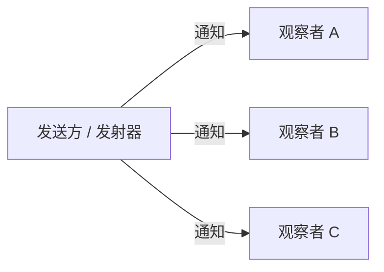

# 模式：观察者 / 发布-订阅 (Observer / Pub-Sub)

## 一句话

让对象订阅事件并在事件发生时收到通知，实现生产者与消费者的解耦——发送方不需要知道谁在监听。

## 核心思想

观察者模式创建一对多依赖：当主题状态改变时，所有注册的观察者都会收到通知。主题不知道观察者会做什么——只是调用它们。



这种解耦是该模式无处不在的原因：从 DOM `addEventListener` 到 Redux `store.subscribe` 到 Node.js `EventEmitter`。

## 生产验证

| 项目 | 源码 | 用途 |
|------|------|------|
| Node.js | [events.js#L456-L520](https://github.com/nodejs/node/blob/main/lib/events.js#L456-L520) | `EventEmitter.prototype.emit` — 遍历注册的监听器并逐个调用。Node 事件驱动架构的基础。 |
| Redux | [createStore.ts#L211-L280](https://github.com/reduxjs/redux/blob/master/src/createStore.ts#L211-L280) | `subscribe()` 添加监听器，`dispatch()` 执行 reducer 后调用所有监听器。Redux 在 dispatch 前快照监听器数组以安全处理订阅/取消。 |

## 实现

::: code-group

```typescript [TypeScript]
type Listener<T> = (data: T) => void;

class EventEmitter<Events extends Record<string, unknown>> {
  private listeners = new Map<keyof Events, Set<Listener<any>>>();

  on<K extends keyof Events>(event: K, fn: Listener<Events[K]>): () => void {
    if (!this.listeners.has(event)) this.listeners.set(event, new Set());
    this.listeners.get(event)!.add(fn);
    return () => this.listeners.get(event)?.delete(fn);
  }

  emit<K extends keyof Events>(event: K, data: Events[K]): void {
    this.listeners.get(event)?.forEach((fn) => fn(data));
  }
}
```

```python [Python]
from collections import defaultdict

class EventEmitter:
    def __init__(self):
        self._listeners = defaultdict(list)

    def on(self, event, listener):
        self._listeners[event].append(listener)
        return lambda: self._listeners[event].remove(listener)

    def emit(self, event, data=None):
        for listener in self._listeners[event]:
            listener(data)

emitter = EventEmitter()
msgs = []
unsub = emitter.on("msg", lambda d: msgs.append(d))
emitter.emit("msg", "hello")
unsub()
emitter.emit("msg", "ignored")
print(msgs)  # ["hello"]
```

:::

## 练习

| 难度 | 练习 | 文件 |
|------|------|------|
| 基础 | 实现 on/off/emit 事件发射器 | `exercises/typescript/observer/01-basic.test.ts` |

## 何时使用

- **事件驱动系统** — UI 事件、网络事件、消息队列
- **模块解耦** — 插件、中间件、扩展点
- **状态管理** — Redux store、MobX observables
- **日志/监控** — 发射事件而不关心谁在收集

## 何时不用

- **同步管线** — 如果处理顺序和完成很重要，直接调用函数
- **事件风暴** — 太多事件难以调试；考虑批处理
- **循环依赖** — A 观察 B，B 观察 A → 无限循环
