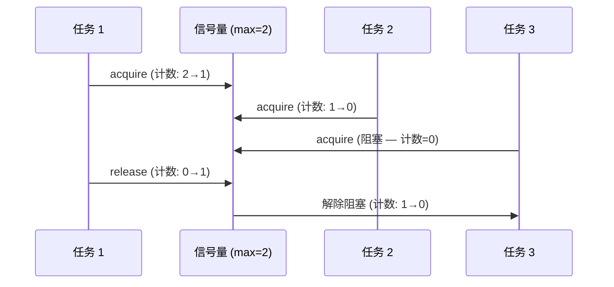

# 模式：信号量 / 有界并发 (Semaphore)

<DifficultyBadge />

## 一句话

通过维护计数器限制并发操作数量——工作前获取，完成后释放，达到上限时阻塞。

<DemoBadge />

## 现实类比

带剩余车位显示的停车场。入口大屏显示还剩几个车位。车进去（计数减一），车出来（计数加一）。显示 0 时，后面的车必须在门口等。

## 核心思想

信号量是一个带两个原子操作的计数器：`acquire`（递减，为零时阻塞）和 `release`（递增）。



| 属性 | 值 |
|------|------|
| acquire | O(1) 如有许可；计数为 0 时阻塞 |
| release | O(1) — 递增计数器，唤醒一个等待者 |
| 公平性 | 取决于实现（FIFO 或任意） |
| 空间 | O(1) 用于计数器 + O(等待者数) 用于阻塞任务 |

**动手试试** — 获取许可证，观察信号量满时工作线程如何排队等待：

<SemaphoreViz />

## 生产验证

| 项目 | 源码 | 用途 |
|------|------|------|
| Linux 内核 | [semaphore.h#L15-L55](https://github.com/torvalds/linux/blob/acb7500801e98639f6d8c2d796ed9f64cba83d3a/include/linux/semaphore.h#L15-L55) | `struct semaphore` — 内核计数信号量，`down()`（获取）和 `up()`（释放）。用于设备驱动访问控制。 |
| Go stdlib | [semaphore.go#L28-L107](https://github.com/golang/sync/blob/5071ed6a9f1617117556b66384f765c934de3698/semaphore/semaphore.go#L28-L107) | `Weighted` 结构体（L28-L33），含 `size`、`cur`、`mu`、`waiters`。`Acquire`（L38-L107）阻塞直到信号量权重可用或上下文取消。 |

## 实现

::: code-group

```typescript [TypeScript]
class Semaphore {
  private queue: (() => void)[] = [];
  private count: number;

  constructor(private max: number) {
    this.count = max;
  }

  async acquire(): Promise<void> {
    if (this.count > 0) {
      this.count--;
      return;
    }
    return new Promise<void>((resolve) => this.queue.push(resolve));
  }

  release(): void {
    const next = this.queue.shift();
    if (next) {
      next();
    } else {
      this.count++;
    }
  }

  get available(): number {
    return this.count;
  }
}

async function withSemaphore<T>(sem: Semaphore, fn: () => Promise<T>): Promise<T> {
  await sem.acquire();
  try { return await fn(); }
  finally { sem.release(); }
}
```

```rust [Rust]
use std::sync::{Arc, Mutex, Condvar};

pub struct Semaphore {
    count: Mutex<usize>,
    cvar: Condvar,
}

impl Semaphore {
    pub fn new(max: usize) -> Self {
        Semaphore { count: Mutex::new(max), cvar: Condvar::new() }
    }

    pub fn acquire(&self) {
        let mut count = self.count.lock().unwrap();
        while *count == 0 { count = self.cvar.wait(count).unwrap(); }
        *count -= 1;
    }

    pub fn release(&self) {
        *self.count.lock().unwrap() += 1;
        self.cvar.notify_one();
    }
}
```

```go [Go]
// Idiomatic Go: buffered channel as semaphore
func process(s string) { /* work */ }

func processWithLimit(items []string, maxConcurrent int) {
	sem := make(chan struct{}, maxConcurrent)
	var wg sync.WaitGroup

	for _, item := range items {
		wg.Add(1)
		sem <- struct{}{} // acquire
		go func(s string) {
			defer wg.Done()
			defer func() { <-sem }() // release
			process(s)
		}(item)
	}
	wg.Wait()
}
```

```python [Python]
import asyncio

async def fetch_with_limit(urls: list[str], max_concurrent: int = 5):
    sem = asyncio.Semaphore(max_concurrent)
    async def fetch_one(url: str):
        async with sem:  # acquire + release via context manager
            return await do_fetch(url)
    return await asyncio.gather(*(fetch_one(u) for u in urls))
```

:::

## 练习

| 难度 | 练习 | 文件 |
|------|------|------|
| 基础 | 实现带 acquire/release 的计数信号量 | `exercises/typescript/semaphore/01-basic.test.ts` |
| 进阶 | 信号量守护的连接池 | `exercises/typescript/semaphore/02-intermediate.test.ts` |

运行练习：`pnpm test`（TypeScript）· `cargo test`（Rust）· `go test ./...`（Go）· `pytest`（Python）

练习文件： Rust `exercises/rust/src/semaphore/mod.rs` · Go `exercises/go/semaphore/semaphore_test.go` · Python `exercises/python/semaphore/test_semaphore.py`

## 何时使用

- **限流** — 限制并发 API 调用、数据库连接
- **资源池** — 控制对固定数量资源的访问
- **背压** — 防止压垮下游服务
- **节流** — 限制并发文件 I/O、网络请求

## 何时不用

- **互斥** — 如果需要独占访问（max=1），用 mutex
- **简单计数** — 不需要阻塞就用原子计数器
- **基于队列的流控** — 如果顺序重要，用有界队列代替

## 更多生产案例

- [Java Semaphore](https://github.com/openjdk/jdk/blob/4b3ec455c85314d051800a8f46dd8f5c93881e3a/src/java.base/share/classes/java/util/concurrent/Semaphore.java) — 公平/非公平计数信号量
- [Python threading.Semaphore](https://github.com/python/cpython/blob/ff64d8de66ab7f8e56b5d410796a7d76c955280c/Lib/threading.py) — 基于条件变量的信号量
- [Nginx](https://github.com/nginx/nginx) — worker connections
- [PostgreSQL](https://github.com/postgres/postgres) — `max_connections`

## 相关模式

| 模式 | 关系 |
|---------|-------------|
| [限流器 / 令牌桶 (Rate Limiter)](/zh/patterns/rate-limiter/) | 限流器控制时间维度的吞吐量；信号量控制并发访问数量 |
| [背压 / 流控 (Backpressure)](/zh/patterns/backpressure/) | 信号量通过在达到上限时阻塞来实现背压 |
| [对象池 (Object Pool)](/zh/patterns/object-pool/) | 池大小本质上是一个信号量——获取对象，完成后释放 |

## 挑战题

::: details Q1: 最大值为 1 的信号量行为类似互斥锁。为什么你要用互斥锁而不是 semaphore(1)？
**答案：** 互斥锁有所有权语义——只有获取它的线程才能释放它——这防止了其他线程的意外释放并启用了优先级继承。

信号量是匿名计数器：任何线程都可以调用 `release()`，无论谁调用了 `acquire()`。这意味着线程 B 意外释放线程 A 的信号量这种 bug 不会被检测到。互斥锁追踪其所有者，所以非所有者的解锁是错误（或 panic）。此外，互斥锁的所有权启用了优先级继承：如果高优先级线程在等待低优先级线程持有的互斥锁，操作系统可以临时提升持有者的优先级。信号量做不到这一点，因为没有"持有者"。
:::

::: details Q2: 三个高优先级任务和一个低优先级任务共享 semaphore(1)。低优先级任务获取了信号量，然后一个中优先级任务抢占了它。高优先级任务现在被阻塞了。这叫什么？如何解决？
**答案：** 这是优先级反转——高优先级任务被中优先级任务间接阻塞，后者抢占了持有锁的低优先级任务。

经典例子是火星探路者（Mars Pathfinder）bug。中优先级任务无限运行因为它不需要信号量，阻止了低优先级任务完成并释放信号量。解决方案：(1) 优先级继承——临时将锁持有者提升到最高等待者的优先级，(2) 优先级天花板——为信号量分配一个等于使用它的最高优先级任务的天花板优先级，(3) 避免在抢占点之间持有信号量。
:::

::: details Q3: 你使用 semaphore(10) 来限制并发数据库连接。在负载下，你发现连接在快速地创建和销毁。这个设计有什么问题？
**答案：** 信号量只限制并发度，不提供复用。你需要将连接池（对象池模式）与信号量结合使用，而不是单独使用信号量。

信号量允许最多 10 个任务继续执行，但不管理连接本身。每个任务创建一个新连接，使用它，然后销毁——信号量只是控制有多少任务可以同时这样做。连接池持有 10 个预创建的连接并借出它们。池在内部使用信号量（或等效的阻塞机制）使所有连接都被借出时让调用者等待。信号量是并发原语；池是资源管理器。
:::

::: details Q4: Go 使用带缓冲的 channel 作为信号量（`sem := make(chan struct{}, N)`）。相比传统信号量实现，这有什么优势？
**答案：** 它与 Go 的 `select` 语句自然组合，无需额外 API 即可实现超时、取消和多资源获取。

使用基于 channel 的信号量，你可以写 `select { case sem <- struct{}{}: /* 获取成功 */ case <-ctx.Done(): /* 已取消 */ }`——在一个构造中组合获取与上下文取消。传统信号量需要单独的 `TryAcquire` 或 `AcquireWithTimeout` 方法。channel 方式还受益于 Go 的运行时调度器：在 channel 操作上阻塞的 goroutine 被高效挂起而不消耗 OS 线程。权衡是在简单场景下 channel 比基于 mutex 的计数器有稍高的开销。
:::
